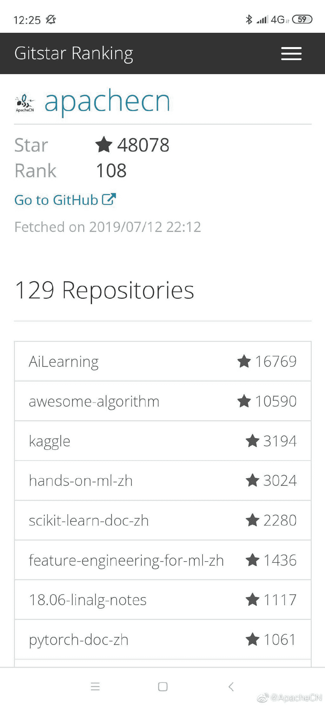

在这段时间里：

*   这些已有的项目即将完结，为所有贡献者点个赞：

    *   [PyTorch 1.0 中文文档](https://github.com/apachecn/pytorch-doc-zh)
    *   [Seaborn 0.9 中文文档](https://github.com/apachecn/seaborn-doc-zh)
    *   [Impatient JavaScript 中文版](https://github.com/apachecn/impatient-js-zh)
    *   [OpenCV 4.0 中文文档](https://github.com/apachecn/opencv-doc-zh)
    *   [UCB CS61b 课本：Java 中的数据结构](https://github.com/apachecn/cs61b-textbook-zh)
    *   [百页机器学习小书](https://github.com/apachecn/ml-book-100-zh)
*   我们又新开设了一些翻译项目：

    *   [Scrapy 1.6 中文文档](https://github.com/apachecn/scrapy-doc-zh)
    *   [Numba 0.44 中文文档](https://github.com/apachecn/numba-doc-zh)
    *   [Cython 3.0 中文文档](https://github.com/apachecn/cython-doc-zh)
    *   [UIUC CS241 系统编程中文讲义](https://github.com/apachecn/uiuc-cs241-notes-zh)
    *   [MIT 18.03 写给初学者的微积分](https://github.com/apachecn/calc4b-zh)
    *   [斯坦福 CS234 强化学习中文讲义](https://github.com/apachecn/stanford-cs234-notes-zh)
*   为了探索新的创作模式，笔记整理项目也陆续启动了：

    *   [斯坦福 CS224n 中文笔记](https://github.com/apachecn/stanford-cs224n-notes-zh)
    *   [斯坦福博弈论中文笔记](https://github.com/apachecn/stanford-game-theory-notes-zh)
*   我们上线了两个系列的视频教程，探索多元化发展之路：

    *   [Kaggle 学习系列视频](https://www.bilibili.com/video/av53119200)
    *   [简历分享系列视频](https://www.bilibili.com/video/av53122083)
*   我们部署上线了订阅列表，然后把群发邮件的程序部署在 CI 上，实现了自动化。

*   我们使用看板来管理的组织任务（不仅仅是翻译），并在周报和群公告中加入看板的截图，与成员共同解决组织的各种需求，极大提高了活跃度。

*   我们开源了用于网页抓取和辅助翻译的 [doctool](https://github.com/258ch/doctool)，并且每个翻译项目优先机翻，加快进度并降低参与门槛。

*   我们将[知识树](https://github.com/apachecn/ai-roadmap/tree/master/v1.0)更新到 v1.0 版本，并获得了 [AI 科技大本营的推荐](https://mp.weixin.qq.com/s/p67JwNb7Cd0IqEZYaoMUyA)。

*   我们开始走向线下，使用二维码不干胶在线下推广。

*   截至目前，我们的 Github 组织排名为 104。近半个月内增加了 1600 个星星。

     

*   经过了四个月，[ApacheCN 公众号](https://weixin.sogou.com/weixin?query=ApacheCN)粉丝数为 1600，其中 600 是近一个月新增的。

*   筹集赞助目前毫无进度。实话说，很多 AI 独角兽（见[『2019 年人工智能行业又进入冬天了吗？』](https://www.zhihu.com/question/308512268/answer/573546877)），互联网创业公司，绝大多数开源社区（见[『Redis 作者 antirez：开源维护者的挣扎』](https://www.oschina.net/news/106799/the-struggles-of-an-open-source-maintainer)）都没有很好的商业模式，我不相信我们能这么快解决，慢慢找吧。

然后是未来的规划：

*   开展优达学院无人驾驶和量化投资笔记整理活动，进一步开展学习活动。这两个方向课程资料稀缺，有必要好好搞。
*   给贡献者发小奖品，包括但不仅限于文化衫、书包、贴纸、水杯、实习证明。
*   开设情感教育项目。大家已经看到，我们做开源与众不同，做情感教育还是你们想不到的路子。
*   将我们的协作模式迁移到软件开发，这是一个长期规划，详见[这里](https://www.cnblogs.com/wizardforcel/p/11288504.html)。
*   维持现有翻译活动，并且以一切手段尽可能搞宣传。