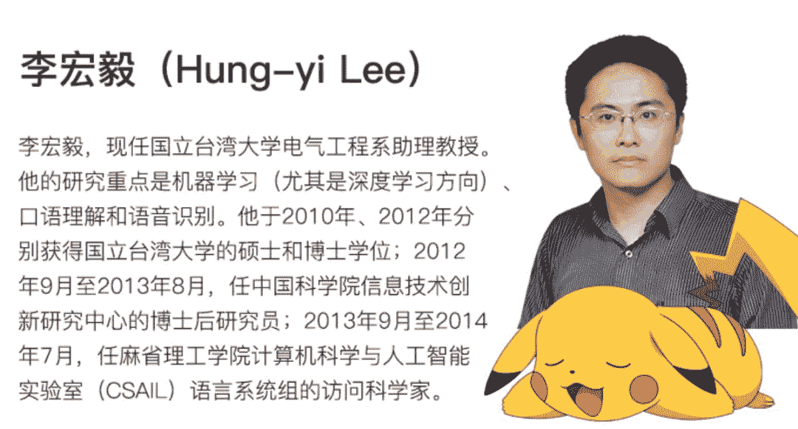
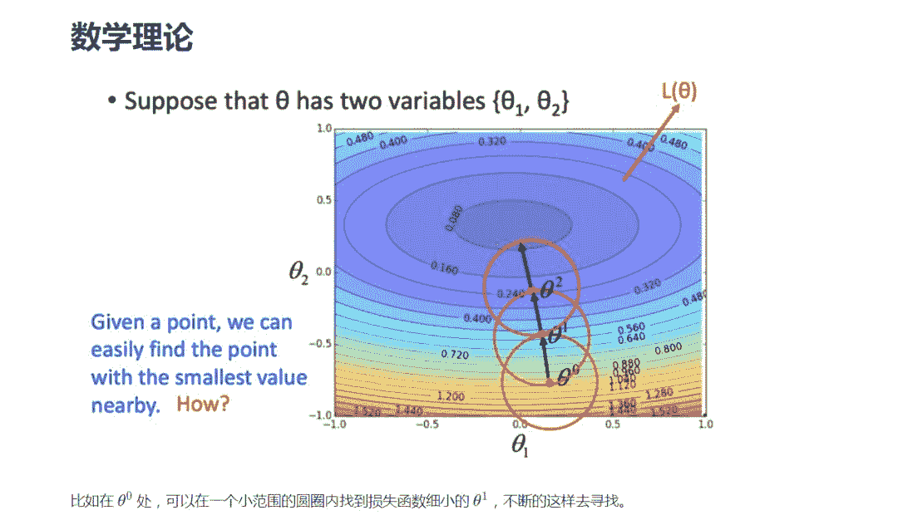
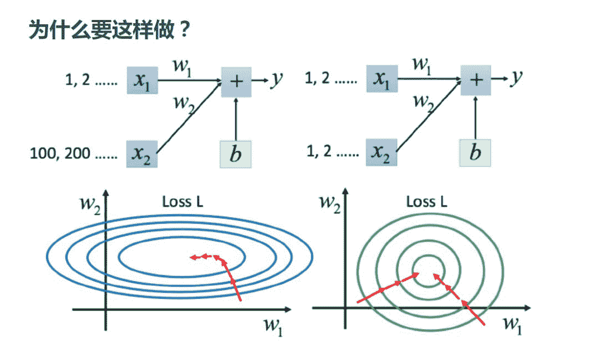
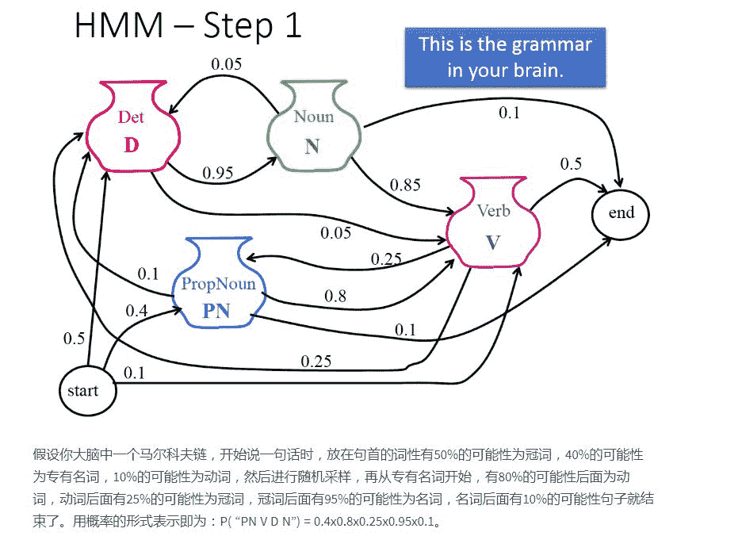
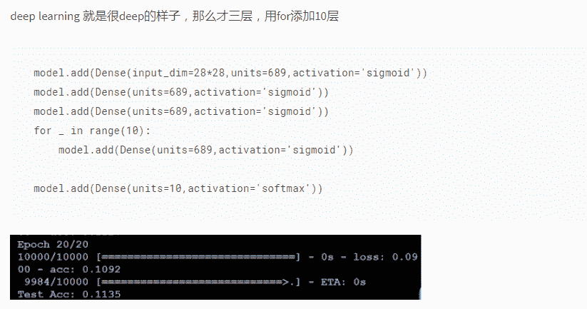
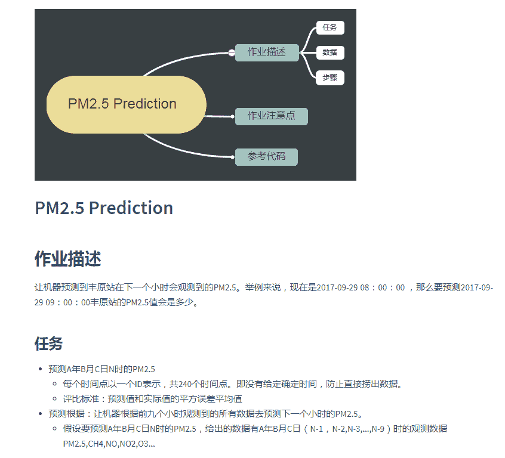
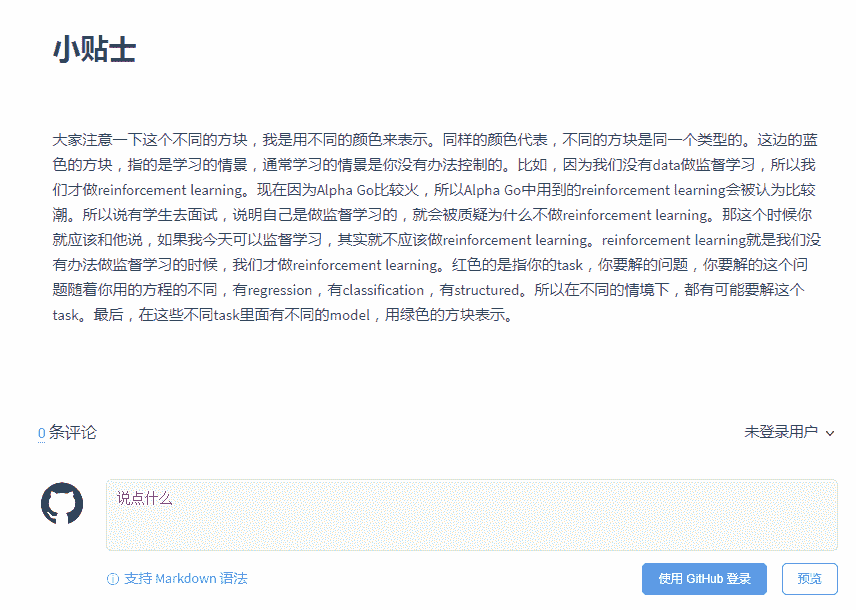

> **【导读】** 关于机器学习的学习资料从经典书籍、免费公开课到开源项目应有尽有，可谓是太丰富啦，给学习者提供了极大的便利。但网上比比皆是的学习资料大部分都是英文材料，这可难倒了英语不好的学习者，单词不认识，理解不到位。小编不禁想问：就真的就没办法了嘛。其实也不尽然，中文还是有一些不错的学习资料的，像周志华老师的西瓜书，李航老师的统计学习方法等等都是相当经典的学习资料。今天的主角LeeML-Notes也是和一门中文经典视频课程–台大李宏毅的机器学习相关。

## 1\. 李宏毅机器学习简介

李宏毅老师的机器学习视频是机器学习领域经典的中文视频之一，也被称为中文世界中最好的机器学习视频。李老师以幽默风趣的上课风格让很多晦涩难懂的机器学习理论变得轻松易懂，他将理论知识与有趣的例子结合在课堂上展现，并且对深奥的理论知识逐步推导，保证学习者能够学习到问题的精髓所在。比如老师会经常用宝可梦来结合很多机器学习算法。对于想入门机器学习又想看中文讲解的人来说绝对是非常推荐的。

## 2\. 《LeeML-Notes》李宏毅机器学习笔记

LeeML-Notes是Datawhale开源组织又一开源学习项目，由团队成员王佳旭、金一鸣牵头，8名成员历时半年精心打磨而成，实现了李宏毅老师机器学习课程内容的100%复现，并且在此基础上补充了有助于学习理解的相关资料和内容，对重难点公式进行了补充推导。期间，Datawhale开源组织打造了《李宏毅老师机器学习》的组队学习，在众多学习者共同的努力下，对该内容进行了迭代和补充。下面，让我们来详细了解下工作详情吧。

具体准备工作：

*   2019年2月–2019年4月：笔记整理初级阶段，视频100%复现

*   2019年4月–2019年6月：网站搭建，对笔记内容及排版迭代优化

*   2019年5月–2019年6月：组队学习《李宏毅机器学习》并对内容进行迭代完善

*   2019年7月：最后内容修正，正式推广。

下图为修订记录表：

## 3\. 《LeeML-Notes》学习笔记框架

内容在整体框架上与李宏毅老师的机器学习课程保持一致，主要由监督学习、半监督学习、迁移学习、无监督学习、监督学习中的结构化学习以及强化学习构成。建议学习过程中将李宏毅老师的视频和这份资料搭配使用，效果极佳。笔记也是和课程视频完全同步。

目录详情见下：

**目录**

**P1 机器学习介绍**

**P2 为什么要学习机器学习**

**P3 回归**

**P4 回归-演示**

**P5 误差从哪来？**

**P6 梯度下降**

**P7 梯度下降（用AOE演示）**

**P8 梯度下降（用Minecraft演示）**

**P9 作业1-PM2.5预测**

**P10 概率分类模型**

**P11 logistic回归**

**P12 作业2-赢家还是输家**

**P13 深度学习简介**

**P14 反向传播**

**P15 深度学习初试**

**P16 Keras2.0**

**P17 Keras演示**

**P18 深度学习技巧**

**P19 Keras演示2**

**P20 Tensorflow 实现 Fizz Buzz**

**P21 卷积神经网络**

**P22 为什么要“深度”学习？**

**P23 半监督学习**

**P24 无监督学习-线性降维**

**P25 无监督学习-词嵌入**

**P26 无监督学习-领域嵌入**

**P27 无监督学习-深度自编码器**

**P28 无监督学习-深度生成模型I**

**P29 无监督学习-深度生成模型II**

**P30 迁移学习**

**P31 支持向量机**

**P32 结构化学习-介绍**

**P33 结构化学习-线性模型**

**P34 结构化学习-结构化支持向量机**

**P35 结构化学习-序列标签**

**P36 循环神经网络I**

**P37 循环神经网络II**

**P38 集成学习**

**P39 深度强化学习浅析**

**P40 机器学习的下一步**

## 4\. 笔记内容细节展示

**4.a 对梯度下降概念的解析**

**4.b 为什么需要做特征缩放**

**4.c 隐形马尔科夫链的应用**

## 5\. 代码呈现

代码在李宏毅老师提供代码的基础上进行了优化，在python3上全部调试通过。

**5.a 回归分析**

**5.b 深度学习**

## 6\. 作业展示

对笔记课程的作业进行了讲解与解读，并且总结了一些需要注意的点，同样在python3上调试通过。

## 7\. 交流互动

目录中每一节最后都设置了交流互动区供大家总结学习内容、提出自己的疑问和广大学习者互动，使用GitHub登录就好啦，是不是交流起来就方便了许多。

## 8\. 开源地址

[https://github.com/datawhalechina/leeml-notes](https://github.com/datawhalechina/leeml-notes)

## 9\. 配套视频

李宏毅机器学习视频：

[https://www.bilibili.com/video/av59538266](https://www.bilibili.com/video/av59538266)

主要贡献人员

负责人：王佳旭、金一鸣

成员：黑桃、李威、 排骨、追风者、Summer、杨冰楠