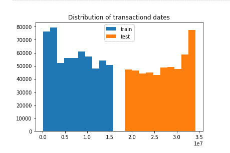
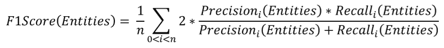

为了帮助更多竞赛选手入门进阶比赛，通过数据竞赛提升理论实践能力和团队协作能力。DataFountain 和 Datawhale 联合邀请了数据挖掘，CV，NLP领域多位竞赛大咖，将从赛题理解、数据探索、数据预处理、特征工程、模型建立与参数调优、模型融合六个方面完整解析数据竞赛知识体系，帮助竞赛选手从0到1入门和进阶竞赛。

下面是大咖分享

???

数据挖掘方向

杰少 ID：尘沙杰少

简介：南京大学计算机系毕业，现任趋势科技资深算法工程师。20多次获得国内外数据竞赛奖项，包括KDD2019以及NIPS18 AutoML等。

**1\. 数据探索的意义？**

数据探索作为大数据竞赛最为核心的模块之一，贯穿整个比赛的始终。

数据探索可以主要划分为两块，一块是赛前对于数据的探索，一块是对于模型的预测结果的分析，而这两大块又可以继续细化为很多细节。

**赛前数据的探索**可以帮助我们更好地了解数据的性质以及干净程度，包括数据的大小，数据的缺失值的分布，训练集与测试集的分布差异等，这些可以为我们的数据预处理带来非常大的参考；同时，数据集中的奇异现象又会进一步促进我们对其进行研究与观察，更好地了解业务，并构建相应强特征；而对**模型的分析**部分，则可以帮助我们了解模型哪些数据做的好，哪些数据做的不好，通过此类反馈，我们就可以对错误的数据展开研究，挖掘我们所遗漏的部分，进一步提升我们模型的预测性能。

**2\. 数据探索需要****做什么？**

此处我把数据探索模块展开成两块，赛前数据分析以及模型的分析。

## **（1）赛前数据分析**

**全局分析：**包括数据的大小，整体数据的缺失情况等；通过全局的分析，我们可以知道我们数据的整体情况，决定我们采用什么样的机器等等；   

**单变量分析：**包括每个变量的分布，缺失情况等；通过单变量分析，我们可以进一步的了解每个变量的分布情况，是否有无用的变量(例如全部缺失的列)，是否出现了某些分布奇怪的变量等.   

**多变量分析：**包括特征变量与特征变量之间的分析以及特征变量与标签之间的分析等；通过多变量分析，很多时候我们可以直接找到一些比较强的特征，此外变量之间的关系也可以帮助我们做一些简单的特征筛选。     

**训练集与测试集的分布分析：**寻找差异大的变量，这些差异大的变量往往是导致线下和线上差异的核心因素，这有利于我们更好的设计线下的验证方法。        

## **（2）模型的分析**

**模型特征重要性分析：**LGB/XGB等的importance、LR、SVM的coeff等；特征重要性可以结合业务理解，有些奇怪的特征在模型中起着关键的作用，这些可以帮助我们更好地理解我们的业务，同时如果有些特征反常规，我们也可以看出来；可能这些就是过拟合的特征等等；     

**模型分割方式分析：**可视化模型的预测，包括LGB的每一颗数等；这些可以帮助我们很好的理解我们的模型，模型的分割方式是否符合常理也可以结合业务知识一起分析，帮助我们更好的设计模型；       

**模型结果分析：**这个在回归问题就是看预测的结果的分布；分类一般看混淆矩阵等。这么做可以帮助我们找到模型做的不好的地方，从而更好的修正我们的模型。  

因为每个比赛的分析的重点都不太一样，上面提到的是几乎适用于80%比赛的框架，今后有机会会结合相应的比赛一并分享。谢谢大家的阅读。

作者公众号：kaggle竞赛宝典

王贺 ID：鱼遇雨欲语与余

简介：武汉大学硕士，2019年腾讯广告算法大赛冠军选手，京东算法工程师，一年内获得两冠四亚一季的佳绩。

**数据探索**

数据探索也被称为EDA，我们首先要知道在EDA的过程中，在拿到一份新的数据集时，需要理解数据集，熟悉数据集的规模，查看数据的统计分布，了解特征之间的相关性等。具体需要解决哪些问题：

1\. 确定问题，确定输入输出原始特征以及数据的类型
2\. 发现缺失值、异常值
3\. 连续型变量和类别型变量分布

### **异常值观察处理**

常见的是通过可视化的方式进行异常值的观察，就是用箱形图和散点图来观察。

### **常见处理方法**

1\. 不处理，例如对于数模型，如LightGBM和XGBoost，这类对异常值不敏感的算法来说不太需要处理；
2\. 把异常值的处理用缺失值的处理的思路来处理，比如mean、median进行填补；
3\. 通过分箱进行泛化处理，在风控系统中，使用lr的时候很常用的处理手段；
4\. 很多可能是业务异常的问题，所以可以结合业务和实际的情况进行处理，比如用户保密填充为-999，还有种是错误的导入导致的；

### **变量的分布**

****通过可视化进行分析，来发现数据的特点。****对于连续型和类别型都可以进行分析。****

1\. 一般可以使用matplotlib和seaborn提供的绘图功能就可以满足需求了。
2\. 比较常用的图表有：查看目标变量的分布。当分布不平衡时，根据评分标准和具体模型的使用不同，可能会严重影响性能。
3\. 对连续型数值变量，可以用箱型图来直观地查看它的分布。
4\. 对于坐标类数据（时间分布型等），可以用散点图来查看它们的分布趋势和是否有离群点的存在。
5\. 对于分类问题，将数据根据label (目标结果) 的不同着不同的颜色绘制出来，这对特征的构造很有帮助。绘制变量之间两两的分布和相关度图表。

### ****对此我们总结为以下几类 (********这里应该不够全面) ********：****

1\. 变量单独分析，基本情况。
2\. 变量结合label进行分析，主要发现与label的关系，是否强相关，不相关的原因。
3\. 构建热力图

上面是构建的日历热力图，它能比较清晰的反映出在一段日期内的数值分布情况，有利于在时间跨度上的分析

  4\. 相关性分析

对单一特征进行分析后，可以考虑两个变量之间的相关性。因为大多数算法使用时都会有一个隐含的假设，就是假定所有特征之间相互独立。而如果两个特征高度线性相关，这可能会使算法的性能下降。因此我们会看下特征之间的相关性，对于高度相关的特征，可以选择只保留其中一个，以此提高性能。

作者知乎专栏：

zhuanlan.zhihu.com/DataAI

林有夕 ID：林有夕

简介：2019 DCIC移动信用评估冠军/KDD CUP，全球Rank 2以及其他多个冠亚军。

数据探索主要通过一些统计指标来分析数据的分布。观察数据和结果的影响。

例如观察**数值特征**的分布，均值，最值等，观察**类别特征**的频率分布等。以及一些交叉分布，比如平均每个用户看过的广告数之类的。

一般数据探索有如下几个好处：

1\. 让你更加了解数据的情况。验证是否符合自己所想的逻辑。

2\. 通过观察特征和标签的分布关系。初步验证该特征是否和标签存在明显的关系。（表现在不同标签下，特征分布差异较大），在一些数据量比较大，模型迭代效率较低的场景下，可以通过该方法初步验证特征是否有意义。

3\. 对于比赛后期，大家关于数据现实意义中有道理的特征和方案都尝试差不多的情况下，数据探索就尤其重要了。因为往往最后的提分点都是一些**数据固有的特点**，而非业务特点。（比如，通过观察你有可能会发现一些采样错误。一些异常数据点（比如地铁停运、极端天气等影响的label）等等。这些单纯靠猜业务是很难想到的。

王茂霖 ID：ML67

简介：华中科技大学研究生，DCIC-2019风电赛Top2选手。

数据探索在机器学习中我们一般称为 **EDA**：是指对已有的数据 (特别是调查或观察得来的原始数据) 在尽量少的先验假定下进行探索，通过作图、制表、方程拟合、计算特征量等手段探索数据的结构和规律的一种数据分析方法。

数据探索有利于我们发现数据的一些特性，数据之间的关联性，对于后续的特征构建是很有帮助的。  

**对于数据的初步分析** (直接查看数据或统计函数) 可以从：样本数量，训练集数量，是否有时间特征，是否是时许问题，特征所表示的含义 (非匿名特征)，特征类型 (字符类似，int，float，time)，特征的缺失情况 (注意缺失的在数据中的表现形式，有些是空的有些是NAN符号等)，特征的均值方差情况。

**进步分析可以通过对特征作图**，特征和label联合做图 (统计图，离散图)，直观了解特征的分布情况，通过这一步也可以发现数据之中的一些异常值等，通过箱型图分析一些特征值的偏离情况，对于特征和特征联合作图，对于特征和label联合作图，分析其中的一些关联性。

**分析记录某些特征值缺失占比30%以上样本的缺失处理**，有助于后续的模型验证和调节，分析特征应该是填充 (填充方式是什么，均值填充，0填充，众数填充等)，还是舍去，还是先做样本分类用不同的特征模型去预测。

******对于异常值做专门的分析**，****分析特征异常的label是否为异常值 (或者偏离均值较远)，异常值是否应该剔除，还是用正常值填充，是记录异常，还是机器本身异常等**。 **

**对于Label做专门的分析**，分析标签的分布情况等。

有了对于数据的EDA分析，我们就会对于数据有基本的一个了解和认识，也会知道其中的一些数据问题，为后续的数据处理和特征工程打下基础。

欢迎大家留言指正交流！
ML67

谢嘉元 ID：谢嘉嘉

简介：华南理工大学博士，多次数据挖掘竞赛中获得优异成绩。

对于机器学习解决实际业务问题而言，数据探索分析是必须要做的。通过数据探索我们可以知道我们的数据的类型，大小，每个字段的缺失情况，字段之间的相关情况，标签的分布等信息，使我们能对手上的**数据有更好的了解**；同时，对于时间序列问题数据进行可视化分析，能够帮助我们去**构建有效的特征**。

数据探索是在具有较为良好的样本后，对样本数据进行解释性的分析工作，它是数据挖掘较为前期的部分。数据探索并不需要应用过多的模型算法，相反，它更偏重于**定义数据的本质、描述数据的形态特征并解释数据的相关性**。通过数据探索的结果，我们能够更好的开展后续的数据挖掘与数据建模工作。

  假设我们在一个很理想情况下，同一周期（年份、月份、天）内统计指标的数值应该都是平稳、相近的。但在现实生活中我们统计指标的数值的观测值往往都是呈现出不平稳的状态。这是因为实际业务场景中，统计指标的数值会受到很多的外部影响因素的作用，最终导致了数据的不平稳。而我们可以进一步对数据进行分析，找到可能会造成影响的因素。如：最简单的曜日因素和月份因素，我们对数据进行简单可视化后可以看出该因素可能会造成的影响。

数据的探索方法较多，我们可以多阅读kaggle的一些EDA方案，多做EDA能够帮助我们更好了解赛题。对数据有更好的理解，才能作出更好的强特征。

钟昌盛 ID：真我小兔子乖乖

简介：Kaggle: Elo Merchant Category Recommendation亚军、2019-kddcup top10、2018ccf电信套餐个性化匹配模型亚军。

很高兴参加这一期数据探索的分享！

在传统机器学习表格题的竞赛当中，数据探索对于模型的建立和模型预测具有不可小觑的作用。下面我们来探讨一下什么是数据探索。

**EDA** ，是指对已有的数据 (特别是调查或观察得来的原始数据) 在尽量少的先验假定下进行探索，通过作图、制表、方程拟合、计算特征量等手段**探索数据的结构和规律**的一种数据分析方法。 特别是党我们对面对大数据时代到来的时候，各种杂乱的“脏数据”，往往不知所措，不知道从哪里开始了解目前拿到手上的数据时候，探索性数据分析就非常有效。 探索性数据分析是上世纪六十年代提出，其方法有美国统计学家John Tukey提出的。为了让大家更加感兴趣这一次的话题，我这次的分享主要是基于正在举行的kaggle-ieee赛题： **IEEE-CIS FraudDetection** 。
 在开源的Kernel ，就让我们一步一步感受到了EDA的魅力。
第一步为 ： 导入数据所需要的包
第二步为 ： 导入数据所需要的函数，其中有个通用的函数麻烦大家保存一下，就是减少数据的大小的函数：

紧接着我们打开data中的文件

这里关键的的地方在于我们寻找到数据集的唯一标签在这里为TransactionID。是基于这个进行merge和进行提交的主键。这类打开方式有些版本不支持，可以自行更改代码。

接下来查看数据集的行数，数据共有多少列：

查看数据的头部：
train_transaction.head()

train_transaction.head()

查看数据集集区缺失值情况：
**划重点，一般在数据集当中我们都会剔除缺失值特别多的列，这样保证模型的泛化能力。**

在剔除过程中我们发现train和test需要剔除的列不完全相同，所以我们集中把这train和test缺失值大于90%以上的列同时剔除。

查看id类的count，如果count分布比较好，可以考虑作为统计特征：

查看TransactionDT的分布

下面是查看cards counts的分布 (一样暂不继续放图)。通过这些我们知道哪类特征需要做统计特征，需要删除哪一类。

那么我们还可以根据数据的类型，判读需要对哪一些列进行编码：

在不断EDA数据探索的过程中，我们完成了一些有用的特征工程和特征预处理，这样不仅会让我们更深刻的理解数据，更会让我获得更好的分数，好了，短暂的分享到此结束了，下期见吧！

CV方向

徐光福 ID：天灵灵地灵灵

简介：多次目标检测比赛第一、2018之江杯VQA比赛第二。

对于挖掘类的比赛来说，数据探索非常重要，涉及的方方面面很多 (反正我也不知道有哪些方面)，但是对于图像类比赛来说，数据探索就相对简单一些，依然以基于虚拟仿真环境下的自动驾驶交通标志识别https://www.datafountain.cn/competitions/339这个比赛为例，讲一下计算机视觉类比赛的数据探索。

对于计算机视觉类比赛，数据探索主要是了解数据集的属性、特点，以及如何进行一些数据预处理，例如图像格式转换，生成数据字典等等，为之后的数据加载做好准备。

首先我们看一下交通标志识别比赛的数据集：

1\. 训练集和测试集都有大约20000张图片，格式为JPG

训练集和测试集都有两万张图片，在一般的比赛中应该属于比较多的了，当然和coco、objects365之类的数据集没法比，格式为JPG，不像某些医疗影像的比赛，还需要做特别的格式甚至坐标的转换，这里不需要，算是一个不错的开端

2\. 训练集和测试集的图像大小都为固定大小，3200x1800

图像大小固定，这也是一个好消息，相比图像大小不一、纵横比也很随意的数据集来说好处理不少。但是，图片大小3200x1800，就有点不一般了，前面说了，这是一个目标检测比赛，这么大的图是很难直接加载并训练的。

面对这种大图，通常我们有两种选择：缩图和裁剪

**缩小图像**对比赛尤其是目标检测比赛来说，通常不是一个好选择，因为无数经验表明，图大往往是提高目标检测成绩的最简单最有效的选择。能原图训练就不要缩小，如果能比原图还大，那通常也是不错的选择，很少有例外；通常不是好选择也不意味着就不能用，在没有其它好的办法的情况下，缩图也是可以接受的，总之有点像无奈的选择

**再说说裁剪**，裁剪意味着可以用很小的尺寸实现近似原图训练的效果，从这点上来说，他比起缩图确实是占有优势的，缺点是处理起来比较麻烦，有时候甚至是很难处理，比如目标比较密集，很容易就把很多目标切的七零八落。所以缩图还是裁剪，还是要根据数据集的特点来选择

3\. 无论训练集和测试集每张图片都固定有一个、且只有一个目标

这简直是福音了，每张图片只有一个目标，这裁剪起来就方便了很多，所以在缩图和裁剪这个问题上就不用纠结了，选择裁剪吧。对于这种单目标的数据集来说，一个很好的选择就是围绕目标进行随机裁剪，而且最好是以online的方式进行，这样每次裁剪出的东西都不一样，极大的增加了样本的数量。

4\. 目标为交通标志，一共有20类，其中有左侧行驶、右侧行驶这类左右对称的目标

这个没什么好说的，目标相对来说比较好识别，需要注意的是既然有左右对称的目标，就不能直接使用左右翻转的数据增强了，当然也可以进行一下特别的处理，比如翻转后调整相应的类别标签

5\. 提供的训练集标注为csv格式，每个目标一行

对于目标检测来说，一般要把标注转换为coco的格式，这通常也是代码的第一步，至于如何转换，首先需要熟悉一下coco的格式，代码方面并没有什么难度

数据探索完成之后，已经基本了解了数据集的属性和特点，就可以开始代码的工作了，先尝试把数据集的标注转换为coco的格式，迈出代码的第一步吧~

王博 ID：000wangbo

简介：西安电子科技大学研究生，一个不断在CV道路上探索的小白。

数据探索在数据挖掘比赛中是特别重要的一部分。如果把我们的模型当作柯南，那我们喂进去的数据就是柯南的破案线索，而破案线索并不会简简单单越多越好 (数据清洗)，柯南选择通过毛利小五郎或者服部平次揭开真相的方式也不同 (模型、超参数选择)。

机器学习类比赛数据探索一般包含缺失值处理、异常值处理、转非数以及绘制关联热力图等等。不过今天作为cv方向嘉宾，那我就从一个比赛导入下如何通过数据探索拿下Top。

  **比赛地址：**

https://www.datafountain.cn/competitions/315

  **解题方案：**

https://zhuanlan.zhihu.com/p/51870164周易大佬的知乎，强推一波，里面有很多大赛的开源

  **赛题任务**
天空的薄云，往往是天气晴朗的象征；而那些低而厚密的云层，常常是阴雨风雪的预兆。我们希望选手基于大赛提供的海量云彩图片，通过深度学习训练模型，识别图片中不同类型的云彩，预测大赛提供的测试云彩图片。

这是个比较明显的五分类的比赛，评价指标是五类F1-score的均值。很多人看到这个题目，就赶紧上个五分类模型跑一哈然后各种数据增强模型融合，可能前期确实能在前排，但是最终一定拿不到Top。

  那我们开始数据探索，首先我们能看到这个数据的**样本不平衡**，那就通过crop上采样一些小样本；然后我们通过比较图片的MD5值，发现竟然有好多**重复的图片**，有一些的label还是矛盾的，清洗清洗！最终我们发现了一个**惊天漏洞**，test中的图片还有大约100张左右和train里面是一样的。

  通过数据中的这些trick，我们做了不到10天就拿到了亚军，足以看出数据探索在比赛中的重要程度了吧！最终，分享下最近一个遥感分类比赛的数据trick（通过排序能够看到很多全黑图片和异常图片）：
http://rscup.bjxintong.com.cn/#/theme/1

NLP方向

张浩 ID：reborn_ZH

简介：CCF2018供应链需求预测亚军、2019搜狐内容识别算法大赛季军。

大家好，本期我将和大家交流下自然语言处理赛题的数据探索部分，为了更好地与实战接轨，后面的部分我都将以2019年搜狐内容识别算法大赛为例进行讲解。

**比赛链接：**2019年搜狐内容识别算法大赛

### **赛题任务**

给定若干文章，目标是判断文章的核心实体以及对核心实体的情感态度。每篇文章识别最多三个核心实体，并分别判断文章对上述核心实体的情感倾向（积极、中立、消极三种）。

### **评价指标**

模型得分的计算方式：

分数由实体词的F1-score以及实体情感的F1-score组成，每个样本计算micro F1-Score，然后取所有样本分数的平均值。
实体词的F1-score如下：

实体情感的F1-score由实体_情绪的组合标签进行判断，只有实体情绪都正确才算正确的标签。
实体情感的F1-score如下：

### **赛题数据**

### **数据可视化**

数据可视化作为数据探索中非常重要的一步，我们利用视觉获取的信息量，远远比别的感官要多得多。通过图形和色彩将关键数据和特征直观地传达出来，从而实现对于复杂的数据的深入洞察。数据可视化则是通过一目了然地方式，获得客观数据层面的引导或者验证。
首先，我们对训练集长度、实体词位置、热点词进行可视化，帮助我们了解训练集的基本信息和数据分布。

从上面3个图中可以得知，训练集的样本长度主要集中在500到1000之间，并且大多数样本的实体词在前几个词中就会出现。
接下来，我们对实体词进行更细致的统计分析，这有利于帮助我们理解数据，便于我们后面对数据进行处理。

统计核心实体在新闻中出现的位置，在第0-100个索引（字）之间有74696个核心实体，100-200有5149个，以此类推。说明在识别实体的时候重点要放在文章的前部半分，不必分析整篇文章。

  分析前n个句子中出现的核心实体数以及占总实体数的百分之多少，前五个句子中出现了的核心实体数占所有实体数的80%多。说明我们只要将前几句输入到模型训练就可得到很好的效果。

