点击上方“**Datawhal****e**”，选择“星标”公众号

第一时间获取价值内容

##### **【引言****】**在GCN的博文中我们重点讨论了图神经网络的逐层传播公式是如何推导的，然而，GCN的训练方式需要将邻接矩阵和特征矩阵一起放到内存或者显存里，在大规模图数据上是不可取的。其次，GCN在训练时需要知道整个图的结构信息(包括待预测的节点), 这在现实某些任务中也不能实现(比如用今天训练的图模型预测明天的数据，那么明天的节点是拿不到的)。GraphSAGE的出现就是为了解决这样的问题，这篇文中我们将会详细得讨论它。

**Inductive learning v.s. Transductive learning**

首先我们介绍一下什么是inductive learning. 与其他类型的数据不同，图数据中的每一个节点可以通过边的关系利用其他节点的信息，这样就产生了一个问题，如果训练集上的节点通过边关联到了预测集或者验证集的节点，那么在训练的时候能否用它们的信息呢? 如果训练时用到了测试集或验证集样本的信息(或者说，测试集和验证集在训练的时候是可见的), 我们把这种学习方式叫做transductive learning, 反之，称为inductive learning. 显然，我们所处理的大多数机器学习问题都是inductive learning, 因为我们刻意的将样本集分为训练/验证/测试，并且训练的时候只用训练样本。然而，在GCN中，训练节点收集邻居信息的时候，用到了测试或者验证样本，所以它是transductive的。

**概述**

GraphSAGE是一个inductive框架，在具体实现中，训练时它仅仅保留训练样本到训练样本的边。inductive learning 的优点是可以利用已知节点的信息为未知节点生成Embedding. GraphSAGE 取自 Graph SAmple and aggreGatE, SAmple指如何对邻居个数进行采样。aggreGatE指拿到邻居的embedding之后如何汇聚这些embedding以更新自己的embedding信息。下图展示了GraphSAGE学习的一个过程： 

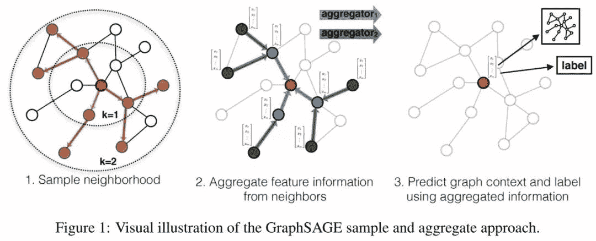

1.对邻居采样

2.采样后的邻居embedding传到节点上来，并使用一个聚合函数聚合这些邻居信息以更新节点的embedding

3.根据更新后的embedding预测节点的标签

**算法细节**

**  1\. 节点 Embedding 生成(即：****前向传播)算法**

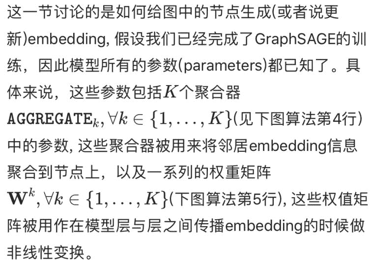

下面的算法描述了我们是怎么做前向传播的：

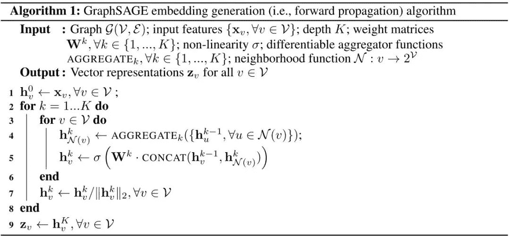 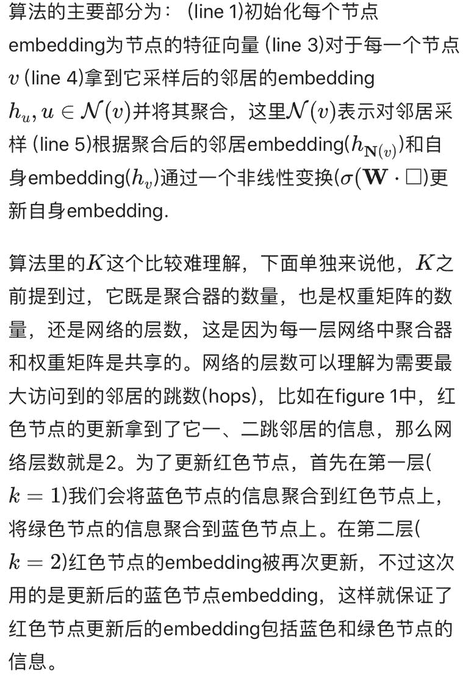

**  2. 采样 (Sample) 算法**

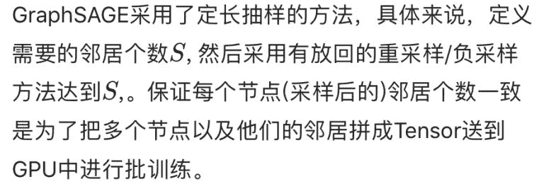

**  3. 聚合器 (Aggregator) 架构**

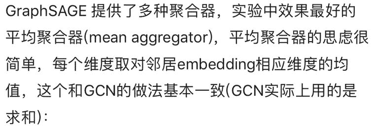 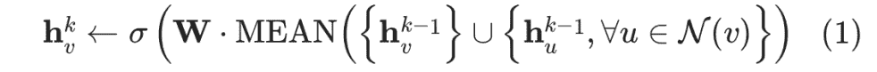 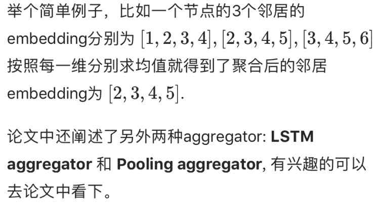

**  4. 参数学习**

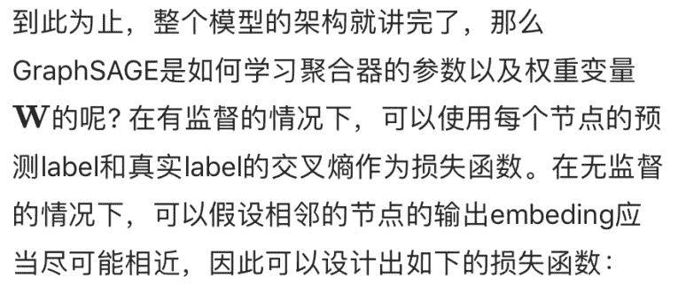 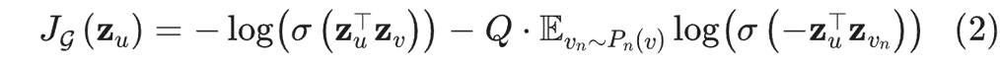 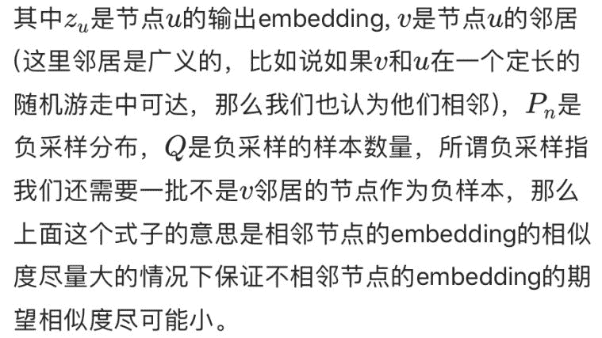

**后话**

GraphSAGE采用了采样的机制，克服了GCN训练时内存和显存上的限制，使得图模型可以应用到大规模的图结构数据中，是目前几乎所有工业上图模型的雏形。然而，每个节点这么多邻居，采样能否考虑到邻居的相对重要性呢，或者我们在聚合计算中能否考虑到邻居的相对重要性? 这个问题在我们的下一篇博文Graph Attentioin Networks中做了详细的讨论。

