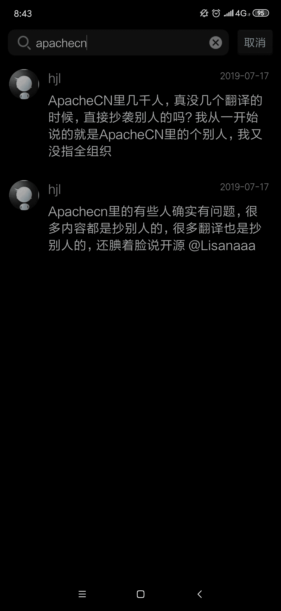

某一天，我（飞龙）在知乎上看到了这个问题：[如何评价 ApacheCN ？](https://www.zhihu.com/question/277595622)。

当然，在一片好评之后，我看到了某个唯一的[为黑而黑的答案](https://www.zhihu.com/question/277595622/answer/764137928)。大家都知道，前段时间有些人妄图将我们的内容商业化，更可恶的是，还删除了开源社区中的备份，这严重损害了开源社区的利益，是一种挑衅。

有些利益相关者就坐不住了，如丧考妣，非得借此机会黑一把，然后他们还非得当缩头王八，搞个匿名回答。下面是回答的摘录以及我本人对他的回应。

> 而外国人看不懂中文又懒得搞跨国维权，所以他们有理由说“这不是侵权”，言论荒诞，可以推测，他们的团队内部是没有靠谱的法律人士的。国内大部分人也是知识产权法盲，不知道作品是有翻译权的，整个环境还在过渡阶段。如果 ApacheCN 的人明知道这是违法行为，却依旧这样做，那真没话说了…

我们永远秉持着一个观点，除非原作者跳出来反对，任何第三方都没资格说侵权。侵权不侵权永远是自诉的，只有原作者可以判断。你一个局外人瞎逼逼啥？

> ApacheCN 的初始定位是开源翻译，初心挺好的，但是没有专业团队运作，能坚持下去吗？

我们相信增长黑客的原则，判断运营专不专业，看的是数据而不是行为。如果你整天喷人能把流量喷上来，你就是比那些装模作样的运营专业。那么多看似专业的团队都嗝屁了，我们还活得好好的。

> 至于目前嘛，估计要开始走流量营销的道路了，公关也开始搞，就是手段有些嫩。

我们的宣传策略源自我自己在苍海国际的积累，以及 88250 运营黑客派的实践，并且根据数据来看是有效的。有本事你也搞一个啊，光在那儿酸有什么意思？

> 初学者入门的时候看看文档玩玩可以，想要深入的话还是学好英语吧。

事实证明如果一个技术没有足够的中文资料，就永远不能在中国扎根。如果中国的 AI 发展不起来，我们怎么办？都去当美帝的走狗？我们懂这些深入的东西，我们想把它在中国普及，让一般的开发者也能享用，挖你祖坟了？

> 真的以为学历和专业素养不重要吗，想法很纯粹从别的层面来看是不是读书读少了呢？多读书能更快地认清自己的能力。

我就是学历比你 NB，编程比你 NB，搞 AI 比你 NB，搞运营比你 NB，装逼还比你 NB。你一个大专毕业就工作的 LOSER 瞎逼逼啥？

* * *

无独有偶，在 Leetcode 群里面也看到了这样的人。

我就不 DISS 了，大家自己看着解（si）决（bi）吧。