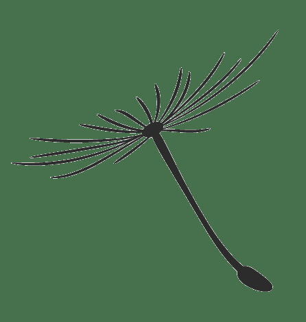
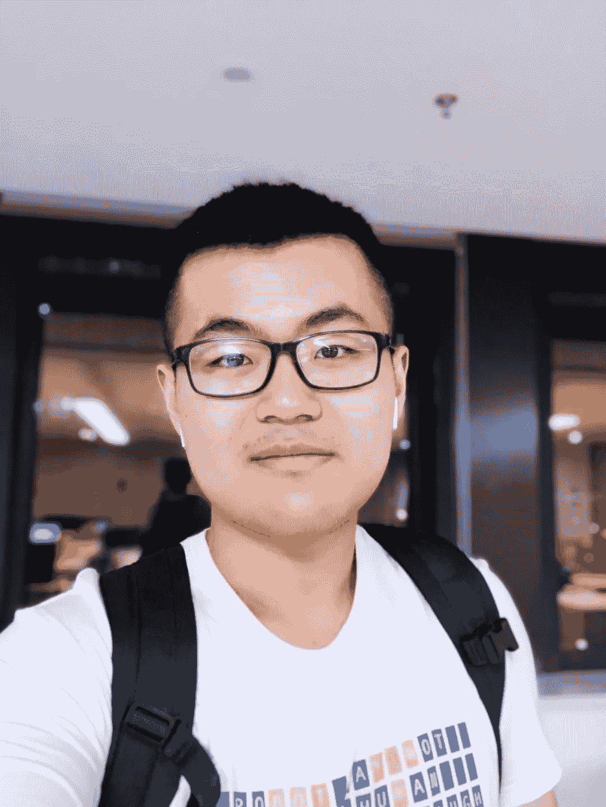
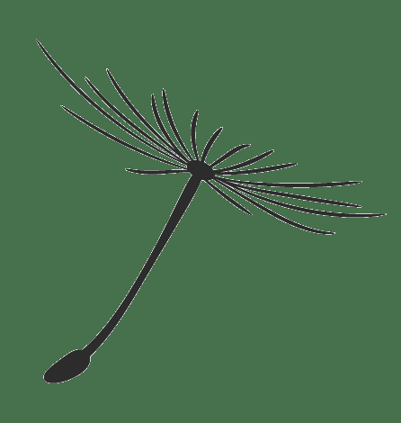
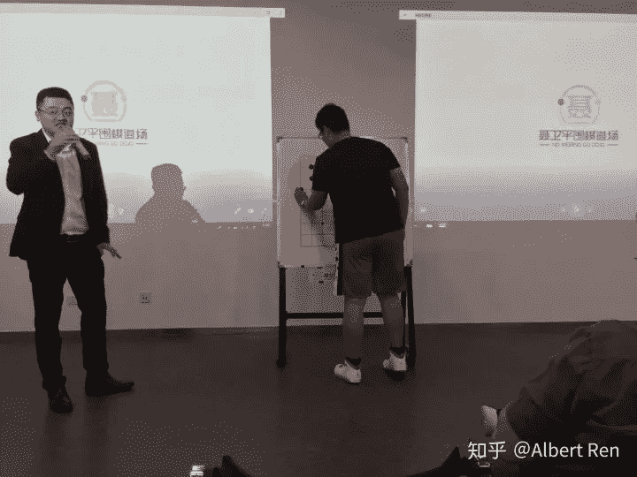
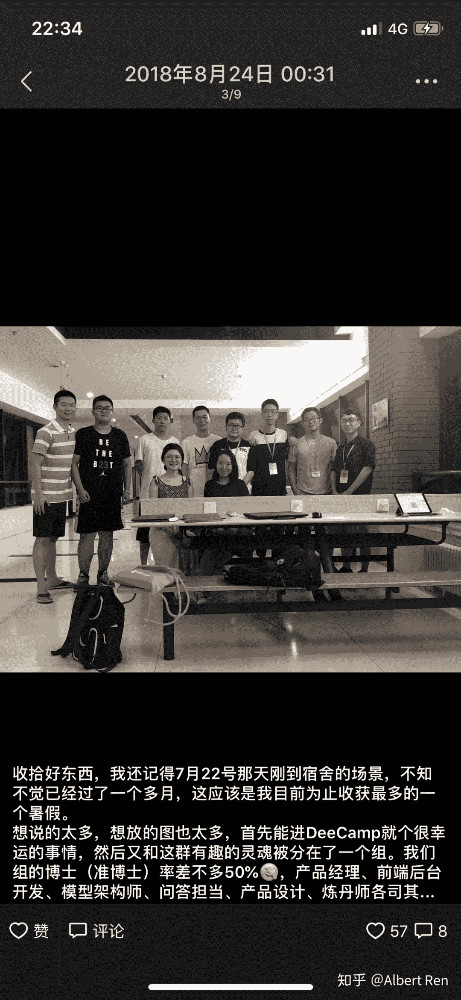
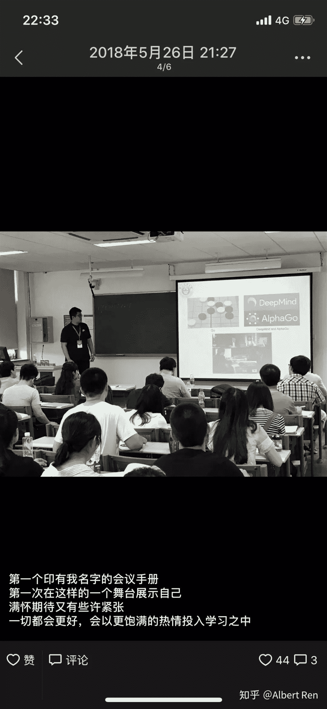
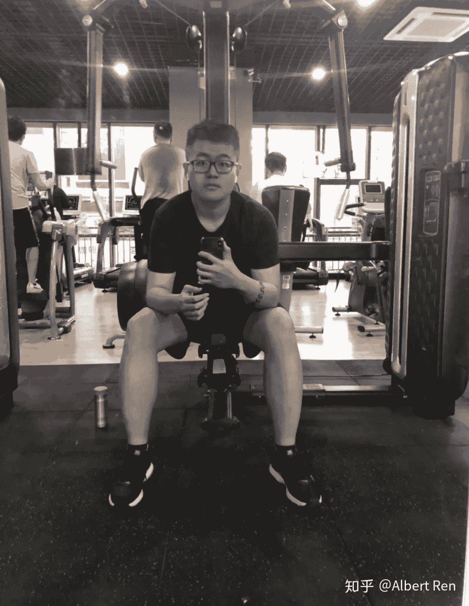

大学的意义是什么，大学之路该如何走，我相信每个人都有不同的答案。有人会勤勤恳恳过四年，有人会洋洋洒洒过四年，有人会浑浑噩噩过四年，这都由你说了算。但未来之路在哪里，很大程度由这四年铺垫而成。

在这四年，无论我们在怎样的高校，怎样的专业，无论我们被贴上怎样的标签，正如电影哪吒里面的经典台词，“如果你问我，人能否改变自己的命运，我也不晓得，但是不认命，就是哪吒的命。”**在不满意的院校或者专业，能不能找到满意的工作或者进入理想中的专业或研究生院校，我也不晓得，但是不认命，是改变的开始。**

Albert Ren

Datawhale 团队成员，本科毕业于南京农业大学，19年9月以免试排名专业第一的身份，保送至东南大学，曾被表彰为江苏省省级三好学生，入选教育部、北京大学、创新工场主办的中国高校人工智能人才国际培养计划。

本科期间担任南京农业大学工学院大数据实验室本科生负责人、机器学习组组长，曾赴美参加International Genetically Engineered Machine Competition并获得Gold Medal，曾于中国R会议（北京）等作主题报告。此外先后参与国内多个知名实验室的研究工作，目前有一篇EI论文录用，另有一篇EI论文和SCI论文在审。

明天就回学校做毕业设计了，大学已去1266天，还有114天毕业，今天刷知乎刷到这个问题很应景，再想到之前很多前辈写下的“博士这五年”，以及前几天很火的《许下我第一千零一个梦想》，于是写下点什么给自己留点回忆，抑或者让后来者少走点弯路吧，余下部分将先回顾我的1266天，而后写些我的感想吧。

开始的开始       

过多的历史暂不陈述，仅用几句话概括，从小到大的升学考试还算顺利，皆升学至当地最好的学校，奈何高中并没有领悟到学习的真谛，亦无脚踏实地，竞赛成绩和学习成绩皆不理想。即便高考前的成绩逐步上升，2015年那年高考在数学上出了点小意外，至此仍记得第18题的答案是“正负1”，这便也是一切的开端，尤其是这1266天奇妙旅程的开端。每次思考人生，我都感谢高考，虽然出现了一些小意外，但是仍让我有机会从江苏高考中杀出，没有这些经历也就没有现在的我，让我看清很多很多。

2015-2016 最初的梦想       

2015年9月，**我怀揣着梦想来到了这所以农学与生命科学而闻名的学校，读的却是电子信息科学与技术专业**，略有沮丧的是我未来4年生活、学习的地方在分校区，和想象中的大学校园略有一点不同，但是后来回想起来却是另一番感受，麻雀虽小，但五脏俱全。

在高考后的那个暑假，我也加了新生群并在群里认识了一些学长学姐，其中包括我后来的师父以及影响我后来人生轨迹的其他学长学姐们。在这里，我简单讲下我的师父，我师父是本专业大我两届的学长，是嵌入式物联网创新工作室的前技术总监，以及我校大数据实验室的本科生负责人（后来这两个title就变成我的啦），他在竞赛、科研上给予我很多的指引与启迪。

在我师父和其他学长学姐的安利下，或许也和我从小对科技的热爱有很大关系，往往别的男孩子对奥特曼、数码宝贝之类非常有兴趣，但我通常会选择诸如《我爱发明》之类的节目，或者开始拆自己的玩具——遥控汽车、玩具手枪。我经过选拔进入了嵌入式协会，也就是现在的嵌入式物联网创新工作室，在那个时候我就许下心愿——一定要在大三成为工作室的技术总监，也许这就是我最初的梦想吧。

大一的生活也没有太多起起伏伏，在嵌入式协会提前学习了C语言、单片机，在业余时间参加了武术协会拳击队的训练。大一的那个暑假，我选择留校一个月，作为我校第一个大一参加电设的同学和学长一起参加了江苏省电子设计大赛，虽然与奖项擦肩而过，但在那段头脑风暴中我献出第一次通宵，猛然间转过头，却发现黑夜已是白昼，纵然40小时只睡了三四小时，却毫无困意。还是那个暑假，我和大数据实验室有了第一次邂逅。

这一年，我还通过四六级、全国计算机二级、江苏省计算机二级，但是丝毫没有意识到GPA的重要性，只取得了一些中规中矩的成绩，GPA在全专业中位列第七。对了，还是在这一年，我在职业生涯规划课的作业中写下了这样的话：

> “未来的我目标清晰明确，以出色、令人满意的成绩完成本科阶段的学习，了解熟悉专业相关软硬件的使用，提前进行相关的科研工作和实验，争取成为国内顶尖大学的硕士研究生，在博士研究生阶段能够有机会出国继续深造，学成归来在国内的科研机构或者高校从事相关的科研工作，成为一名充满热血的科研工作者。 虽然我才大一，但是我早已规划好我的未来，坚定决心，看清未来的道路，我对科学的热情和对事情的执着与坚持，让我对我的职业选择无怨无悔，并将坚持到底，为科学事业奋斗终生！ ”
> “我又一次思考了我的人生，树立了人生目标，制定了切实可行的职业生涯规划方案，并且将有机会在展示的过程中不断改善。 实践未始，计划先行，也许有很多人会质疑它，会嘲笑嘲讽它，也许会认为我不能走到那个高度，但不管怎样，我会在梦想的道路上继续走下去，在困难面前永不言弃，最终实现目标，成为领域里的专家，为母校争光，造福人类。 ”

2016-2017 重生与转折       

大二，我如愿以偿成为大数据实验室的成员，同组的除了我都是三年级的学长们，加的组呢，是硬件组。不知道是什么缘故，大二上学期我总是心不在焉，上课也不好好听，可能是沉浸在第一取得尚且的成绩，大二上的期末考试给了我一个下马威，这一学期的成绩很差很差，我的排名直降，GPA掉了0.06。下学期吸取经验，悬崖勒马不至于让自己很难堪罢了，耳边总响着父母或者老师的声音，当然是说我的GPA。

我觉得2016-2017改变我的有三件事情，一件事情是我寒假“误入”将门创投的技术群或者叫学术群，让我一个曾准备投身于电子或者通信事业的人发现了新大陆——人工智能，虽然起初我不太懂，就逼着自己听了几期talk，然后又看了吴军老师的《数学之美》、《智能时代》，“原来世界上还有这么有意思的东西”，再加上AlphaGo战胜李世石（说来也巧，后来在18年暑假，我还见到了樊麾老师，这是我的背影了），一颗种子在我心中萌芽了。

第二件事情就是THU数据派在17年五月份看到我在公众号的留言，给我一张机器之心主办的全球机器智能峰会的门票，再加上实验室老师的支持，我一个人来到了北京，那次我开玩笑道”这是我目前距离人工智能顶级专家最近的一次“。在那次峰会上，我见到了前微软人工智能首席科学家邓力博士、前谷歌云总裁李佳博士、港科大的杨强老师等诸位大佬，并还曾与邓力博士擦肩而过。在北京的日子，还偶然看到了中科院自动化所，再次朝圣了清华大学。

第三件事情就是偶尔机会认识了国内知识图谱圈一位比较出名的老师，在参加过相关训练营后被留下来参与了一些关于知识图谱、问答系统的项目，这应该是我第一次参与一个实际的人工智能项目，受益匪浅。在这之前，老师还要求我照着书打了一遍《机器学习实战》的代码，后来我回到本校的实验室，这也成了我给学弟学妹的建议。

2017-2018 爆发       

索性我将这一年成为收获的一年，上一年被GPA的问题一直困扰，而且这一年学习的都是专业课，我还记得在期末考试前的那个月，我要复习完8门课，那段时间的压力真的大到吓人，我每天都要和好友或者父母打电话倾诉以缓解压力，尤其要感谢我的母亲，感谢她不厌其烦听我倾诉，这一年我完成了一个大逆转，在这一年的专业课中大多数课取得了95+，甚至还回答了一个著名问题——到底是脱单难还是考满分难（显然前者难啊），这一年的排名1/110。还记得那段时间，除了洗澡、吃饭等，我几乎全部待在实验室，那一个月都没有出过校门（我平时隔几天可能就要出去逛一下），还记得那个和期末复习一起的跨年夜。

这一年，我参加了一个国际性赛事，我们团队利用合成生物学去解决小麦赤霉病，我的任务就是将机器学习技术用于小麦赤霉病的检测，顺带我还用词云分析了“小麦赤霉病”在一些语料中的相关词、相似词，为我们HP的宣传提供一些建议。那是我第一次出国，要去大洋彼岸的波士顿，还记得那个赛后的冬日午后，外面下着雨夹雪，途径查尔斯河，一直走到MIT和Harvard，希望以后有机会还可以再来。关于本次比赛的具体情况，可以移步我在博客上写下的博文——忆——2017 International Genetically Engineered Machine Competition。在这里，我尤其要感谢我们队长给我参与这项赛事的机会，并给予我的信任与支持@Chenrui，十分感谢。

还是在这一年，我入选了教育部、北京大学、创新工场主办的中国高校人工智能人才国际培养计划，在美丽的燕园度过了7月和8月，看到了真的李开复老师，听了各路大佬的talk，受益匪浅，周围的小伙伴都非常优秀，我也不知道我是怎么从7000人中成为最后选上的300人。在实践环节，我负责我们组的问答系统，得益于去年暑假关于知识图谱、问答系统的相关实习，在有限的时间里搭建了一个看起来还蛮智(zhi)能(zhang)的农业问答系统。

还有一件有意思的事情，我曾经大二想要参加统计之都主办的中国R会议，这个会议应该在国内统计圈还比较出名，当时已经准备去杭州了，但是学校有点事情，就没有去。大三我准备了一个关于“AI in Agriculture”的talk，本来要去的论坛临时去不了，我索性就将不到100页的keynote投到了R会，经历一番过程之后，我成了那个会议的演讲嘉宾，在统计之都主办、北京大学光华管理学院和中国人民大学统计学院承办的R会上做了一个关于农业人工智能的报告，紧张与激动并存。

2018-2019 最后的最后       

当9月，固然是一个收获的季节，在这个秋天我以专业第一的综合排名拿到了本校的免试攻读研究生资格，如愿以偿被录取到同城的一所双一流大学的双一流学科继续攻读研究生，跟着学术水平极高的老师，继续从事计算机视觉相关的研究工作，未来我应该也会继续去读博，去实现我造福世界的梦想。

到了这里，我在2018-2019的故事还没有结束，我应该是一个偏执狂，从10月起的4个月里，我合理调整饮食、积极进行各类无氧、有氧运动，体重也差不多少了20kg，未来我应该会继续运动，“每天运动一小时，为祖国健康工作60年”吧。

接下来，神奇的事情发生了——小豆豆在领地竞争中，战胜了第三名，第二名……甚至第一名。

写在最后       

从2015年9月7号至今的1266天，荣获了江苏省三好学生在内的校级及以上表彰9项、国际基因工程机械大赛金奖在内的省级及以上科技竞赛奖项14项；曾任嵌入式物联网创新工作室技术总监，从大数据实验室的硬件组成员到机器学习组组长再到如今的本科生负责人；因公出差南至深圳、北至哈尔滨、最远至波士顿；减重20kg，从一跑就喘到能够一次性跑完13公里；也认识很多优秀优秀的小伙伴们；并且我相信我的一切还未结束。

1266天前，我绝对想不到现在的我是这样的，这也许就是时间给我的答案。我的经历也许远没有那些大佬丰富多彩，也许课程难度、比赛含金量可能有人存疑，但至少给我带来的一丝丝感动。这些日子里，我经历了酸甜苦辣，其中的滋味只有自己知道：在波士顿，没有倒时差，每天只睡三四个小时，彻夜准备presentation，回国生病一个月有余；无论刮风下雪，在实验室度过一个个漫长黑夜，这些场景太多太多，偶尔回想起来这一切一切都如电影般在脑中重现，希望未来一切安好，我也可以实现我的第一千零一个愿望。

借用清华特奖韩衍隽大神的一句话结束这篇文章，希望自己未来可以仰望星空、脚踏实地：

> 自强 不息、奋斗不止，努力成为钱学森先生所描述的大师级人才，通过基础研究探索人类认知的极限，并将理论用以实践来解决人类文明与国计民生的基本问题。

