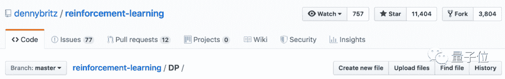
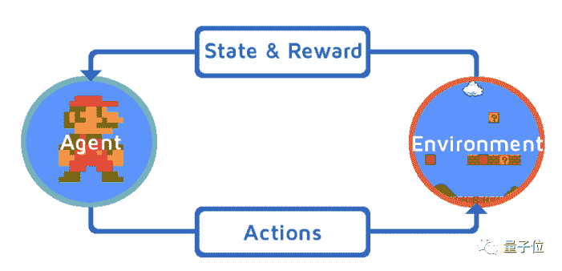
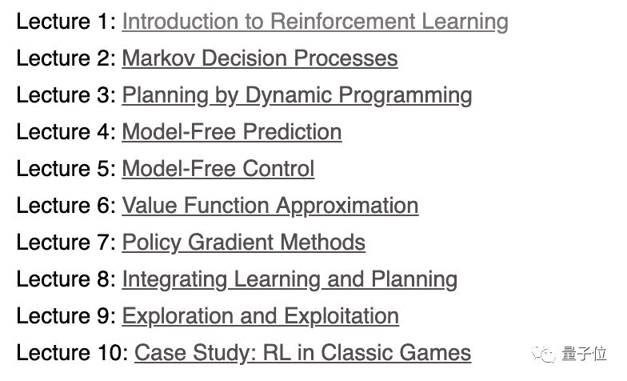
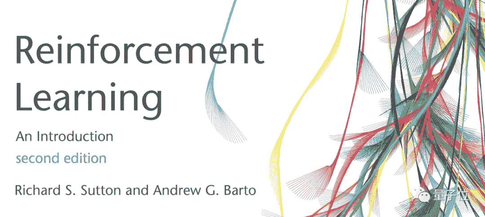
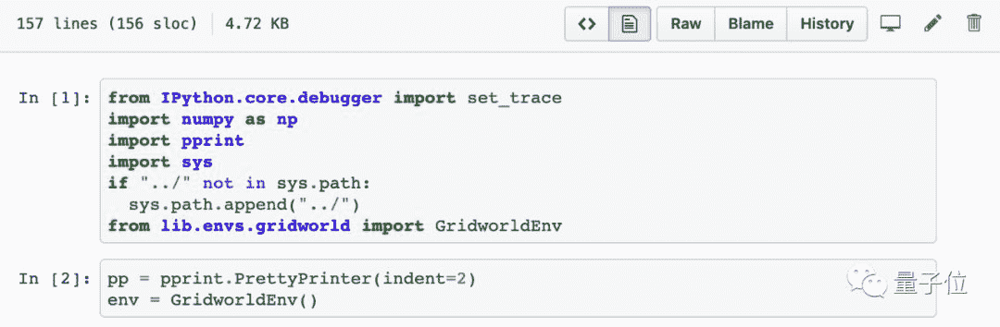
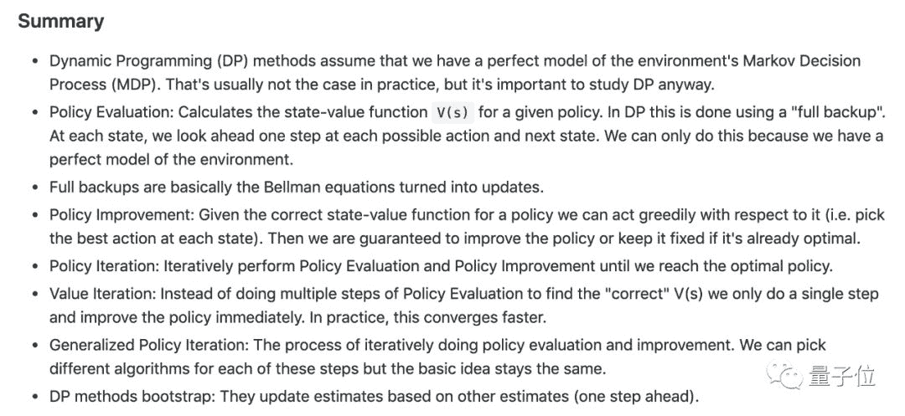
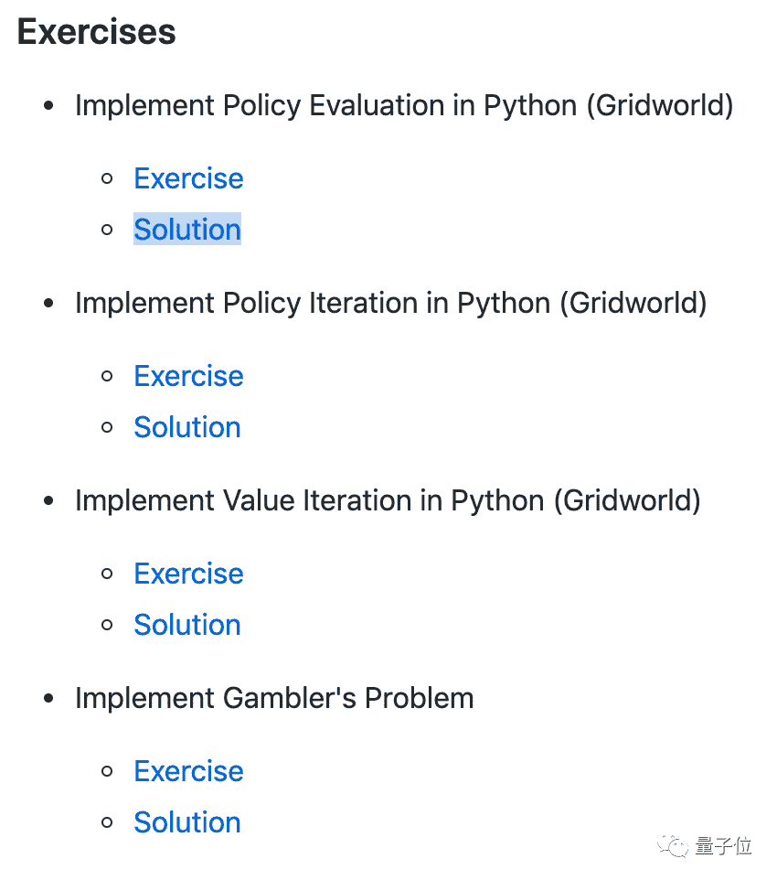
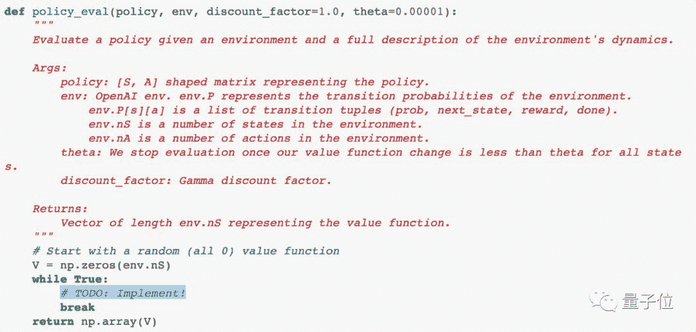
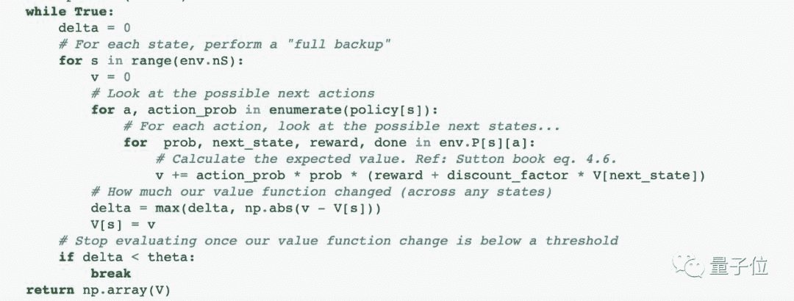

点击上方“**Datawhal****e**”，选择“星标”公众号

第一时间获取价值内容

##### 鱼羊 发自 凹非寺 
量子位 报道 | 公众号 QbitAI

自从有了强化学习（RL），AI上能星际争霸，下能雅达利称王，让内行人沉醉，让外行人惊奇。

这里恰有一份标星过万的强化学习资源，既有教程推荐，又有配套练习，网友学了都说好，并且还在实时更新。

入学要求并不高，只需要一些基础的数学和机器学习知识。

## 清晰的学习路径

想要入门强化学习，一份优质的课程必不可少。

强化学习资源千千万，项目作者 Denny Britz 大力推荐这两个：

**David Silver 的强化学习课程**：
http://www0.cs.ucl.ac.uk/staff/d.silver/web/Teaching.html

以及 **Richard Sutton 和 Andrew Barto的《强化学习：****简介（第二版）》**：
http://incompleteideas.net/book/RLbook2018.pdf

*p.s. 实测无需魔法*

Denny Britz 小哥表示，这两本书几乎涵盖了入门强化学习需要了解的大部分研究论文，基础决定高度，理论知识还是要扎扎实实学起来。

理论有了，可书里并没有算法实现。

别担心，帮人帮到底，送佛送到西，Denny Britz 亲自动手，用 Python，OpenAI Gym 和 Tensorflow 实现了大多数标准强化算法，并把它们都共享了出来，方便大家配合教材食用。

简直太贴心。

在这份万星资源里，每个文件夹都对应着教材的一个或多个章节。除了练习和解决方案之外，每个文件夹下还包含了一系列学习目标，基础概念摘要，以及相关链接。

以**基于模型的强化学习：使用动态规划的策略迭代和值迭代**这一章为例。

这一章配套的是 David Silver RL课程的第三讲，动态编程规划。

首先是学习目标：

*   了解策略评估和策略改进之间的区别，以及这些流程如何相互作用

*   理解策略迭代算法

*   理解值迭代算法

*   了解动态规划方法的局限性

设定好学习目标，这份教程还替你划了重点概念。

最后，奉上实战演练。

大框架已经搭好，只需专注重点思考如何填空：

文后附标准答案：

## 实现算法列表

这份教程现在涵盖了以下算法实现。

*   动态规划策略评估

*   动态规划策略迭代

*   动态规划值迭代

*   蒙特卡洛预测

*   Epslion-Greedy 策略的蒙特卡洛控制

*   具有重要性抽样的蒙特卡洛非策略控制

*   SARSA（策略 TD 学习）

*   Q学习（非策略 TD 学习）

*   线性函数逼近的Q学习

*   雅达利游戏的深度Q学习

*   雅达利游戏的双重深度Q学习

*   优先经验回放的深度Q学习（施工中）

*   策略梯度：基线强化

*   策略梯度：基线Actor-Critic 算法

*   策略梯度：具有连续动作空间的基线 Actor-Critic 算法

*   连续动作空间的确定性策略梯度（施工中）

*   DDPG（施工中）

*   异步优势 Actor-Critic 算法（A3C）

学习路径如此清晰，这样的优质资源，不Mark一下吗？

**GitHub地址**：
https://github.com/dennybritz/reinforcement-learning

点击阅读原文，进入项目