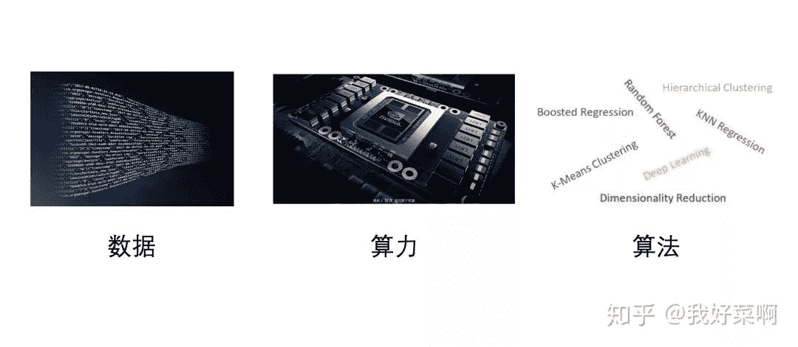
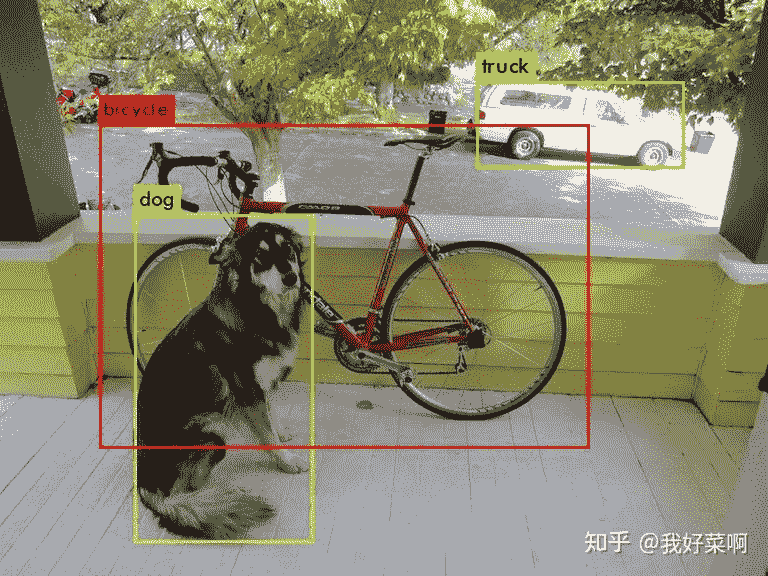
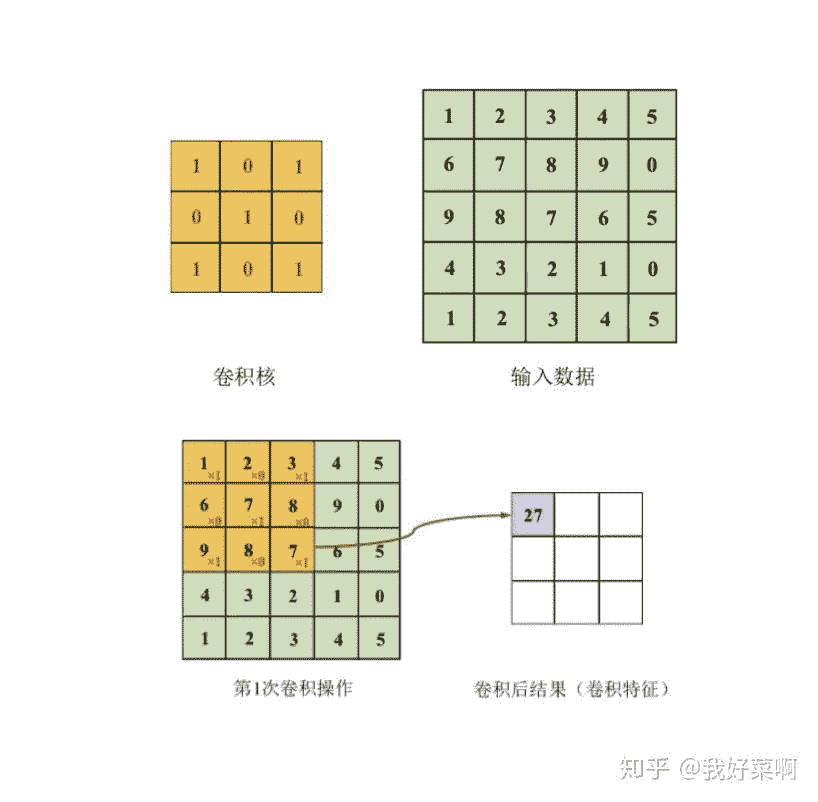

点击上方“**Datawhal****e**”，选择“星标”公众号

第一时间获取价值内容

> 《解析卷积神经网络》是  @魏秀参  博士撰写的深度学习实践手册，主要以卷积神经网络为主体，可以在魏博士个人主页获取电子版或者在文末下载，解析卷积神经网络——深度学习实践手册 [1]，基本涵盖了卷积神经网络的基础概念、实践操作等，内容也不多，平时看看复习一下也不错，这篇文章的目的是为方便大家快速学习和复习所用，同时也便于之后在这个基础上丰富卷积神经网络相关知识。下面的内容，一部分将以自己的口吻描述，也有一部分参考了原文。

**深度学习的前世今生**

实际上深度学习，只是机器学习的一个子领域，同样地，机器学习也是人工智能的一个子领域。但是随着深度学习的发展，尤其是在AlphaGo那场世纪大战之后，深度学习渐渐地脱离于机器学习，人们口中的“机器学习”逐渐地成了传统机器学习，即不包含深度学习的那部分。与此同时，机器学习、深度学习同时也是计算机视觉、自然语言处理、语音识别的工具，上述领域的关系相辅相成，不能割裂地看待。

深度学习，尤其指的是人工神经网络，其实早在上个世纪就存在，而不是最近几年的产物（深度学习不一定指深度神经网络，其他的形式还有深度森林等模型）。1948 年，诺伯特·维纳发表了著名的《控制论——关于在动物和机器中控制和通讯的科学》，这是非常经典的巨作之一，其他还有《信息论》、《博弈论》等。控制论的出现，提出了一些简单的线性模型，但是这些简单模型无法处理异或问题，并且那个年代的计算力有限，神经网络的研究进入寒冬。1986年，Rumelhart, D. E., Hinton, G. E.等人提出了Learning internal representations by error propagation [2]，用于解决神经网络的复杂计算量问题，并且可以使用神经网络计算异或问题。深度学习在十九世纪八十年代迎来了第二个春天，但是硬件设备不足，无法提供足够算力，同时传统机器学习算法的不断发展，使得深度学习再次迎来寒冬。

本世纪初，随着各种智能设备的出现，数据获取变得非常简单，与此同时硬件也不断发展，高性能计算机、图形处理器等也加速了其发展。2012年，在计算机视觉领域权威赛事ImageNet挑战赛上AlexNet强势夺冠；2015年，ResNet在视觉分类任务上超越人类水平。除此以外，算法也得到不断发展，从朴素神经网络到卷积神经网络、循环神经网络、对抗生成网络、图神经网络，也发生了翻天覆地的变化，这也离不开深度学习三雄Hinton、LeCun、Bengio等前辈在领域的不断深耕，深度学习也迎来了第三个春天。

*   1940s - 1960s，控制论等的出现，但仍然无法解决异或问题、计算力问题等；

*   1980s - 1990s，反向传播算法的出现，连接主义的兴起，异或问题得到解决，但是数据获取困难，硬件受限，深度学习本身是个黑箱问题，同时传统机器学习算法不断发展；

*   2000s - 至今，随着数据、算力、算法的不断发展，深度学习在多项任务上的性能先后超越人类；

深度学习有一个比较重要的思想——“end-to-end”，中文译为“端到端”，这是深度学习区别于其他机器学习算法的一个方面。传统的机器学习，一般使用特征工程以及特定某个问题涉及的机器学习算法。使用手工设计的特征，如计算机领域经典的一些算子（全局特征算子、局部特征算子，常见描述局部特征的算子有SIFT、PCA-SIFT、SURF、HOG等，可以参考这篇文章A performance evaluation of local descriptors [3]），对这些特征加以选择、降维等，再针对某个特定问题选择或者设计一个机器学习算法。难免会出现以下两个问题：

*   针对每个问题，都需要选择或者设计新的特征以及机器学习算法，这样的代价比较大。

*   在机器学习问题中，经常使用分治法，将一个问题分成若干子问题，针对每个子问题分别解决，但是每个子问题的最优解，未必会在整体问题上具有最优解。

深度学习通过端到端的学习自动学习特征，而不再需要手工提取的特征，能够学到更加适合任务的表示，可见深度学习其实也是表示学习的一种方式。区别于之前的离散式表示（比如对一个图像使用特征描述算子提取特征，使用词袋模型表示这个图像），深度学习更多的是分布式表示（distributed representation），这里指：

> 语义概念（concept）到神经元（neuron）的一个多对多映射，即每个语义概念由许多分布在不同神经元中被激活的模式表示； 而每个神经元又可以参与许多不同语义概念的表示中去。

上述内容也就凸显出深度学习在这些方面的必要性，但是同样地深度学习也具有一些问题，比如一直被人诟病的解释性问题或者叫黑盒问题，以及在实际训练过程中如何让网络快速收敛并且达到实际之初的期望等。

**卷积神经网络那些事**

1958年，加拿大神经科学家Hubel与Wiesel在猫视觉皮层实验中，详细描述了发现视觉皮层的简单细胞，观察到视觉初级皮层的神经元对移动的边缘刺激敏感，提出了猫视觉皮层的感受野（receptive field）等，为后续视觉神经研究奠定了重要的基础。1980前后，日本科学家Kunihiko Fukushima提出神经认知模型，在该单元中最重要的两类细胞是，“S型细胞”（用于抽取局部特征）和“C型细胞”（用于抽象和容错），与如今的卷积层和池化层有异曲同工之妙。此后，先后诞生了一系列非常经典的卷积神经网络结构，如*LeNet、AlexNet、VGG、GoogLeNet、Network in Network、Resnet、SENet、SKNet**等*，以及轻量级的结构，如*S**huffleNet系列、MobileNet系列*等。甚至在今天，可以使用NAS（网络结构搜索）去让计算机自己“设计”一个性能极佳的神经网络。与此同时，卷积神经网络也被广泛应用于各类任务中，尤其是视觉相关的诸多任务，如目标检测（*RCNN系列、YOLO系列、Anchor-Free系列**等*）、目标追踪（*Siamese系列**等*）、人体姿态估计（*OpenPose、AlphaPose**等*）等。

*目标检测，Darknet Demo*

卷积神经网络实际上是层次模型（hierarchical model），原始输出通常经过卷积操作、池化操作和非线性激活函数映射等的层层组合（2012年ImageNet视觉挑战赛获胜网络AlexNet本质上，与上个世纪九十年代左右的LeNet其实没有太大差别）。原始数据一层层经过网络，逐渐抽取出低层特征，直至高级语义特征，这一过程为前馈运算；网络根据前馈运算的结果，与真实结果之间的误差，通过反向传播算法由最后一层逐渐向前反馈，更新模型的参数；在更新参数的模型上进行再次前馈运算，重复上述步骤，直至整个网络模型收敛。一般地，前馈运算指对样本进行推理或者预测，反馈运算指预测误差反向传播更新参数。

**卷积操作**

卷积本质上就是矩阵和矩阵之间的对应元素相乘，再加结果求和的过程，二维情况可以参考下图，三维情况类似，如果输入数据深度为3，对应的卷积核深度也为3，仍然是对应位置的元素相加再求和。对于卷积操作，需要选择的是卷积核大小（kernel size）、卷积步长（stride）、填充（padding，通常填充0）经过卷积操作后的特征图尺寸（F表示输入大小，K表示卷积核大小，P表示填充，S表示步长，⌊⌋表示向下取整）：

实际上卷积核传统数字图像处理中各类滤波器非常像，只是卷积神经网络中的卷积核参数是通过网络学习得到的，通常在浅层的卷积核对边缘等敏感，而高层的卷积核对高级特征敏感。除常规卷积外，还有一些特殊的卷积，比如空洞卷积、可变形卷积、转置卷积等，这里便不再一一赘述，后续会写一个系列文章，分别来详细叙述深度学习各部分以及相关实践。

**池化操作**

池化，又可以称作汇合，英文pooling，本质是一种降采样，具有特征不变性、特征降维、防止过拟合等作用，一般是均值池化（average pooling）和最大池化（max pooling）。对于均值池化，池化操作的核大小区域内的值平均后，代替原区域，如2*2的区域内有 2，1，3，6，均值池化后该区域就变成只有一个值3；对于最大值池化，则是选取池化操作的核大小区域内的最大值，代替原区域，上述例子中结果为6。

**激活函数**

如果没有激活函数，或者称为非线性映射，整个网络缺失非线性，再多层的堆叠，其本质仍然是线性的。从生物角度来看，神经元获得的信号输入积累大于某一阈值后，神经元才会被激活，激活函数从某种程度上讲，与此也有异曲同工之妙。常见的激活函数有Sigmoid、tanh、ReLU（参数化ReLU、随机ReLU、leaky ReLU等），Sigmoid与tanh容易发生饱和区，容易造成梯度消失，同时Sigmoid的值域被压到[0, 1]。

此外，由于一些模型参数比较多，需要的算力比较大，由此也衍生了一个研究热点：模型压缩。目前很多嵌入式设备上需要搭载深度学习模型，需要更轻量化的结构。同时，很多深度学习过参数化，存在着冗余，但是该冗余又十分有必要：*深度神经网络要解决的是一个很复杂的非凸优化问题，参数上的冗余保证了网络能够收敛到比较好的最优值。*目前存在的一些办法有：

*   知识蒸馏、紧凑的网络设计、滤波器层面的剪枝（如何衡量滤波器的重要性以确定剪枝对象）等

*   低秩近似（稠密矩阵能够由若干低秩小矩阵近似重构）、未加限制的剪枝、参数量化（使用聚类中心的权重代替原有权重或使用哈希）、二值网络（参数量化的极端情况，如何二值化权重？如何传递梯度？）等

**卷积神经网路之纸上得来终觉浅**

在真实场景下，训练一个好的深度学习模型，掌握上述内容往往是不够的，还有一些实践的知识需要了解。

**数据增广与不平衡样本处理**

对数据简单进行数据增广，比如水平翻转、随机截取、尺度变换、旋转等；同时，可对颜色等进行改变从而增加数据，比如颜色抖动，改变RGB或者HSV空间的值。特殊地，如AlexNet中使用Fancy PCA，或者针对不同的任务有不同的增广方式，如目标检测领域还涉及到检测框，可以参见之前的一篇文章，谷歌使用数据增广策略在目标检测任务上达到SOTA [4]。

对于不平衡样本，需要从数据、算法两个层面解决。

*   数据层面：数据重采样（上采样，复制或者数据扩充使得样本少类与样本最多的类一致；下采样，比如在每个batch中保证正负比例相等）、类别平衡采样（将样本归类，将所有类扩充到与样本最多的类一致后随机打乱，方法与数据重采样中的上采样类似）

*   算法层面：代价敏感

**模型集成**

*   数据层面：测试阶段数据增广（对同一张图像增广成n张，将n张输入模型得到n个结果进行集成）、简易集成法

*   模型层面：单模型集成（多层特征融合，将多层特征融合；网络快照法）、多模型集成（多模型生成，同一模型不同初始化、同一模型不同训练轮数、不同目标函数、不同网络结构；多模型集成，直接平均、加权平均、投票法、堆叠法（将集成结果作为新的特征训练另一个模型，这里的模型可以是神经网络，也可以是传统机器学习方法））

**网格参数初始化**

*   全零初始化，但是当全零初始化时，导致网络输出全部相同，梯度更新完全相同，模型无法训练

*   随机初始化，在实际应用，通常将随机参数服从均匀分布或者高斯分布，具体的由Xavier方法等

**激活函数**

上述内容已经叙述，这里不再赘述

**目标函数**（损失函数，个人认为非常重要）

*   分类任务：交叉熵损失函数（常用目标函数）合页损失函数、坡道损失函数、中心损失函数

*   回归任务：L1损失函数、L2损失函数

网络正则化（保证范化能力的同时，避免过拟合）

*   L2正则化（在机器学习中被称为岭回归）、L1正则化（相比于L2，能够产生更稀疏的参数）、Elastic网络正则化（L1和L2按比例混合）

*   随机失活，注意训练阶段和测试阶段的区别，需要乘系数

*   增加训练数据，使用更多的数据扩充方式

*   加入随机噪声

**超参数设定与网络训练**

*   超参数设定：输入数据像素大小、卷积层参数设定（卷积核大小、卷积操作的步长、卷积核个数；通常卷积核大小为奇数，一般推荐为3、5；卷积核个数一般为2的次幂）、池化层参数设定

*   网络训练：在每轮训练前将训练集顺序打乱（参考依据：信息论中从不相似的事件中学习总是比从相似事件中学习更具信息量）、学习率设定（初始不宜过大，后续需要减缓）、是否使用Batch Normalization、优化算法的选择（SGD、基于动量的SGD、Nesterov、Adagrad、Adadelta、RMSProp、Adam等）

**一些术语**

epoch、batch与batch size：遍历用于训练的数据集（训练集）一次，称为一轮，one epoch。在反馈运算中，经常使用的是梯度下降算法，但是进行一次梯度下降算法需要遍历整个训练集，在训练集比较庞大的时候，代价很高，之后就有随机梯度下降，每次只使用一个样本后更新参数；批处理的随机梯度下降，每次遍历一批（batch）样本后更新参数，每批（batch）的样本数量即为batch size。假设有一个训练集，有160000个样本，假设batch size为32，训练10000个batch之后，训练的样本数为320000，相当于2个epoch。

**下载地址**

https://t.zsxq.com/IiYzNNF

*参考链接：*

[1] http://www.weixiushen.com/book/CNN_book_small.pdf

[2] http://www.cs.toronto.edu/~hinton/absps/pdp8.pdf

[3] http://www.ai.mit.edu/courses/6.891/handouts/mikolajczyk_cvpr2003.pdf

[4] https://zhuanlan.zhihu.com/p/76446741

[5] https://www.cnblogs.com/duinduin/archive/2013/03/29/hubelwiesel.html

