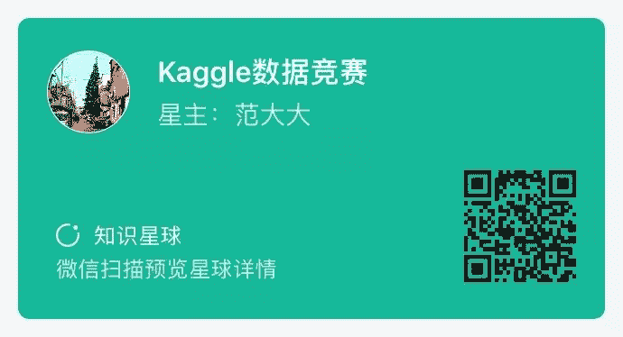

做技术怎么快速提升？能够拿公司实际生产运营中的项目提升自己的能力固然是好，但如果接触不到优质的项目，又该怎么办呢？

项目不够，比赛来凑的说法相信大家都不陌生。有的人会说：道理我都懂，但我仍然打不好比赛。这其中常见的问题有：

1.  比赛平台众多，比赛涉及领域也相当广泛，我应该挑选哪个平台的哪种类型的比赛呢？简直逼死强迫症。

2.  找不到队友，看到一个相当不错的比赛跃跃欲试，但问了一圈都没有人跟我组队，对于我等小弱鸡，也没有大佬带飞。

3.  好容易找到了队友了，报名后几个人研究完赛题无从下手，大眼瞪小眼，不知道怎么入手。

4.  终于能跑出一个结果了吧，一提交结果成绩基本垫底，不知道怎么优化。

5.  好像对比赛有点感觉了耶，我怎么能一鸣惊人，拿到冠军，赢取白富美，走向人生巅峰呢？

**Kaggle数据竞赛知识星球**是由开源组织Datawhale、Kaggle竞赛宝典和鱼佬联合共建的竞赛领域社区，汇聚了数据竞赛领域爱好者和Top级选手，为学习者提供数据竞赛的一站式服务。

**一站式服务**

**************1.竞赛答疑**************

可以在知识星球向嘉宾提问，答疑嘉宾将在收到问题提醒后24小时内提供专业解答。

********2.竞赛知识体系********

Top选手将为大家梳理竞赛领域知识框架，从数据竞赛的类型到数据竞赛所涉及的理论知识，帮助大家入门和进阶竞赛领域。

********3.竞赛项目学习********

Datawhale将对部分竞赛项目开展组队学习，帮助大家更好的入门。项目学习主要分为：基础理论知识、以往比赛的复盘学习和现有比赛的学习交流，总有一款是你急需的。遇到问题还可以及时交流，想想也是超级棒了。

********4.专属会员********

将会进入专属的会员群，结识众多竞赛领域大咖，认识志同道合的优秀伙伴。

**********5.组织参赛**********

对于当下热门的比赛进行统一组织参赛，大家可以找到志同道合的队友一起征战比赛，星球嘉宾也将给予比赛指导。

************6.官方认证及奖励************

对于星球内部表现优秀的成员，Datawhale将联合各大竞赛官方平台颁发专属证书及奖励。

**合作竞赛平台**?****

************7.**************************优秀内推**************

竞赛优秀的小伙伴将获得各大厂内推资格。

**合作内推企业**?****

************8.**************其他福利**

**1\. Baseline**

Top选手将不定期为大家分享各大竞赛的Baseline。

**2\. Top方案**

各大竞赛Top方案及代码（kaggle、天池、腾讯、Kesci、DF、DC等）。

**3. 竞赛经验**

将为大家分享比赛的经验技巧。

**4\. 互动直播**

嘉宾将不定期组织直播分享，与Top选手互动交流。

**适合群体**

1\. 对数据竞赛特别感兴趣的你

2. 想在数据科学领域一展拳脚的你

3\. 学习了一堆理论但缺乏实践的你

4\. 想找工作但缺乏相关项目的你

5\. 想结识更多优秀同伴和竞赛大佬的你

**加入方式**

1\. 扫描下方二维码申请加入

2.「特价」限额折扣，前**1k**人享受**5折**特惠，99元/年，之后将恢复至199/年

3.「福利」限额免费，其中前50个朋友圈集99赞后发送到Datawhale后台得，以及留言点赞数最高的前20名得（30字以上走心留言，截止到明晚10点）

4. 支付完成后，加微信号datawhale2020，邀您进会员群

点击**阅读原文**，立即报名。