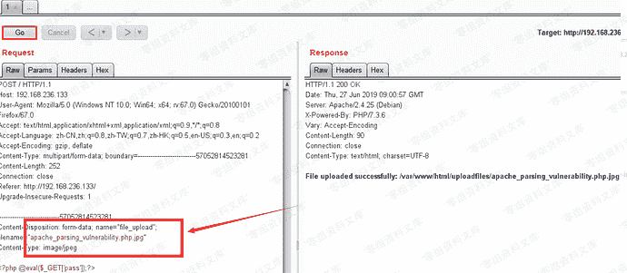
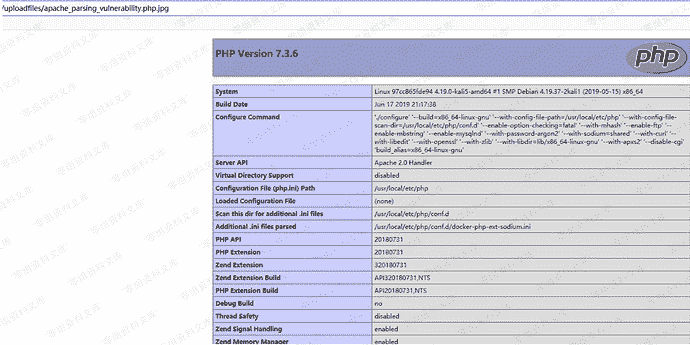

# Apache HTTPD 多后缀解析漏洞

## 一、漏洞简介

Apache HTTPD 支持一个文件拥有多个后缀，并为不同后缀执行不同的指令。比如，如下配置文件：

```
AddType text/html .html
AddLanguage zh-CN .cn 
```

其给`.html`后缀增加了media-type，值为`text/html`；给`.cn`后缀增加了语言，值为`zh-CN`。此时，如果用户请求文件`index.cn.html`，他将返回一个中文的html页面。

以上就是Apache多后缀的特性。如果运维人员给`.php`后缀增加了处理器：

```
AddHandler application/x-httpd-php .php 
```

那么，在有多个后缀的情况下，只要一个文件含有`.php`后缀的文件即将被识别成PHP文件，没必要是最后一个后缀。利用这个特性，将会造成一个可以绕过上传白名单的解析漏洞。

//说白了就是文件重命名为`xxx.php.jpg`就可以被识别成php文件

## 二、漏洞影响

## 三、复现过程

首先正常上传一个 `xxx.php` 文件


这里可以看到上传失败了。我们更改一下文件后缀名

将上传文件命名为 `xxx.php.jpg`



通过游览器访问上传的“jpg文件”

