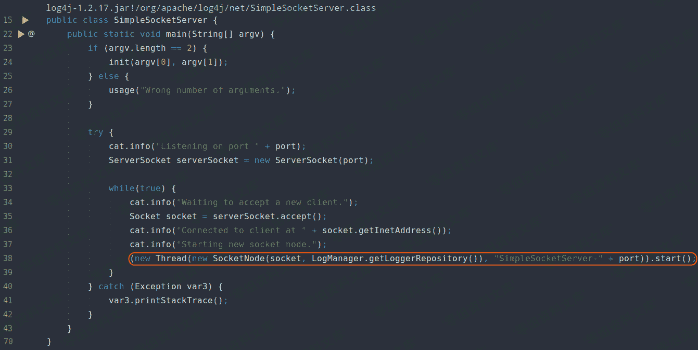
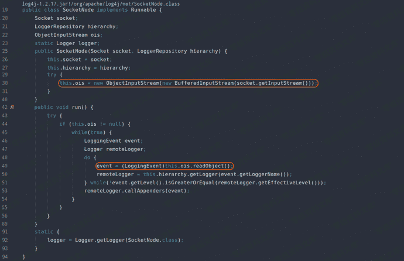
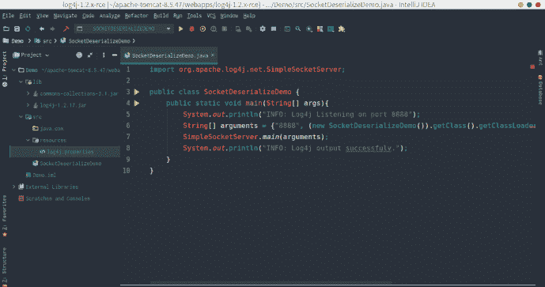

# （CVE-2019-17571）Log4j 1.2.X反序列化漏洞

## 一、漏洞简介

## 二、漏洞影响

Apache Log4j <= 1.2.17

Apache Log4j的1.X版本官方在2015年8月已停止维护

## 三、复现过程

### 漏洞分析

其实这个漏洞非常简单，本质就是对从 **socket** 流中获取的数据没有进行过滤，而直接反序列化。如果当前环境中存在可利用的反序列化 **Gadget** 链，就可以达到命令执行等效果。我们可以创建如下 **Demo** 代码用于测试。


```
// src/SocketDeserializeDemo.java
import org.apache.log4j.net.SimpleSocketServer; `public class SocketDeserializeDemo {

public static void main(String[] args){

System.out.println(“INFO: Log4j Listening on port 8888”);

String[] arguments = {“8888”, (new SocketDeserializeDemo()).getClass().getClassLoader().getResource(“log4j.properties”).getPath()};

SimpleSocketServer.main(arguments);

System.out.println(“INFO: Log4j output successfuly.”);

}

}` 
```

```
# src/resources/log4j.properties
log4j.rootCategory=DEBUG,stdout
log4j.appender.stdout=org.apache.log4j.ConsoleAppender
log4j.appender.stdout.layout=org.apache.log4j.PatternLayout
log4j.appender.stdout.threshold=DEBUG
log4j.appender.stdout.layout.ConversionPattern=[%d{yyy-MM-dd HH:mm:ss,SSS}]-[%p]-[MSG!:%m]-[%c\:%L]%n 
```

我们跟进 **SimpleSocketServer** 的 **main** 方法，发现其中调用了 **SocketNode** 类，具体代码如下。



如下图， **SocketNode** 类实现了 **Runnable** 接口，其构造方法从 **socket** 流中获取了数据，并将数据封装为一个 **ObjectInputStream** 对象。然后在其 **run** 方法中调用了 **readObject** 方法进行反序列化操作。由于这里没有对数据进行过滤，所以这里就出现了反序列化漏洞。



这里我们添加一条 **commons-collections** 的 **Gadget** 链用来演示命令执行。

