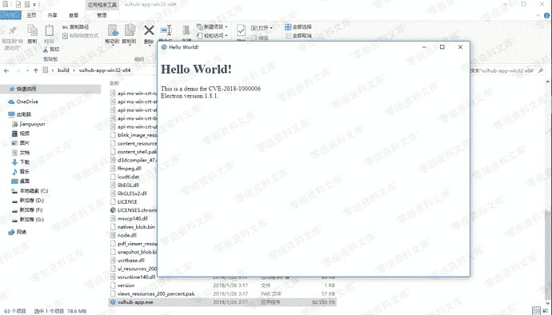

# （CVE-2018-1000006）Electron 远程命令执行漏洞

## 一、漏洞简介

在Windows下，如果Electron开发的应用注册了Protocol Handler（允许用户在浏览器中召起该应用），则可能出现一个参数注入漏洞，并最终导致在用户侧执行任意命令。

## 二、漏洞影响

Electron < v1.8.2-beta.4

## 三、复现过程

### 编译APP

执行如下命令编译一个包含漏洞的应用：

```
docker-compose run -e ARCH=64 --rm electron 
```

上述命令中，因为软件需要在Windows平台上运行，所以需要设置ARCH的值为平台的位数：32或64。

编译完成后，再执行如下命令，启动web服务：

```
docker-compose run --rm -p 8080:80 web 
```

此时，访问`http://www.0-sec.org:8080/`即可看到POC页面。

### 漏洞复现

首先，在POC页面，点击第一个链接，下载编译好的软件`vulhub-app.tar.gz`。下载完成后解压，并运行一次：



这一次将注册Protocol Handler。

然后，再回到POC页面，点击第二个链接，将会弹出目标软件和计算器：


> 如果没有成功，可能是浏览器原因。经测试，新版Chrome浏览器点击POC时，会召起vulhub-app，但不会触发该漏洞。

### POC

可以直接使用 elec_rce\elec_rce-win32-x64\elec_rce.exe

也可以自己打包成exe应用,生成有漏洞的版本应用，以版本1.7.8为例：

```
electron-packager ./test elec_rce --win --out ./elec_rce --arch=x64 --version=0.0.1 --electron-version=1.7.8 --download.mirror=https://npm.taobao.org/mirrors/electron/ 
```

https://github.com/ianxtianxt/CVE-2018-1000006-DEMO