# Phpcms v9.6.0 sql注入

## 一、漏洞简介

## 二、漏洞影响

Phpcms v9.6.0

## 三、复现过程

这个版本的 **SQL注入** 主要在于程序对解密后的数据没有进行过滤，我们来看一下漏洞文件 **phpcms/modules/content/down.php** 。在其 **init** 方法中，从 **GET** 数据中获取了 **a_k** 的值，该值若能解密成程序规定格式的字符串，则程序继续运行（这里加解密使用的秘钥必须一致，例如这里秘钥为 **pc_base::load_config('system','auth_key')** ）。程序将解密后的数据用 **parse_str** 函数处理，这里又存在变量覆盖问题。然后将可控变量 **$id** 带入数据库查询，我们跟进 **get_one** 方法。

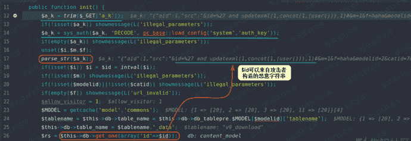

**get_one** 方法调用了 **sqls** 方法，而在 **sqls** 方法中可以明显看到，未过滤的数据直接拼接进了 **SQL** 语句中。

那么现在，我们要解决的问题是：如何构造出加密数据，使得数据能够被正常解密？我们先来看一下 **sys_auth** 函数的代码，其代码位于 **phpcms/libs/functions/global.func.php** 中。开头我们可以很明显看到，当我们没有指定加解密用的 **key** 时，系统默认使用 **pc_base::load_config('system','auth_key')** 作为 **key** ，这样我们就不用特地去搜索形如 **sys_auth('xxx','ENCODE',pc_base::load_config('system','auth_key'))** 的代码段，直接搜索形如 **sys_auth('可控字符串','ENCODE')** 或 **sys_auth('可控字符串')** 的代码段即可。（这里搜索这种代码段的目的，是为了找到可利用的点将恶意 **payload** 进行加密，然后传输给开头 **phpcms/modules/content/down.php** 文件的 **init** 方法进一步利用）

通过搜索，会发现在 **set_cookie** 方法中使用了 **sys_auth($value, 'ENCODE')** ，我们可以寻找是否存在可控的 **$value** 。

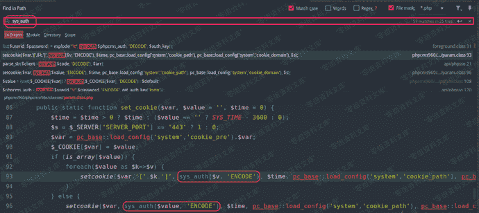

我们可以搜到 **phpcms/modules/wap/index.php** 文件，在该文件中 **$_GET['siteid']** 可控，并且可以通过 **cookie** 获得加密后的数据，但是这里有 **intval** 过滤，所以无法放置我们的 **payload** 。

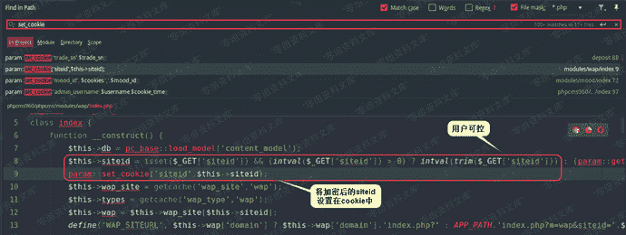

我们继续寻找，会发现 **phpcms/modules/attachment/attachments.php** 文件的 **swfupload_json** 方法有满足我们需要的代码。程序将可控数据放在了 **cookie** ，其中可控数据中，比较好利用的是 **$_GET['src']** 。

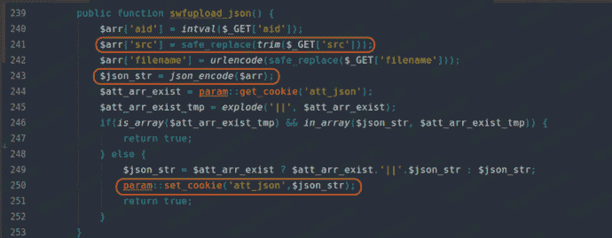

**$_GET['src']** 只是经过了 **safe_replace** 函数的过滤，该函数会将某些字符替换为空，而我们却可以在 **payload** 中插入这些字符，从而绕过黑名单的过滤。 **safe_replace** 函数代码如下：

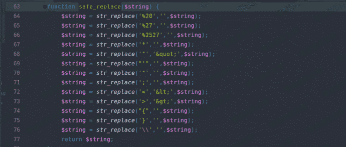

貌似现在已经找到了利用链了？别高兴的太早。在调用这个 **swfupload_json** 方法之前，程序会执行 **attachments** 类的 **__construct** 方法，而这个方法中有用户登录状态检测。用于登录状态检测的 **$this->userid** 可以来自 **sys_auth($_POST['userid_flash'],'DECODE')** ，即我们让 **$_POST['userid_flash']** 经过 **sys_auth** 方法解密之后有东西即可。而这个加密数据，就可以利用我们上面说到的 **phpcms/modules/wap/index.php** 文件。通过 **cookie** 获取 **$_GET['siteid']** 加密后的数据，然后再作为 **$_POST['userid_flash']** 的值，即可绕过登录检测。

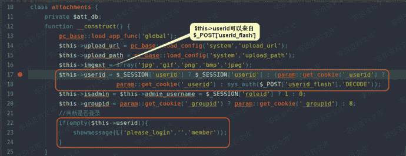

绕过登录检测后，我们将 **payload** 传给 **phpcms/modules/attachment/attachments.php** 文件 **swfupload_json** 方法中的 **$_GET['src']** ，再利用开头 **parse_str** 函数进行变量覆盖，最终完成整个漏洞链。整个漏洞的利用流程图如下：

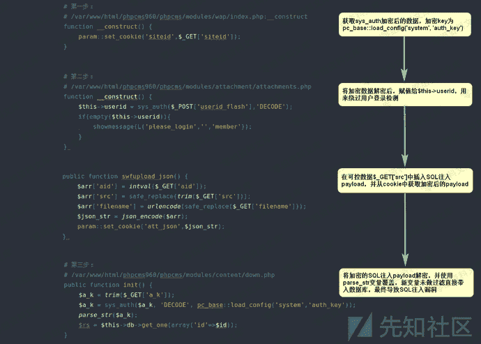

按照默认配置安装的网站搭建好后， **WAP** 是处于禁用状态，但是这并不影响我们获得加密后的 **$_GET['siteid']** 。

我们再来假设，如果网站管理员删除了 **WAP** 模块的代码，这个洞还能利用吗？我们可以继续来挖掘一下这个漏洞链的其他入口，这也是网络上未公开的一个入口点。上面我们在搜索 **set_cookie** 方法找可控数据时，会发现 **phpcms/modules/mood/index.php** 文件的 **post** 方法可以直接获得一个加密后的数据，这样我们就可以将这个数据，用在漏洞链的第二步：绕过用户登录验证，具体代码如下：

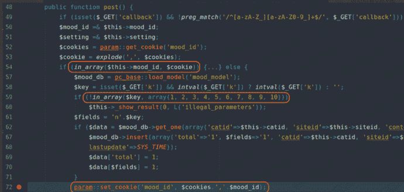

这里只要按照代码逻辑，构造参数即可。这里可能还要注意本类的 **__construct** 方法，同样按照逻辑构造参数即可，具体构造这里不再赘述。

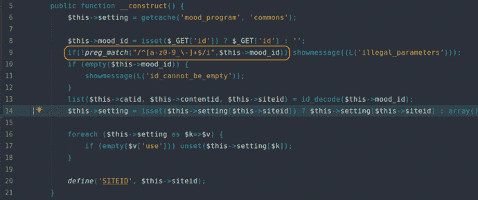

通过上面这个漏洞链入口，我们便可以进行 **报错SQL注入** 。比较有意思的是， **PHPCMS** 会将 **admin** 登录的 **cookie** 存储在数据库中，我们可以通过注入获取管理员 **cookie** ，然后伪造管理员身份利用后台 **getshell** 。这里如何伪造身份，网络上貌似提及很少，唯一找到一篇文章https://www.secpulse.com/archives/57486.html ，发现作者竟然还少提及了一个关键参数。于是我将伪造的数据包，与正常登录的数据包进行对比，逐个删除 **cookie** 中的数据，看看少了哪个关键参数。接下来，我们来具体看一下如何伪造 **cookie** 进入后台。

**PHPCMS** 专门在数据库中建了一个表来存放 **PHPSESSID** ，其中也包含管理员的 **PHPSESSID** ，且登录状态下的 **userid** 字段会被设为1，注销则为0，具体如下：

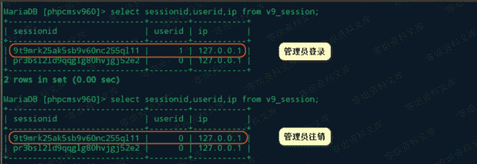

我们把 **PHPSESSID=9t9mrk25ak5sb9v60nc255ql11** 加到 **cookie** 中，直接访问后台，这是发现程序还是会让你登录，估计我们是少了什么，下面来动态调试一下。经过调试，我们会发现程序终止在了 **admin** 类 **__construct** 方法的 **self::check_admin()** 语句中，其具体代码如下：

可以明显看到，我们原先的 **cookie** 中少了 **$userid** 对应的字段，而且要想绕过登录，必须保证 **$_SESSION['roleid']** 和 **$userid** 相等且它们两者非空。那么现在，我们只要加上 **$userid** 对应字段就行了，其值可以从上面漏洞链第一步中的响应包 **Set-Cookie** 字段获取。这里要注意一个点，一旦管理员注销，我们就无法利用这个点伪造 **cookie** 了，这也是这个漏洞的鸡肋之处。

最后来看一下官方发布的 **PHPCMS v9.6.1** 中是如何修复这个漏洞的，补丁如下：

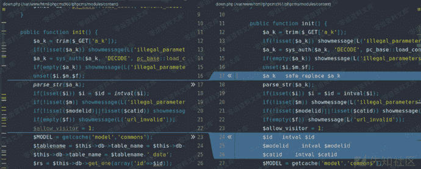

可以看到官方对解密后的数据进行了 **safe_replace、intval** 双重过滤处理。

## 参考链接

> https://xz.aliyun.com/t/5730