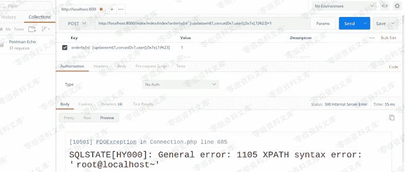
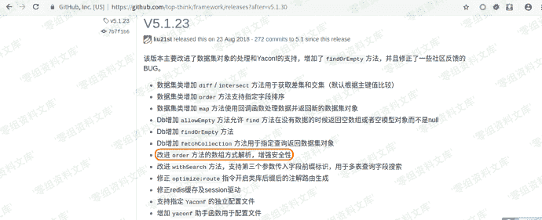
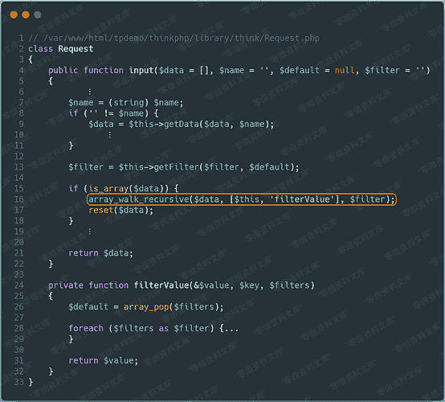
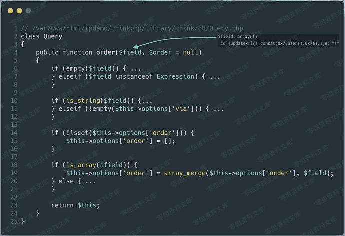
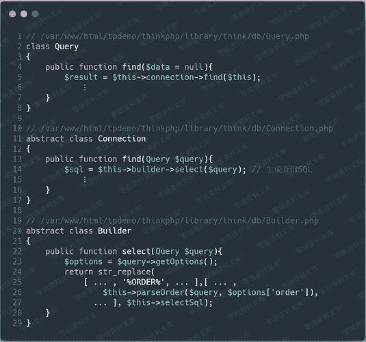
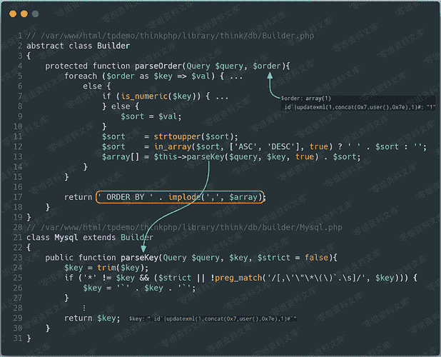
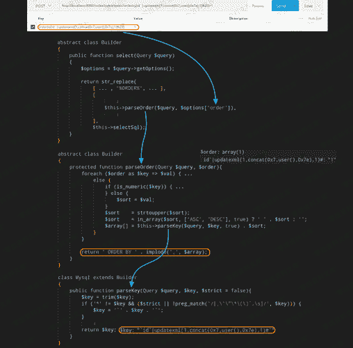

# 5.1.16 <= Thinkphp <= 5.1.22

## 一、漏洞简介

本篇文章，将分析 **ThinkPHP** 中存在的 **SQL注入** 漏洞（ **orderby** 方法注入）。本次漏洞存在于 **Builder** 类的 **parseOrder** 方法中。由于程序没有对数据进行很好的过滤，直接将数据拼接进 **SQL** 语句，最终导致 **SQL注入漏洞** 的产生。

## 二、漏洞影响

5.1.16 <= Thinkphp <= 5.1.22

## 三、复现过程

### 漏洞环境

通过以下命令获取测试环境代码：

```
composer create-project --prefer-dist topthink/think=5.1.22 tpdemo 
```

将 **composer.json** 文件的 **require** 字段设置成如下：

```
"require": {
    "php": ">=5.6.0",
    "topthink/framework": "5.1.22"
} 
```

然后执行 `composer update` ，并将 **application/index/controller/Index.php** 文件代码设置如下：

```
<?php
namespace app\index\controller; `class Index

{

public function index()

{

$orderby = request()->get(‘orderby’);

$result = db(‘users’)->where([‘username’ => ‘mochazz’])->order($orderby)->find();

var_dump($result);

}

}` 
```

在 **config/database.php** 文件中配置数据库相关信息，并开启 **config/app.php** 中的 **app_debug** 和 **app_trace** 。创建数据库信息如下：

```
create database tpdemo;
use tpdemo;
create table users(
	id int primary key auto_increment,
	username varchar(50) not null
);
insert into users(id,username) values(1,'mochazz'); 
```

访问 **http://localhost:8000/index/index/index?orderby[id`|updatexml(1,concat(0x7,user(),0x7e),1)%23]=1** 链接，即可触发 **SQL注入漏洞** 。（没开启 **app_debug** 是无法看到 **SQL** 报错信息的）



### 漏洞分析

首先在官方发布的 **5.1.23** 版本更新说明中，发现其中提到该版本增强了 **order** 方法的安全性。



通过查阅其 **commit** 记录，发现其修改了 **Builder.php** 文件中的 **parseOrder** 方法。其添加了一个 **if** 语句判断，来过滤 **)、#** 两个符号。


接下来，我们直接跟着上面的攻击 **payload** 来看看漏洞原理。首先程序通过 **input** 方法获取数据，并通过 **filterCalue** 方法进行简单过滤，但是根本没有对数组的键进行过滤处理。



接着数据就原样被传入数据库操作相关方法中。在 **Query** 类的 **order** 方法中，我们可以看到数据没有任何过滤，直接存储在 **$this->options['order']** 中。（下图 **第19行** ）



接着来到 **find** 方法，在 **Connection** 类的 **find** 方法中调用 **Builder** 类的 **select** 方法来生成 **SQL** 语句。相信大家对 **Builder** 类的 **select** 方法应该不会陌生吧，因为前几篇分析文章中都有提及这个方法。这个方法通过 **str_replace** 函数将数据填充到 **SQL** 模板语句中。这次我们要关注的是 **parseOrder** 方法，这个方法在新版的 **ThinkPHP** 中做了代码调整，我们跟进。



在 **parseOrder** 方法中，我们看到程序通过 **parseKey** 方法给变量两端都加上了反引号（下图 **第26行** ），然后直接拼接字符串返回（下图 **第17行** ），没有进行任何过滤、检测，这也是导致本次 **SQL注入漏洞** 的原因。



### 漏洞修复

官方的修复方法是：在拼接字符串前对变量进行检查，看是否存在 **)、#** 两个符号。


### 攻击总结

最后，再通过一张攻击流程图来回顾整个攻击过程。



## 参考链接

> https://github.com/Mochazz/ThinkPHP-Vuln