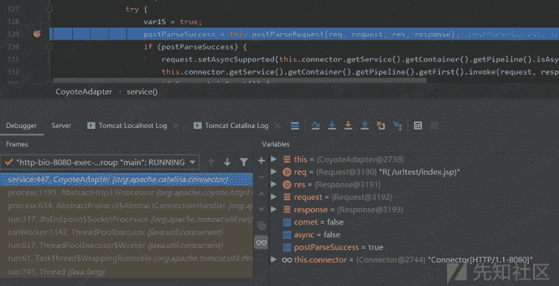
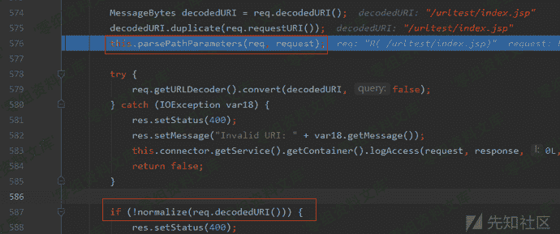
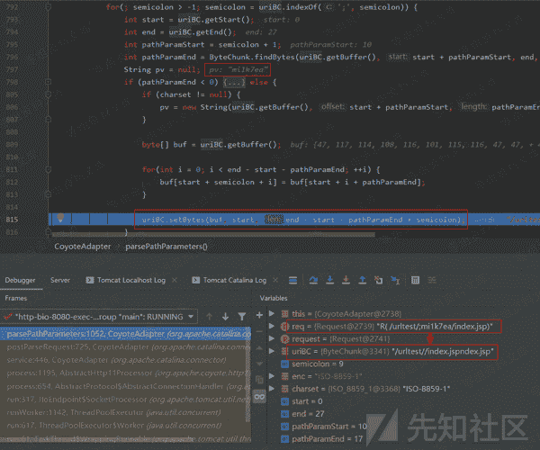
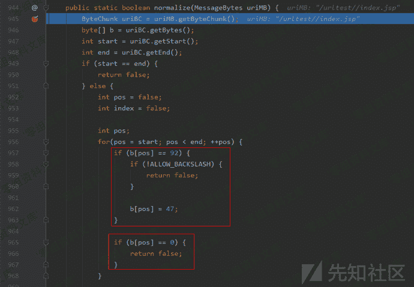
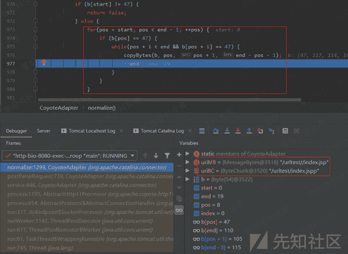
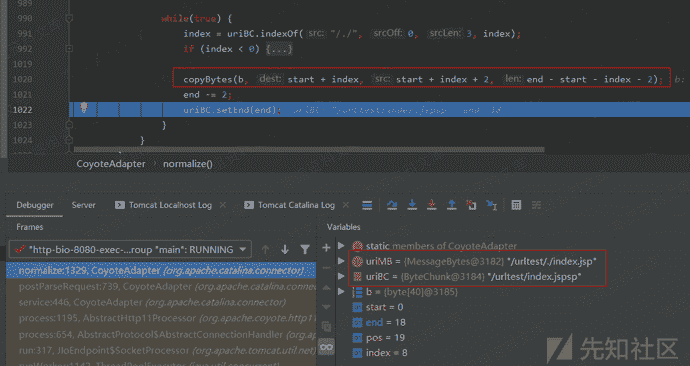
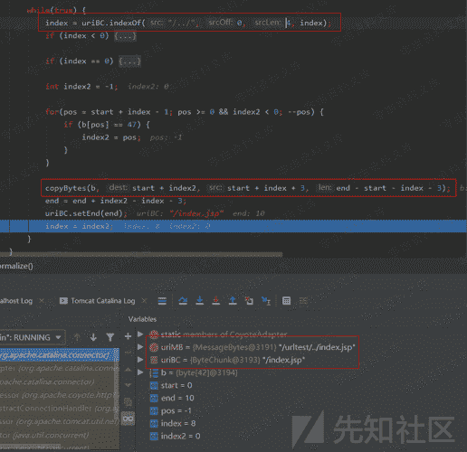

### Tomcat对URL特殊字符的处理

这里我们先来调试分析下Tomcat是如何对请求URL中不同的特殊字符作不同的处理的。

经过调试分析，得知Tomcat是在CoyoteAdapter.service()函数上对请求URL进行解析处理的，直接在这里打上断点，此时的函数调用栈如下：

```
service:452, CoyoteAdapter (org.apache.catalina.connector)
process:1195, AbstractHttp11Processor (org.apache.coyote.http11)
process:654, AbstractProtocol$AbstractConnectionHandler (org.apache.coyote)
run:317, JIoEndpoint$SocketProcessor (org.apache.tomcat.util.net)
runWorker:1142, ThreadPoolExecutor (java.util.concurrent)
run:617, ThreadPoolExecutor$Worker (java.util.concurrent)
run:61, TaskThread$WrappingRunnable (org.apache.tomcat.util.threads)
run:745, Thread (java.lang) 
```

在CoyoteAdapter.service()函数中，会调用postParseRequest()函数来解析URL请求内容：



跟进postParseRequest()函数中，其中先后调用parsePathParameters()和normalize()函数对请求内容进行解析处理：



这里我们先跟进parsePathParameters()函数，先是寻找URL中是否存在`;`号，找到的话才会进入下面的if代码逻辑：


如果找到了`;`号，在if代码逻辑中后面的循环体会将`;xxx/`中的分号与斜杠之间的字符串以及分号本身都去掉，我们访问`http://localhost:8080/urltest/;mi1k7ea/index.jsp`再试下，就可以进入该代码逻辑调试看到（代码中ASCII码59是`;`，47是`/`）：



由此可知，parsePathParameters()函数是对`;xxx/`这种形式进行处理的。

接着，跟进normalize()函数，该函数是对经过parsePathParameters()函数处理过后的请求URL进行标准化处理。

先看到这段代码，ASCII码92表示`\`，当匹配到时将其替换为ASCII码为47的`/`；当匹配到ASCII码0即空字符时，直接返回false无法成功解析：



往下是这段循环，判断是否有连续的`/`，存在的话则循环删除掉多余的`/`：



接着往下看，这段循环就是对`./`和`../`这些特殊字符进行处理，如果这两个字符串都找不到则直接返回true：


这里尝试下添加`/./`访问的处理，看到找到之后是直接将其去掉然后继续放行：



这里尝试下添加`/../`访问的处理，看到找到后是会进行往前目录层级的回溯处理再拼接到上面某一层目录形成新的URL：



由此可知，normalize()函数对经过经过parsePathParameters()函数过滤过`;xxx/`的URL请求内容进标准化处理，具体为将连续的多个`/`给删除掉只保留一个、将`/./`删除掉、将`/../`进行跨目录拼接处理，最后返回处理后的URL路径。

**结论**

Tomcat对`/;xxx/`以及`/./`的处理是包容的、对`/../`会进行跨目录拼接处理。