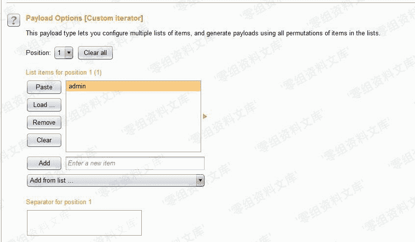
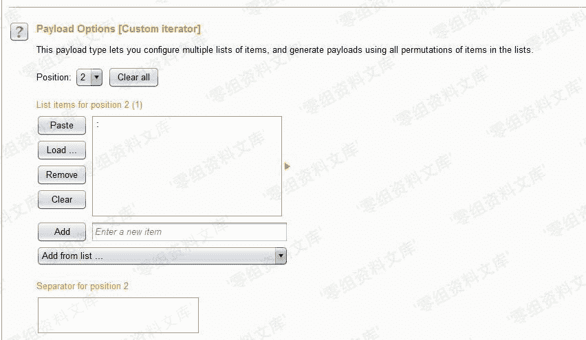
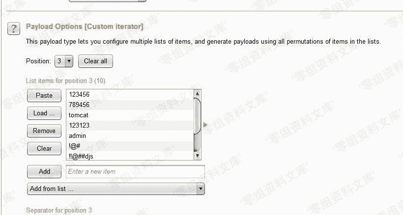
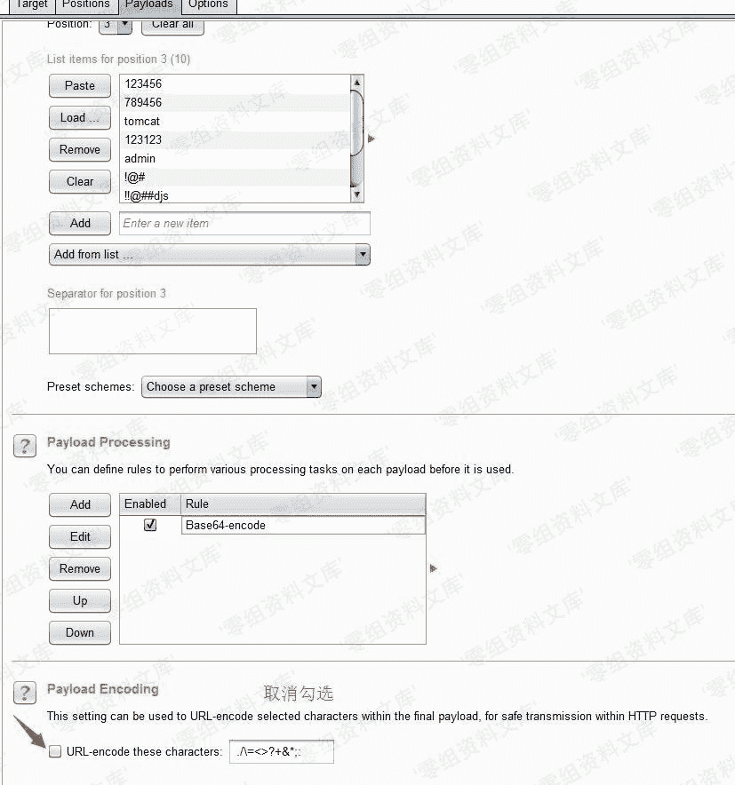
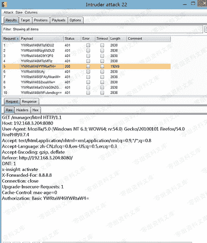

# Tomcat 后台爆破

## 一、漏洞简介

## 二、漏洞影响

## 三、复现过程

在渗透测试中，我们经常遇到tomcat后台被默认部署在外部的情况，类似于`http://192.168.3.204:8080/host-manager/html`

在这种情况下，我们都会选择去爆破来进入后台部署shell。

先抓取一下我们的登录包：

```
GET /host-manager/html HTTP/1.1
Host: 192.168.3.204:8080
User-Agent: Mozilla/5.0 (Windows NT 6.3; WOW64; rv:54.0) Gecko/20100101 Firefox/54.0 FirePHP/0.7.4
Accept: text/html,application/xhtml+xml,application/xml;q=0.9,*/*;q=0.8
Accept-Language: zh-CN,zh;q=0.8,en-US;q=0.5,en;q=0.3
Accept-Encoding: gzip, deflate
DNT: 1
x-insight: activate
Connection: keep-alive
Upgrade-Insecure-Requests: 1
Authorization: Basic YWRtaW46MTIzNDU2 
```

在Tomcat后台登录的数据包中我们发现它会将输入的账号和密码都编码成Base64密文。

格式：`用户名:密码` => `admin:123456` => `YWRtaW46MTIzNDU2`

这里我们可以采用Metasploit中的tomcat爆破辅助模块，当然也可以用BurpSuite来爆破：

将数据包发送到Intruder模块，添加一个变量：


在设置Payload的时候要使用自定义迭代器：


由于登录令牌都是`base64`加密的，我们需要 `[用户名]:[密码]`这样的格式进行`base64encde`才可以发送出去，我们设置三个迭代payload分别代表：用户名、:、密码、。



第一位设置用户名这类的字典，可以多个。



第二位设置`:`，只需要一个即可。



第三位设置密码，可以多个。

然后设置一个编码器，选择`base64`这个函数：


接下来再将url编码去掉，因为在base64密文里`=`会被编码成`%3d`。



设置完毕后，我们可以爆破了：



## 参考链接

> https://payloads.online/archivers/2017-08-17/2#tomcat-%E7%88%86%E7%A0%B4