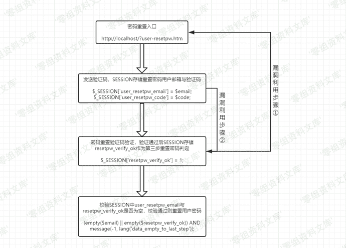

# WellCMS 1.1.02 任意用户密码重置漏洞

## 一、漏洞简介

## 二、漏洞影响

WellCMS 1.1.02

## 三、复现过程

### 漏洞分析

CMS中密码重置逻辑代码存放于 /route/user.php 中，在没有配置邮件服务情况加，我们可以在生成验证码后增加 `message(0, '重置密码验证码为：'.$code);`代码弹出验证码，修改后需删除 /route/route_user.php 原缓存文件，重新执行弹出验证码代码便会生效，详细代码如下：

```
// 重设密码第 1 步 | reset password first step
 if ($action == 'resetpw') {

```
// hook user_resetpw_get_post.php

!$conf['user_resetpw_on'] AND message(-1, '未开启密码找回功能！');

if ($method == 'GET') {

    // hook user_resetpw_get_start.php

    $header['title'] = lang('resetpw');

    // hook user_resetpw_get_end.php

    include _include(APP_PATH . 'view/htm/user_resetpw.htm');

} else if ($method == 'POST') {

    // hook user_resetpw_post_start.php

    $email = param('email');
    empty($email) AND message('email', lang('please_input_email'));
    !is_email($email, $err) AND message('email', $err);

    $_user = user_read_by_email($email);
    !$_user AND message('email', lang('email_is_not_in_use'));

    $code = param('code');
    empty($code) AND message('code', lang('please_input_verify_code'));

    $sess_email = _SESSION('user_resetpw_email');
    $sess_code = _SESSION('user_resetpw_code');
    empty($sess_code) AND message('code', lang('click_to_get_verify_code'));
    empty($sess_email) AND message('code', lang('click_to_get_verify_code'));
    $email != $sess_email AND message('code', lang('verify_code_incorrect'));
    $code != $sess_code AND message('code', lang('verify_code_incorrect'));

    $_SESSION['resetpw_verify_ok'] = 1;

    // hook user_resetpw_post_end.php

    message(0, lang('check_ok_to_next_step'));
} 
```

// 重设密码第 3 步 | reset password step 3

} elseif ($action == ‘resetpw_complete’) {

```
// hook user_resetpw_get_post.php

// 校验数据
$email = _SESSION('user_resetpw_email');
$resetpw_verify_ok = _SESSION('resetpw_verify_ok');
(empty($email) || empty($resetpw_verify_ok)) AND message(-1, lang('data_empty_to_last_step'));

$_user = user_read_by_email($email);
empty($_user) AND message(-1, lang('email_not_exists'));
$_uid = $_user['uid'];

if ($method == 'GET') {

    // hook user_resetpw_get_start.php

    $header['title'] = lang('resetpw');

    // hook user_resetpw_get_end.php

    include _include(APP_PATH . 'view/htm/user_resetpw_complete.htm');

} else if ($method == 'POST') {

    // hook user_resetpw_post_start.php

    $password = param('password');
    empty($password) AND message('password', lang('please_input_password'));

    $salt = $_user['salt'];
    $password = md5($password . $salt);

    !is_password($password, $err) AND message('password', $err);

    user_update($_uid, array('password' =&gt; $password));

    unset($_SESSION['user_resetpw_email']);
    unset($_SESSION['user_resetpw_code']);
    unset($_SESSION['resetpw_verify_ok']);

    // hook user_resetpw_post_end.php

    message(0, lang('modify_successfully'));

} 
```

// 发送验证码

} elseif ($action == ‘send_code’) {

```
$method != 'POST' AND message(-1, lang('method_error'));

// hook user_sendcode_start.php

$action2 = param(2);

    // 重置密码，往老地址发送
if ($action2 == 'user_resetpw') {

    $email = param('email');

    empty($email) AND message('email', lang('please_input_email'));
    !is_email($email, $err) AND message('email', $err);
    $_user = user_read_by_email($email);
    empty($_user) AND message('email', lang('email_is_not_in_use'));

    empty($conf['user_resetpw_on']) AND message(-1, lang('resetpw_not_on'));

    $code = rand(100000, 999999);
    $_SESSION['user_resetpw_email'] = $email;
    $_SESSION['user_resetpw_code'] = $code;
    message(0, '重置密码验证码为：'.$code);
} 
``` `}` 
```

梳理密码重置逻辑流程图如下（黑色实现箭头为漏洞利用的简单思路步骤）：



从逻辑中可以看出，在第三部中，重置密码仅进行了简单的SESSION中存储数据是否为空的验证，而并未对密码重置用户邮箱进行严格验证；若重置密码时，SESSION中存储的邮箱非当前验证用户邮箱，便会造成任意密码重置漏洞；

### 漏洞复现

在此程序中，在获取验证码时刷新当前SESSION中存储的密码重置用户邮箱，而未对SESSION中resetpw_verify_ok数据进行清除，也因此造成了任意用户密码重置逻辑漏洞。

我们先使用自己的账户通过验证进入第三步的用户重设密码界面；在此时，SESSION中user_resetpw_email是当前通过验证的攻击账户邮箱，SESSION中resetpw_verify_ok值为1，浏览器界面如下图所示：


在第三步时，我们可以在浏览器中打开一个新的标签页，使用管理员的邮箱发送重置密码验证码请求，在同一浏览器中SESSION会话不会改变，此时 `$_SESSION['user_resetpw_email'] = $email;`代码会将SESSION中存储的密码重置邮箱更新为管理员邮箱，如下图所示：


回到第一个标签页，刷新页面可以发现当前SESSION中存储的密码重置用户邮箱已经变为管理员用户邮箱（非必须刷新，密码重置第三部中邮箱取自SESSION，并非提交参数），我们提交重设密码请求后，即可更改管理员用户密码，如下图所示：


## 参考链接

> [http://www.shexink.top/2020/03/wellcms%e4%bb%bb%e6%84%8f%e7%94%a8%e6%88%b7%e5%af%86%e7%a0%81%e9%80%bb%e8%be%91%e6%bc%8f%e6%b4%9e/](http://www.shexink.top/2020/03/wellcms%E4%BB%BB%E6%84%8F%E7%94%A8%E6%88%B7%E5%AF%86%E7%A0%81%E9%80%BB%E8%BE%91%E6%BC%8F%E6%B4%9E/)