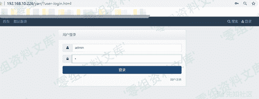
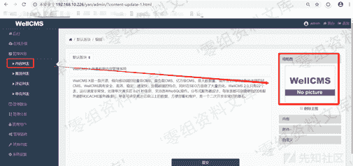
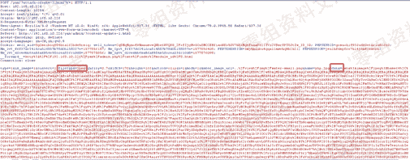
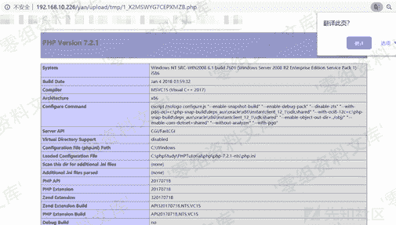

# WellCMS 2.0 Beta3 后台任意文件上传

## 一、漏洞简介

## 二、漏洞影响

## 三、复现过程

### 漏洞分析

根据漏洞定位代码文件：route/attach.php，代码如下：

```
if ($action == 'create') {
    // hook attach_create_start.php
    user_login_check();
    // hook attach_create_check_after.php
    $backstage = param(2, 0);
    $width = param('width', 0);
    $height = param('height', 0);
    $is_image = param('is_image', 0); // 图片
    $name = param('name');
    $data = param_base64('data');
    $mode = param('mode', 0); // 上传类型 1主图
    $filetype = param('filetype'); // 压缩图片后缀jpeg jpg png等
    $convert = param('convert', 0); // 图片转换压缩 = 1
    $n = param('n', 0); // 对应主图赋值
    $type = param('type', 0); // type = 0则按照SESSION数组附件数量统计，type = 1则按照传入的n数值
    // hook attach_create_before.php
    // 允许的文件后缀名
    //$types = include _include(APP_PATH.'conf/attach.conf.php');
    //$allowtypes = $types['all'];
    empty($group['allowattach']) AND $gid != 1 AND message(2, '您无权上传');
    // hook attach_create_center.php
    empty($data) AND message(1, lang('data_is_empty'));
    //$data = base64_decode_file_data($data);
    $size = strlen($data);
    $size > 20480000 AND message(1, lang('filesize_too_large', array('maxsize' => '20M', 'size' => $size)));
    // hook attach_create_file_ext_start.php
    // 获取文件后缀名 111.php.shtmll
    $ext = file_ext($name, 7);
    $filetypes = include APP_PATH . 'conf/attach.conf.php';
    // hook attach_create_file_ext_before.php
    //主图必须为图片
    if ($is_image == 1 && $mode == 1 && !in_array($ext, $filetypes['image'])) message(1, lang('well_up_picture_error'));

```
// hook attach_create_file_ext_center.php

// 如果文件后缀不在规定范围内 改变后缀名
//!in_array($ext, $filetypes['all']) AND $ext = '_' . $ext;
if (!in_array($ext, $filetypes['all'])) {
    $ext = '_' . $ext;
} else {
    // CMS上传图片
    $t == 1 AND $convert == 1 AND $is_image == 1 AND $ext = $filetype;
}
// hook attach_create_file_ext_after.php
$tmpanme = $uid . '_' . xn_rand(15) . '.' . $ext;
// hook attach_create_tmpanme_after.php
$tmpfile = $conf['upload_path'] . 'tmp/' . $tmpanme;
// hook attach_create_tmpfile_after.php
$tmpurl = $conf['upload_url'] . 'tmp/' . $tmpanme;
// hook attach_create_tmpurl_after.php
$filetype = attach_type($name, $filetypes);
// hook attach_create_save_before.php
file_put_contents($tmpfile, $data) OR message(1, lang('write_to_file_failed'));
// hook attach_create_save_after.php
// 保存到 session，发帖成功以后，关联到帖子。
// save attach information to session, associate to post after create thread.
// 抛弃之前的 $_SESSION 数据，重新启动 session，降低 session 并发写入的问题
// Discard the previous $_SESSION data, restart the session, reduce the problem of concurrent session write
sess_restart();
empty($t) AND empty($_SESSION['tmp_files']) AND $_SESSION['tmp_files'] = array();
$t == 1 AND empty($_SESSION['tmp_website_files']) AND $_SESSION['tmp_website_files'] = array();

// hook attach_create_after.php
// type = 0则按照SESSION数组附件数量统计，type = 1则按照传入的n数值
empty($type) AND $n = ($t == 1) ? count($_SESSION['tmp_website_files']) : count($_SESSION['tmp_files']);
$filesize = filesize($tmpfile);
$attach = array(
    'backstage' =&gt; $backstage, // 0前台 1后台
    'url' =&gt; $backstage ? '../' . $tmpurl : '' . $tmpurl,
    'path' =&gt; $tmpfile,
    'orgfilename' =&gt; $name,
    'filetype' =&gt; $filetype,
    'filesize' =&gt; $filesize,
    'width' =&gt; $width,
    'height' =&gt; $height,
    'isimage' =&gt; $is_image,
    'downloads' =&gt; 0,
    'aid' =&gt; '_' . $n
);
// hook attach_create_array_after.php
if ($mode == 1) {
    // hook attach_create_thumbnail_beofre.php
    $_SESSION['tmp_thumbnail'] = $attach;
    // hook attach_create_thumbnail_after.php
} else {
    // hook attach_create_website_files_beofre.php
    // 0 BBS 1 CMS
    $t == 1 ? $_SESSION['tmp_website_files'][$n] = $attach : $_SESSION['tmp_files'][$n] = $attach;
    // hook attach_create_website_files_after.php
}
// hook attach_create_session_after.php
unset($attach['path']);
// hook attach_create_end.php
message(0, $attach); 
``` `}` 
```

大致流程：
1、 首先，接受相关参数，将filetype自行设置成“php”：

```
$data = param_base64('data');
$filetype = param('filetype'); / 
```

2、 进行逻辑判断：

```
if (!in_array($ext, $filetypes['all'])) {
        $ext = '_' . $ext;
    } else {
        // CMS上传图片
        $t == 1 AND $convert == 1 AND $is_image == 1 AND $ext = $filetype;
    } 
```

3、 最后成功写入：

```
$tmpanme = $uid . '_' . xn_rand(15) . '.' . $ext;
    // hook attach_create_tmpanme_after.php
    $tmpfile = $conf['upload_path'] . 'tmp/' . $tmpanme;
    // hook attach_create_tmpfile_after.php
    $tmpurl = $conf['upload_url'] . 'tmp/' . $tmpanme;
    // hook attach_create_tmpurl_after.php
    $filetype = attach_type($name, $filetypes);
    // hook attach_create_save_before.php
    file_put_contents($tmpfile, $data) OR message(1, lang('write_to_file_failed')); 
```

### 漏洞复现

第一步，登陆该CMS后台：



第二步，进入“后台管理“，定位利用点，点击下图红框中图片进行上传：



上传并抓取数据包：



第三步，修改post包中“filetype”参数类型为“php”；经分析 “data”参数为base64加密，这里我们将测试数据“ ”经过base64加密等构造，形成“data”参数的数据：data%3Aimage%2Fjpeg%3Bbase64%2CPD9waHAgcGhwaW5mbygpOz8%2B，最后数据包放行，返回成功上传为php文件的路径：


最后，尝试访问，成功：



## 参考链接

> https://xz.aliyun.com/t/7284