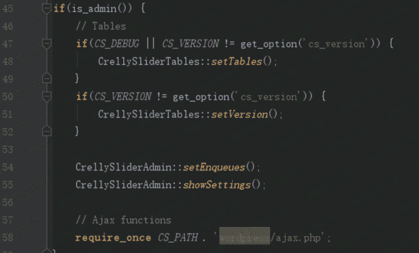
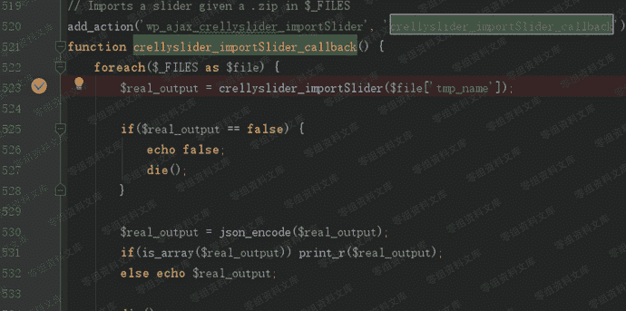
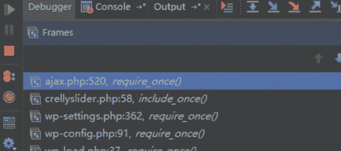
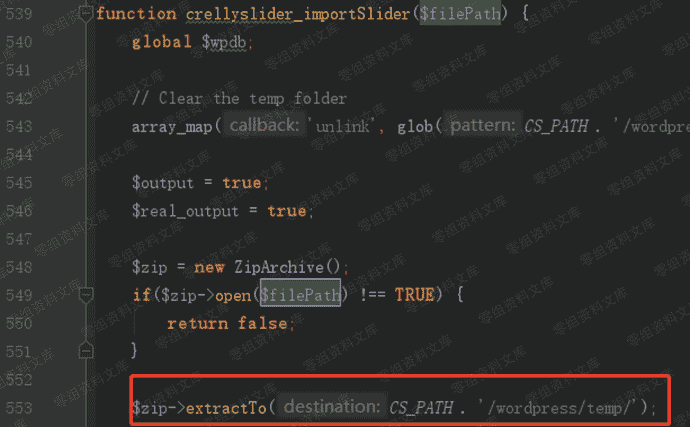
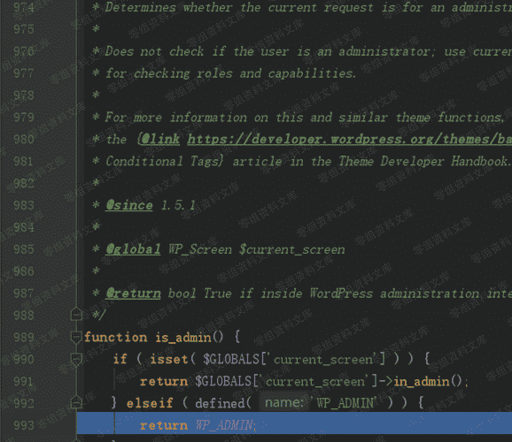
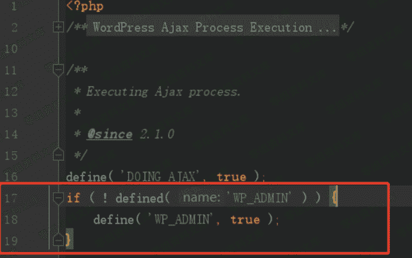
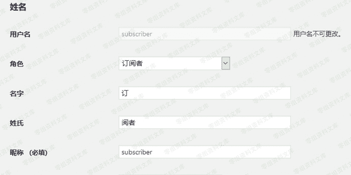
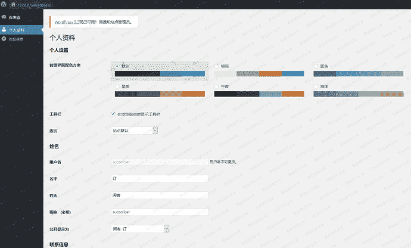
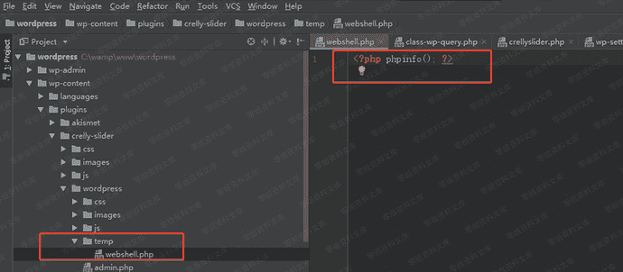

# （CVE-2019-15866）WordPress Plugin - Crelly Slider 任意文件上传&RCE漏洞

## 一、漏洞简介

WordPress Crelly Slider是一个开源的幻灯片插件。用户可以使用强大的拖放生成器来添加文本、图像、youtube/vimeo视频，并为每个视频制作动画。

WordPress Crelly Slider插件具有20,000多个活动安装。该插件在1.3.4及更低版本中出现任意文件上传漏洞。任意经过身份验证的用户（例如订阅者身份）可通过向wp_ajax_crellyslider_importSlider发送带有恶意PHP文件的ZIP压缩文件来利用该漏洞上传文件并将恶意PHP文件解压到插件目录中。

## 二、漏洞影响

## 三、复现过程

### 漏洞分析

在crelly-slider\crellyslider.php文件中，存在如下代码



位于上图45行处可见，插件使用if(is_admin())进行判断，满足条件则可以进入上图if分支，并且在58行处将wordpress/ajax.php文件包含进来

接着来分析下ajax.php文件

在crelly-slider/wordpress/ajax.php中存在如下代码



可见上图520行处注册了一个名为wp_ajax_crellyslider_importSlider 的ajax action并指向ajax.php中的crellyslider_importSlider_callback方法。

在wordpress插件调用机制里，crellyslider_importSlider_callback方法可以通过构造

```
http://0-sec.org/wordpress/wp-admin/admin-ajax.php?action=crellyslider_importSlider 
```

这样的url来访问

具体调用链如下



在搞清楚crellyslider_importSlider_callback方法是如何通过url调用后，继续分析crellyslider_importSlider_callback方法

在crellyslider_importSlider_callback方法中523行处使用crellyslider_importSlider方法来处理上传文件，如下图


接着来看下crellyslider_importSlider方法



crellyslider_importSlider方法将上传zip文件解压，并将解压后的文件存储于/wordpress/temp/路径中，如上图553行红框处

现在梳理一下上文介绍的流程：

crelly-slider插件将使用is_admin()方法验证用户是否有使用crellyslider_importSlider_callback方法的使用权限。通过is_admin()方法验证的用户则可以使用crellyslider_importSlider_callback方法上传任意zip压缩包，程序将上传的压缩包中的文件解压至/wordpress/temp/路径。

能使整个流程执行的前提是通过is_admin()的校验。但是is_admin()方法具体是做什么的呢？它是否像字面上看起来的那样：判断用户是否是管理员身份吗？——答案是否定的。

is_admin方法只是用来确定当前请求是否是针对管理界面页面。使用if(is_admin())只是为了确保if条件中的代码在后端管理界面加载，而不会再前台管理界面加载

is_admin方法并没有核实用户是否是管理员身份的能力，其代码如下图:



因此crelly-slider插件开发者误用了is_admin方法，错误的将其用来判断当前操作的用户身份是否为管理员身份。

事实上，只要是是后台文件，都会定义WP_ADMIN常量为true，例如本次漏洞的入口：wp-admin/admin-ajax.php文件，如下图



可见上图17-19行，使用常量WP_ADMIN来标识这是一个后台文件

这就导致了无论什么身份的用户，只要访问后台文件，is_admin方法都会返回true

我们新建一个名为subscriber的用户，其权限为订阅者权限(subscriber)



在wordpress中，订阅者权限具有极低的权限：

“具有订阅者用户角色的用户可以登录WordPress站点并更新自己的配置。他们可以根据需要更改密码。订阅者用户角色无法在WordPress管理后台内撰写文章，查看评论或执行任何其他操作。订阅者用户角色无权访问设置，插件或主题，因此无法更改网站上的任何设置”

订阅者wordpress管理页面如下



crelly-slider插件开发者的本意是希望”is_admin”用户拥有调用crellyslider_importSlider ajax接口的权限，但实际上，subscriber身份的用户仍有权限使用crellyslider_importSlider ajax接口上传压缩包并将其中内容解压到/wordpress/temp/路径中

在我们构造的webshell.php文件中写入如下代码


并将其压缩至webshell.zip中


使用subscriber身份的用户的cookie，发送如下POST请求


webshell.zip 中的webshell.php将会被解压到wordpress\temp目录下，如下图



通过访问这个地址，webshell.php中的内容将会被执行

## 四、参考链接

> https://xz.aliyun.com/t/6841