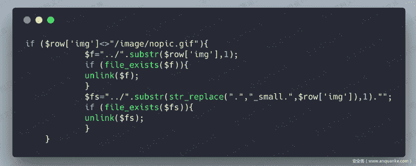
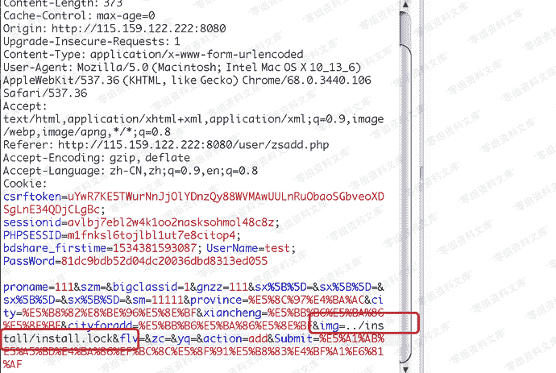
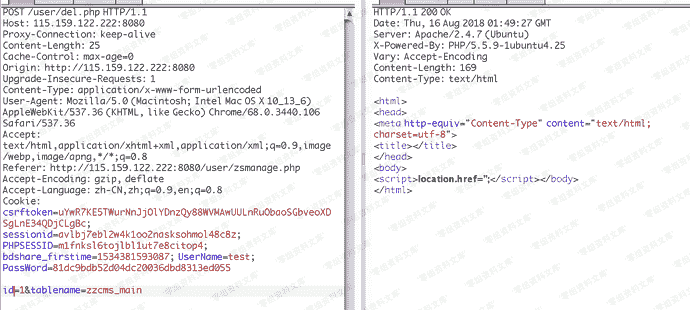

# （CVE-2018-13056）Zzcms 8.3 任意文件删除

## 一、漏洞简介

## 二、漏洞影响

版本：Zzcms 8.3 user / del.php

## 三、复现过程

漏洞点出现在 `/user/del.php` 的55行到64行

看到是从数据库中取出的img字段，然后直接判断了是不是默认值，然后检查文件存在，最后是删除，这其中并没有涉及到文件合法性检查。
那我们就可以去找一下这个字段是怎么进入数据库的：

首先找到表名，是`zzcms_main`表，然后找一下insert或者update操作，然后我们在`/user/zssave.php`中发现了有关操作。

然后查看是否经过了过滤，因为经过了伪全局过滤，这里的`$img`并没有经过任何有效过滤。

所以向数据库中插入污点数据是很简单的，只要在发布招商信息的时候，抓包，修改掉img的数据即可，这里我们测试`/install/install.lock`：

然后就可以到`/user/del.php`中去删除文件，这样就能触发删除操作。
但是这里有一个问题，就是删除的时候需要知道这一条记录在数据库中的id编号，可以采用爆破的方法来得到。

发包以后，我们刷新页面就可以发现，安装的锁文件已经被成功删除：

然后就可以配合之前的漏洞，任意文件写入拿到webshell。

## 参考链接

> https://www.anquanke.com/post/id/156660