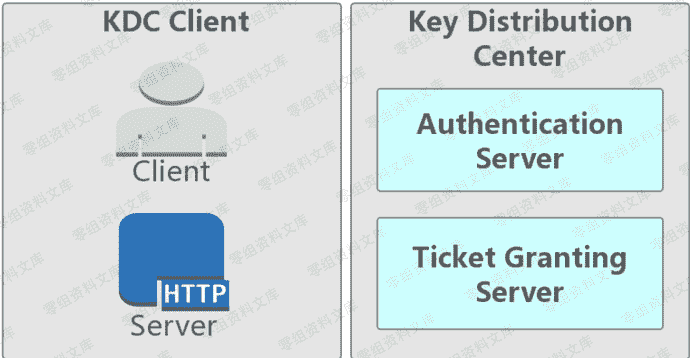
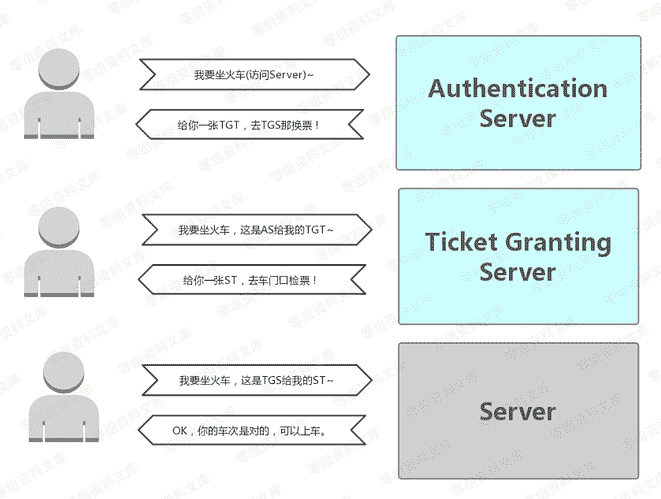

## 2.1 Kerberos 协议框架

Kerberos 协议中主要有三个角色:

*   访问服务的 Client
*   提供服务的 Server
*   KDC(Key Distribution Center)密钥分发中心

KDC 默认安装在域控中，而 Client 和 Server 为域内的用户或者服务，如 web 应用、数
据库服务器和邮件服务器等。Client 是否有权限访问 Server 端的服务由 KDC 发放的票据来 决定。

如果把 Kerberos 中的票据比作一张火车票，那么 Client 端就是乘客，Server 就是火车， 而 KDC 就是火车站的认证系统。如果 Client 端的票据是合法的(由你本人身份证购买并且 由你本人持有)同时有访问 Server 端服务的权限(车票对应车次正确)那么你才能上车。当 然和火车票不同的是 Kerberos 中有两张票据，而火车票只有一张。

由上图可以看出，KDC 又分为两个部分:

> Authentication Server:

AS 的作用就是验证 Client 的身份(确认你是身份证上的本人)，
验证通过就给一张 TGT(Ticket Granting Ticket)票给 Client。

> Ticket Granting Server:

TGS 的作用就是通过 AS 发给 Client 的票(TGT)换取访问 Server
端的票 ST(Server Ticket)。ST 也有资料称之为 TGS Ticket。

