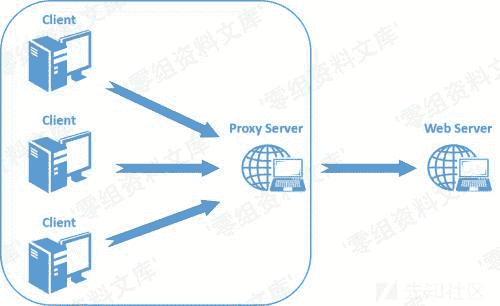

# Http 请求走私产生原因

当前很多网站都用了CDN加速服务，在源站的前面加上一个具有缓存功能的反向代理服务器，用户在请求某些静态资源时，直接从代理服务器中就可以获取到，不用再从源站所在服务器获取，拓扑结构：



反向代理服务器与后端的源站服务器之间，会重用TCP链接，因为代理服务器与后端的源站服务器的IP地址是相对固定，不同用户的请求将通过代理服务器与源站服务器建立链接。

但是由于两者服务器的实现方式不同，如果用户提交模糊的请求可能代理服务器认为这是一个HTTP请求，然后将其转发给了后端的源站服务器，但源站服务器经过解析处理后，只认为其中的一部分为正常请求，剩下的那一部分就是走私的请求了，这就是HTTP走私请求的由来。

HTTP请求走私漏洞的原因是由于HTTP规范提供了两种不同方式来指定请求的结束位置，它们是`Content-Length`标头和`Transfer-Encoding`标头，`Content-Length`标头简单明了，它以字节为单位指定消息内容体的长度，例如：

```
POST / HTTP/1.1
Host: ac6f1ff11e5c7d4e806912d000080058.web-security-academy.net
User-Agent: Mozilla/5.0 (Windows NT 10.0; WOW64; rv:48.0) Gecko/20100101 Firefox/48.0
Accept: httext/html,application/xhtml+xml,application/xml;q=0.9,*/*;q=0.8
Accept-Language: en-US,en;q=0.5
Cookie: session=5n2xRNXtAYM9teOEn3jSkEDDabLe0Qv8
Content-Length: 35
a=11 
```

`Transfer-Encoding`标头用于指定消息体使用分块编码（Chunked Encode），也就是说消息报文由一个或多个数据块组成，每个数据块大小以字节为单位（十六进制表示） 衡量，后跟换行符，然后是块内容，最重要的是：整个消息体以大小为0的块结束，也就是说解析遇到0数据块就结束。如：

```
POST / HTTP/1.1
Host: ac6f1ff11e5c7d4e806912d000080058.web-security-academy.net
Content-Type: application/x-www-form-urlencoded
Transfer-Encoding: chunked
b

a=11 `0` 
```

其实理解起来真的很简单，相当于我发送请求，包含`Content-Length`，前端服务器解析后没有问题发送给后端服务器，但是我在请求时后面还包含了`Transfer-Encoding`，这样后端服务器进行解析便可执行我写在下面的一些命令，这样便可以绕过前端的waf。