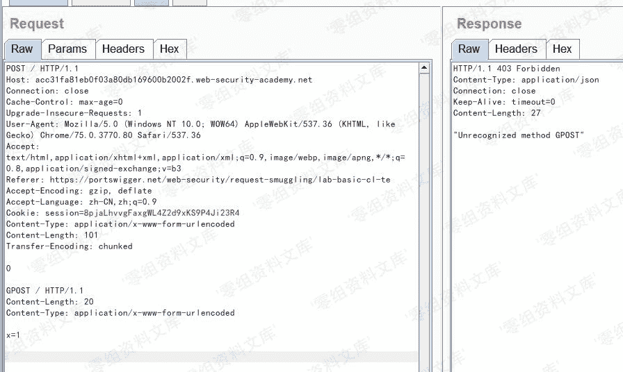

### CL-TE

> `RFC2616`的第4.4节中，规定:如果收到同时存在Content-Length和Transfer-Encoding这两个请求头的请求包时，在处理的时候必须忽略Content-Length。

Chunk传输数据格式如下，其中**size的值由16进制表示**：

```
[chunk size][\r\n]
[chunk data][\r\n]
[chunk size][\r\n]
[chunk data][\r\n
[chunk size = 0][\r\n]
[\r\n] 
```

即：当收到存在两个请求头的请求包时，前端服务器只对Content-Length这一请求，而后端服务器将忽略Content-Length，去处理Transfer-Encoding这一请求。

**实验地址**：https://portswigger.net/web-security/request-smuggling/lab-basic-cl-te

**实验描述**：

本实验涉及一个前端和后端服务器，两个服务器以不同的方式处理重复的HTTP请求标头。前端服务器拒绝未使用GET或POST方法的请求。

要解决此问题，请向后端服务器走私一个请求，以便后端服务器处理的下一个请求似乎使用GPOST方法。

**实验过程**：

