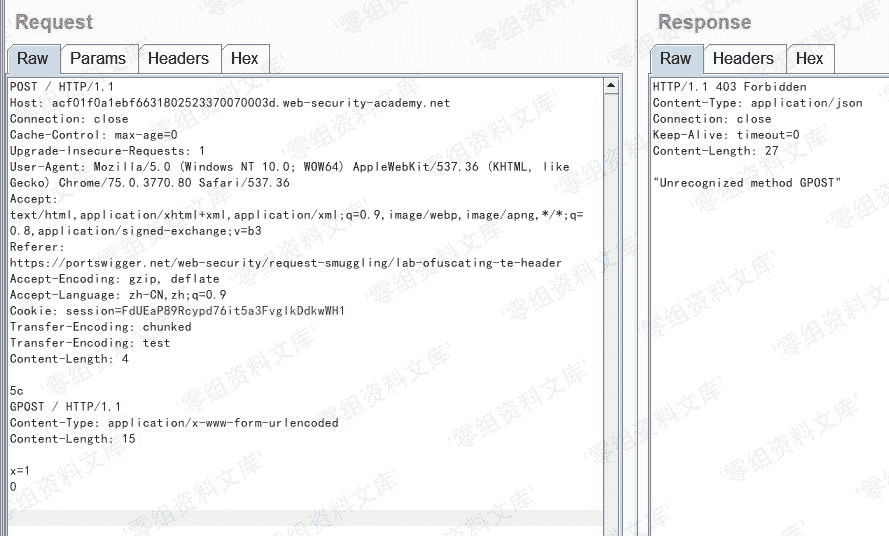

### TE-TE

当收到存在两个请求头的请求包时，前后端服务器都处理`Transfer-Encoding`请求头，这确实是实现了RFC的标准。不过前后端服务器毕竟不是同一种，这就有了一种方法，我们可以对发送的请求包中的`Transfer-Encoding`进行某种混淆操作，从而使其中一个服务器不处理`Transfer-Encoding`请求头。从某种意义上还是`CL-TE`或者`TE-CL`。

**实验地址**：https://portswigger.net/web-security/request-smuggling/lab-ofuscating-te-header

**实验描述**：

本实验涉及一个前端和后端服务器，两个服务器以不同的方式处理重复的HTTP请求标头。前端服务器拒绝未使用GET或POST方法的请求。

要解决此问题，请向后端服务器走私一个请求，以便后端服务器处理的下一个请求似乎使用GPOST方法。

**实验过程**：

本质上因为前后端服务器对TE头解释不一致导致请求走私，可视作是TE-CL或CL-TE；经过测试，本实验中应该属于TE-CL。

前端服务器处理TE头，将数据转发至后端服务器；后端服务器处理CL内容，于是`GPOST`请求走私成功。