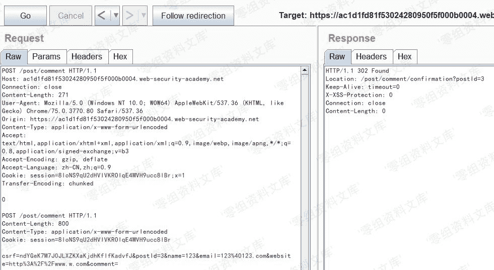
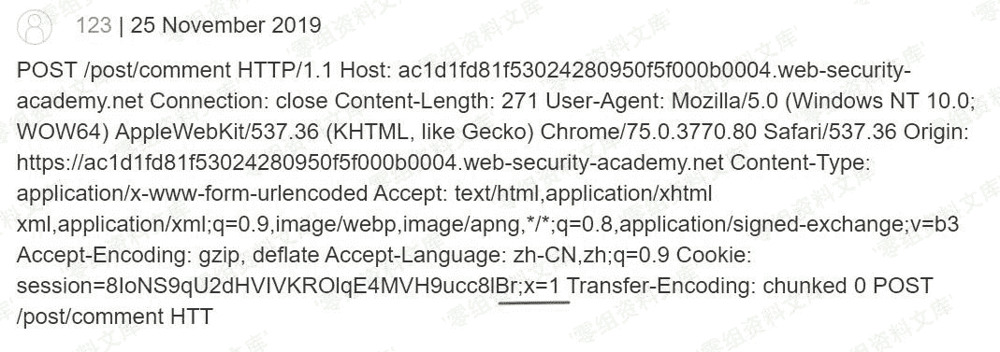

### 利用请求走私捕获其他用户的请求

在上一个实验中，我们通过走私一个不完整的请求来获取前端服务器添加的字段，而字段来自于我们后续发送的请求。换句话说，我们通过请求走私获取到了我们走私请求之后的请求。如果在我们的恶意请求之后，其他用户也进行了请求呢？我们寻找的这个POST请求会将获得的数据存储并展示出来呢？这样一来，我们可以走私一个恶意请求，将其他用户的请求的信息拼接到走私请求之后，并存储到网站中，我们再查看这些数据，就能获取用户的请求了。这可以用来偷取用户的敏感信息，比如账号密码等信息。

**实验地址**：https://portswigger.net/web-security/request-smuggling/exploiting/lab-capture-other-users-requests

**实验描述**：

本实验前端服务器不支持分块编码，即CL-TE

完成本实验需将请求走私到后端服务器，该请求导致

**实验过程**：

构造请求

走私请求中CL为800，其他用户的HTTP请求将会接在走私请求尾部。

理论上实验中会有机器人定时发送请求，但这里等了很久没等到，只捕获自己的请求，但原理是一样的。

