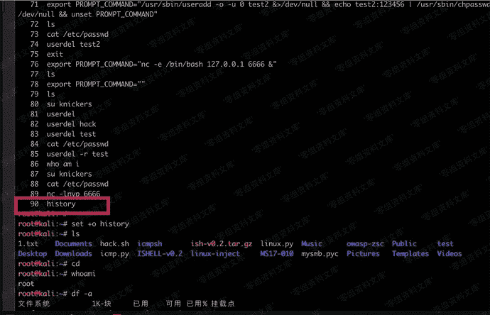
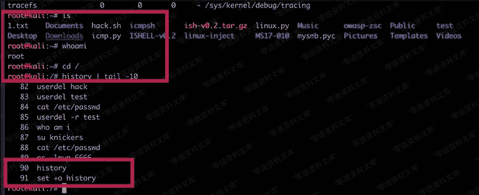
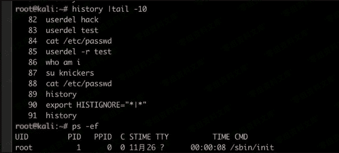
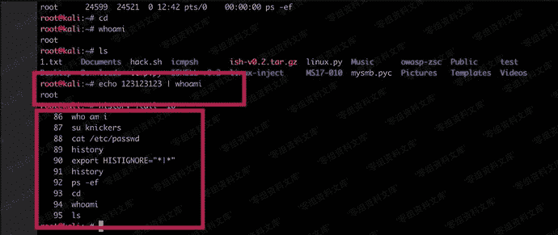

# 删除/隐藏历史操作命令

**删除**

删除通常使用两种方式：

*   1、history -c
*   2、rm -rf /root/.bash_history 建议使用第二种，第一种只是当前清除，并没有清除文件内容。

**隐藏**

隐藏命令的方式有很多，history 只会在会话结束时写入，所以只要会话还没有结束就可以想办法隐藏。比如同时开启两个终端，第一个终端启动vim编辑history文件，等第二个执行的都差不多了，结束会话后，在保存第一个，这样就覆盖了第二个终端所执行的命令。 这里我分享几个经常使用的隐藏历史命令的方法。

```
set +o history // 不会将任何当前会话写入日志。可以在会话期间任何时间运行，并隐藏所有命令。 
```





```
export HISTIGNORE="*|*" //这条命令是不记录带有管道符的命令。 
```

执行后命令可以echo 123123123 | whoami这样也可以做到隐藏命令的目的。



